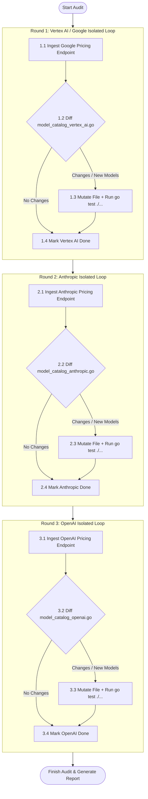

# 🛰️ Model Catalog Auditor & Sync Skill Specification

> **Version**: v1.1.0  
> **Mission**: Audit and synchronize model catalogs across provider-isolated files (`internal/core/model_catalog_*.go`) against official vendor pricing endpoints. Supports targeted single-provider runs via `--provider=<name>` or sequential one-by-one isolated pipelines (`Ingest` $\to$ `Diff` $\to$ `Mutate` $\to$ `Test`) when no flag is specified. Strictly forbids crawling all vendors at once before performing global batch mutations.

---

## 🎯 1. Core Principles

1. **Authoritative Single Source of Truth**:
   - Strictly prohibit reliance on secondary blogs, unofficial summaries, or assumptions. All pricing adjustments and newly added models must be backed by official vendor documentation URLs.
2. **Zero Noise & Silent Exit (No-Op)**:
   - If differential analysis shows that existing models, standard input rates, prompt caching discounts, and output rates are identical to official documentation with no missing models, **strictly forbid modifying that provider's file** and report "No update needed for provider". If all providers are clean, exit silently with zero code changes and no pull request.
3. **Sequential Provider Isolation (Reject Global Batching)**:
   - **Strictly prohibit** ingesting all vendor websites simultaneously into context before performing bulk edits.
   - Each provider must execute a complete, isolated lifecycle (`Ingest` $\to$ `Diff` $\to$ `Mutate` $\to$ `Test`) before proceeding to the next provider.
4. **Mandatory High-Signal Test Coverage**:
   - Any added model or rate adjustment must update test assertions in `internal/core/model_specs_test.go`. Running `go test -count=1 ./...` must pass with 100% green status.
5. **English Code & Strict Identifier Conventions**:
   - In accordance with `AGENTS.md` Article I, all source code, comments, struct fields, constants, variables, and Git commit messages must be strictly in English.

---

## 🗺️ 2. Per-Provider File Layout & Responsibilities

The model catalog is physically separated by provider into isolated files. Changes must stay strictly within their defined scopes:

| File Path | Scope & Role | Audit & Mutation Boundaries |
| :--- | :--- | :--- |
| [`internal/core/model_catalog_vertex_ai.go`](file:///Users/daniel_y_yang/Documents/self/heimdall/internal/core/model_catalog_vertex_ai.go) | **Google / Vertex AI Catalog** | Modified only when auditing Google / Vertex AI. Manages `vertexAIModelCatalog` models and pricing. |
| [`internal/core/model_catalog_anthropic.go`](file:///Users/daniel_y_yang/Documents/self/heimdall/internal/core/model_catalog_anthropic.go) | **Anthropic Claude Catalog** | Modified only when auditing Anthropic. Manages `anthropicModelCatalog` models and pricing. |
| [`internal/core/model_catalog_openai.go`](file:///Users/daniel_y_yang/Documents/self/heimdall/internal/core/model_catalog_openai.go) | **OpenAI Catalog** | Modified only when auditing OpenAI. Manages `openAIModelCatalog` models and pricing. |
| [`internal/core/model_catalog.go`](file:///Users/daniel_y_yang/Documents/self/heimdall/internal/core/model_catalog.go) | **Shared Types, Enums & Catalog Assembly** | Add new constant to `ModelID` enum only when onboarding a **brand new model ID**; aggregates top-level `modelCatalog` map. |
| [`internal/core/model_specs.go`](file:///Users/daniel_y_yang/Documents/self/heimdall/internal/core/model_specs.go) | **Normalization & Resolver Engine** | Update `NormalizeModelID` to handle aliases and vendor prefixes for new models. |
| [`internal/core/model_specs_test.go`](file:///Users/daniel_y_yang/Documents/self/heimdall/internal/core/model_specs_test.go) | **Unit Tests for Catalog Resolution** | Add or update assertions for `ResolveModelInfo` pricing and cache discount rates. |

---

## 🎛️ 3. Execution & Flag Control Modes

The skill supports two distinct execution strategies:

```text
CLI Invocations:
1. Targeted Single Provider: --provider=anthropic (or --provider=vertex_ai, --provider=openai)
2. Unflagged (Default): Sequential one-by-one pipeline (Vertex AI -> Anthropic -> OpenAI)
```

### Mode A: Targeted Single Provider Mode
- **Trigger**: Called with `--provider=<name>` flag (e.g., `--provider=anthropic`).
- **Standard Operating Procedure**:
  1. **Ingest only** the official documentation endpoint for that specific provider.
  2. **Diff and mutate only** that provider's catalog file (e.g., `model_catalog_anthropic.go`).
  3. If a new model ID is introduced, add it to `model_catalog.go` (`ModelID` enum) and `model_specs.go` (`NormalizeModelID`).
  4. Run `go test -count=1 ./...` to verify zero regression.
  5. **Never** read or modify other provider catalog files.

---

### Mode B: Unflagged Default Pipeline (Sequential Isolation)
- **Trigger**: No `--provider` flag specified (full audit).
- **Standard Operating Procedure (Strict Prohibition of Global Batching)**:
  The agent **must execute three independent, sequential rounds**, each completing its own closed loop:



1. **Round 1 (Google / Vertex AI)**:
   - Official Endpoints: `https://ai.google.dev/gemini-api/docs/pricing` & `https://cloud.google.com/gemini-enterprise-agent-platform/generative-ai/pricing`
   - Target File: `internal/core/model_catalog_vertex_ai.go`
   - If diff detected: Mutate file and tests, run `go test -count=1 ./...` until green, then complete Round 1.
2. **Round 2 (Anthropic Claude)**:
   - Official Endpoint: `https://platform.claude.com/docs/en/about-claude/pricing`
   - Target File: `internal/core/model_catalog_anthropic.go`
   - If diff detected: Mutate file and tests, run `go test -count=1 ./...` until green, then complete Round 2.
3. **Round 3 (OpenAI)**:
   - Official Endpoint: `https://developers.openai.com/api/docs/pricing.md`
   - Target File: `internal/core/model_catalog_openai.go`
   - If diff detected: Mutate file and tests, run `go test -count=1 ./...` until green, then complete Round 3.
4. **Final Settlement**:
   - If all three rounds detect zero differences $\to$ Output "Model catalog across all providers is up to date", exit silently as No-Op.
   - If any round introduced changes $\to$ Compile the change log and commit / push.

---

## 🌐 4. Official Vendor Documentation Endpoints

### 1. Google Cloud / Vertex AI & Google AI Studio
- **Developer API (AI Studio)**: `https://ai.google.dev/gemini-api/docs/pricing`
- **Vertex AI / Gemini Enterprise**: `https://cloud.google.com/gemini-enterprise-agent-platform/generative-ai/pricing`
- **Catalog File**: `internal/core/model_catalog_vertex_ai.go`
- **Key Metrics to Verify**:
  - Standard Input USD / 1M tokens.
  - Context Caching Rate (75% OFF or 90% OFF $\to$ `CacheDiscountRate`: `0.75` or `0.90`).
  - Output USD / 1M tokens, free safety model flag (`IsFree: true`).

### 2. Anthropic (Claude)
- **Official Platform Pricing**: `https://platform.claude.com/docs/en/about-claude/pricing`
- **Catalog File**: `internal/core/model_catalog_anthropic.go`
- **Key Metrics to Verify**:
  - Base Input Tokens (Sonnet $3.00, Sonnet 5 $2.00, Haiku $1.00, Opus $5.00).
  - Cache Hits Rate (typically 0.1x / 90% OFF $\to$ `CacheDiscountRate = 0.90`).
  - Output Tokens (Note: Vertex AI hosted Claude models include a +10% premium, while first-party Anthropic platform uses native rates).

### 3. OpenAI (GPT & Reasoning Models)
- **Official Documentation**: `https://developers.openai.com/api/docs/pricing.md`
- **Catalog File**: `internal/core/model_catalog_openai.go`
- **Key Metrics to Verify**:
  - Short Context Input USD / 1M tokens.
  - Short Context Cached Input (converted to `CacheDiscountRate`: 50% OFF `0.50`, 75% OFF `0.75`, 90% OFF `0.90`).
  - Short Context Output USD / 1M tokens.
  - Primary Model Series: `gpt-5`, `gpt-5-mini`, `gpt-4o`, `gpt-4o-mini`, `o1`, `o3`, `o3-mini`, `o4-mini`.

---

## 📋 5. Micro-SOP per Provider

Within each isolated round, the agent strictly executes the following 4 steps:

1. **Web Ingestion**:
   - Fetch the official documentation URL for the single active provider.
2. **Differential Analysis**:
   - Compare active pricing numbers against current values in `model_catalog_<provider>.go`.
   - Check if new flagship/reasoning models have been officially launched.
   - If zero diff is detected $\to$ Mark round as No-Op and proceed immediately to next provider.
3. **Local Mutation**:
   - Edit only `model_catalog_<provider>.go`.
   - If a new model ID is added, register `ModelID` in `model_catalog.go` and add alias mapping in `model_specs.go`.
   - Add unit test assertions in `model_specs_test.go`.
4. **Verification**:
   - Run `go test -count=1 ./...`. Only proceed after 100% green test passes.
