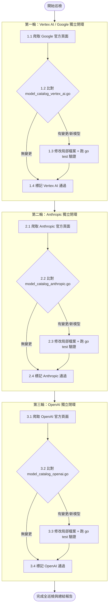

# 🛰️ Model Catalog Auditor & Sync Skill (模型目錄自動化巡檢與同步專案規範)

> **版本**：v1.1.0  
> **目標**：依據各 Provider 獨立檔案結構（Google / Vertex AI、Anthropic、OpenAI），巡檢最新官方定價與新模型發布狀態。支援單一 Provider 旗標指定更新，或在無旗標時以「逐一 Provider 獨立完成（Ingest $\to$ Diff $\to$ Mutate $\to$ Test）」的方式依序巡檢，嚴禁全網爬完混合大修。

---

## 🎯 一、 核心原則 (Core Principles)

1. **唯一權威來源鐵律 (Authoritative Single Source of Truth)**：
   - 嚴禁依賴非官方二手部落格或猜測。所有費率調整與新模型新增必須具備官方文件 URL 支撐。
2. **零擾動與靜默退出原則 (Zero Noise & Silent Exit)**：
   - 若巡檢比對後發現目標 Provider 目錄內的模型名稱、標準輸入、快取命中、生成輸出價格與官方完全一致，且無必要收錄之新模型，**嚴禁修改該 Provider 檔案**，直接回報「該 Provider 目錄無須更新」。若所有 Provider 皆無變更，則完全不發起 PR。
3. **逐一 Provider 隔離閉環 (Sequential Isolation, Reject Global Batching)**：
   - **嚴禁**一次把三家網站全部看完後再做大規模混雜修訂！
   - 每個 Provider 必須獨立跑完完整閉環（爬取 $\to$ 比對 $\to$ 修改局部檔案 $\to$ 驗證測試），再進入下一個 Provider。
4. **高訊號測試閉環 (Mandatory Test Coverage)**：
   - 任何新增的模型或價格異動，必須同步在 `internal/core/model_specs_test.go` 新增或調整斷言，並執行 `go test -count=1 ./...` 確保 100% 綠燈通行。
5. **英文代碼與駝峰命名 (Constitution Compliance)**：
   - 依據 `AGENTS.md` 第一條，所有代碼、型態、常數、變數、註解與 Commit 訊息必須全英文；文件說明採用繁體中文（台灣習慣用語）。

---

## 🗺️ 二、 監控檔案與目錄職責拓撲 (Per-Provider File Layout)

模型目錄已依供應商徹底拆分為獨立檔案，作業半徑嚴格限定於對應檔案：

| 檔案路徑 | 職責定義 | 巡檢與修改規範 |
| :--- | :--- | :--- |
| [`internal/core/model_catalog_vertex_ai.go`](file:///Users/daniel_y_yang/Documents/self/heimdall/internal/core/model_catalog_vertex_ai.go) | **Google / Vertex AI 專屬目錄** | 僅於巡檢 Google/Vertex AI 時修改，維護 `vertexAIModelCatalog` 對應的模型資訊。 |
| [`internal/core/model_catalog_anthropic.go`](file:///Users/daniel_y_yang/Documents/self/heimdall/internal/core/model_catalog_anthropic.go) | **Anthropic Claude 專屬目錄** | 僅於巡檢 Anthropic 時修改，維護 `anthropicModelCatalog` 對應的模型資訊。 |
| [`internal/core/model_catalog_openai.go`](file:///Users/daniel_y_yang/Documents/self/heimdall/internal/core/model_catalog_openai.go) | **OpenAI 專屬目錄** | 僅於巡檢 OpenAI 時修改，維護 `openAIModelCatalog` 對應的模型資訊。 |
| [`internal/core/model_catalog.go`](file:///Users/daniel_y_yang/Documents/self/heimdall/internal/core/model_catalog.go) | **共用列舉、型態與註冊表組裝** | 若有**全新模型 ID**，於 `ModelID` 列舉新增常數；組裝 `modelCatalog` 頂層映射。 |
| [`internal/core/model_specs.go`](file:///Users/daniel_y_yang/Documents/self/heimdall/internal/core/model_specs.go) | **模型正規化與解析器** | 於 `NormalizeModelID` 補齊新模型的別名與前綴剝離處理。 |
| [`internal/core/model_specs_test.go`](file:///Users/daniel_y_yang/Documents/self/heimdall/internal/core/model_specs_test.go) | **目錄解析單元測試** | 為異動或新增的模型補齊 `ResolveModelInfo` 費率與快取折扣率斷言。 |

---

## 🎛️ 三、 執行模式與 Provider 旗標控制 (Flag & Execution Modes)

本 Skill 支援以下兩種執行策略：

```text
指令範例：
1. 指定單一 Provider：--provider=anthropic（或 --provider=vertex_ai、--provider=openai）
2. 未帶旗標（預設）：循序一個接一個（Vertex AI -> Anthropic -> OpenAI）
```

### 模式 A：指定單一 Provider 模式（Targeted Mode）
- **觸發條件**：帶有 `--provider=<name>` 參數（如 `--provider=anthropic`）。
- **行為規範**：
  1. **僅爬取**該 Provider 之官方端點。
  2. **僅比對與修改**該 Provider 對應的獨立檔案（例如 `model_catalog_anthropic.go`）。
  3. 若該 Provider 有新模型，於 `model_catalog.go` 增補 `ModelID` 列舉並於 `model_specs.go` 補齊別名。
  4. 執行 `go test -count=1 ./...` 驗證。
  5. **絕不**存取或修改其他 Provider 檔案。

---

### 模式 B：未帶旗標的預設循序隔離流水線（Sequential Default Pipeline）
- **觸發條件**：未提供 `--provider` 旗標（全量巡檢）。
- **行為規範（嚴禁一次看完再改！）**：
  Agent **必須分三輪獨立循序進行**，每輪自成閉環：



1. **第一輪 (Google / Vertex AI)**：
   - 爬取端點：`https://ai.google.dev/gemini-api/docs/pricing`
   - 比對目標：`internal/core/model_catalog_vertex_ai.go`
   - 若有差量：修訂該檔與測試，執行 `go test -count=1 ./...` 通過後，才結束本輪。
2. **第二輪 (Anthropic Claude)**：
   - 爬取端點：`https://platform.claude.com/docs/en/about-claude/pricing`
   - 比對目標：`internal/core/model_catalog_anthropic.go`
   - 若有差量：修訂該檔與測試，執行 `go test -count=1 ./...` 通過後，才結束本輪。
3. **第三輪 (OpenAI)**：
   - 爬取端點：`https://developers.openai.com/api/docs/pricing.md`
   - 比對目標：`internal/core/model_catalog_openai.go`
   - 若有差量：修訂該檔與測試，執行 `go test -count=1 ./...` 通過後，才結束本輪。
4. **最終結算**：
   - 若三個輪次皆無實質差量 $\to$ 輸出「全平台模型目錄無須更新」，No-Op 退出。
   - 若有任一輪次產生改動 $\to$ 彙整變動清單並提交 Commit / PR。

---

## 🌐 四、 各 Provider 官方監控端點矩陣

### 1. Google Cloud / Vertex AI & Google AI Studio
- **Developer API (AI Studio)**: `https://ai.google.dev/gemini-api/docs/pricing`
- **Vertex AI / Gemini Enterprise**: `https://cloud.google.com/gemini-enterprise-agent-platform/generative-ai/pricing`
- **對應檔案**: `internal/core/model_catalog_vertex_ai.go`
- **核心核對指標**：
  - Standard Input USD / 1M tokens
  - Context Caching Rate（75% OFF 或 90% OFF $\to$ `CacheDiscountRate`：`0.75` 或 `0.90`）
  - Output USD / 1M tokens、免費模型標記（`IsFree: true`）

### 2. Anthropic (Claude)
- **Official Platform Pricing**: `https://platform.claude.com/docs/en/about-claude/pricing`
- **對應檔案**: `internal/core/model_catalog_anthropic.go`
- **核心核對指標**：
  - Base Input Tokens（Sonnet $3.00, Sonnet 5 $2.00, Haiku $1.00, Opus $5.00）
  - Cache Hits Rate（一般為 0.1x 即 90% OFF $\to$ `CacheDiscountRate = 0.90`）
  - Output Tokens（注意：Vertex AI 託管版本具備 +10% 溢價，但 Anthropic 直營目錄採用原生平台價格）

### 3. OpenAI (GPT & Reasoning Models)
- **Official Documentation**: `https://developers.openai.com/api/docs/pricing.md`
- **對應檔案**: `internal/core/model_catalog_openai.go`
- **核心核對指標**：
  - Short Context Input
  - Short Context Cached Input（換算 `CacheDiscountRate`：50% OFF `0.50`, 75% OFF `0.75`, 90% OFF `0.90`）
  - Short Context Output
  - 核心主力系列：`gpt-5`、`gpt-5-mini`、`gpt-4o`、`gpt-4o-mini`、`o1`、`o3`、`o3-mini`、`o4-mini`

---

## 📋 五、 單一輪次之微觀操作 SOP (Micro-SOP per Provider)

每個輪次內部嚴格執行以下 4 步：

1. **Web Ingestion**：讀取該 Provider 的唯一官方端點。
2. **Differential Analysis**：
   - 檢查該 Provider 現有條目數值是否變更。
   - 檢查該 Provider 是否有新主力模型發布。
   - 若無任何變更 $\to$ 記錄本輪 No-Op，直接跳至下一輪次。
3. **Local Mutation**：
   - 修改對應的 `model_catalog_<provider>.go`。
   - 若有新增模型，於 `model_catalog.go` 增補 `ModelID`，於 `model_specs.go` 增補別名。
   - 於 `model_specs_test.go` 增補單元測試斷言。
4. **Verification**：
   - 執行 `go test -count=1 ./...`，綠燈後才算完成該 Provider 的同步。
