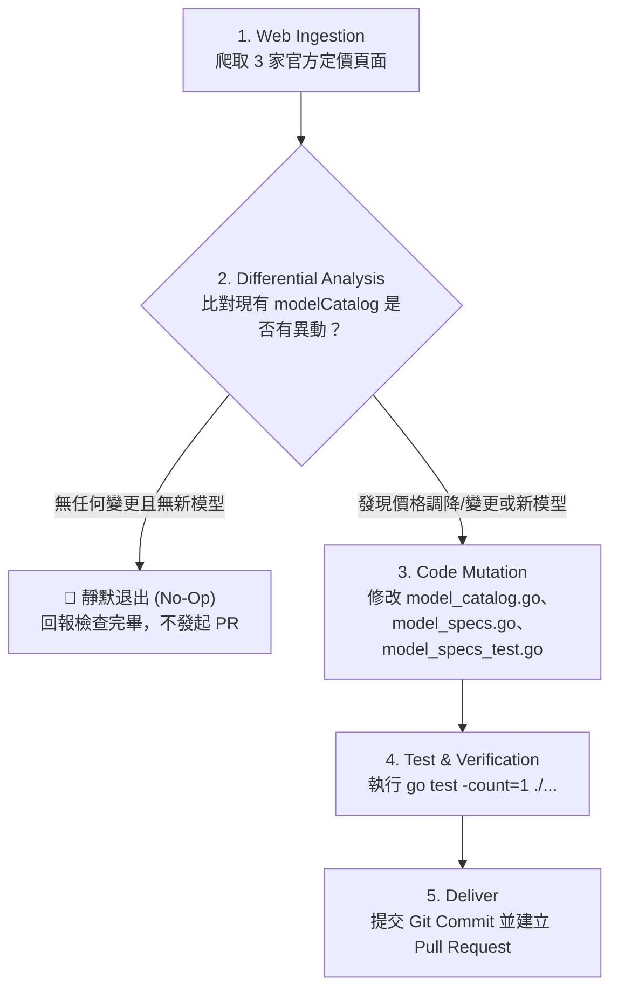

# 🛰️ Model Catalog Auditor & Sync Skill (模型目錄自動化巡檢與同步專案規範)

> **版本**：v1.0.0  
> **目標**：自動化巡檢主流 LLM 供應商（Google / Vertex AI、Anthropic、OpenAI）之最新定價與模型發布狀態，主動修正 `internal/core/model_catalog.go` 內的過時數值與遺漏模型，維持全專案推論計費與快取節省計算之百分之百權威性。

---

## 🎯 一、 核心原則 (Core Principles)

1. **唯一權威來源鐵律 (Authoritative Single Source of Truth)**：
   - 嚴禁依賴非官方二手部落格或猜測。所有費率調整與新模型新增必須具備官方文件 URL 支撐。
2. **零擾動與靜默退出原則 (Zero Noise & Silent Exit)**：
   - 若巡檢比對後發現目前 `model_catalog.go` 的模型名稱、標準輸入、快取命中、生成輸出價格與官方完全一致，且無必要收錄之新模型，**嚴禁修改任何檔案**，直接回報「檢查完畢，目錄無須更新」並結束任務。
3. **高訊號測試閉環 (Mandatory Test Coverage)**：
   - 任何新增的模型或價格異動，必須同步在 `internal/core/model_specs_test.go` 新增或調整斷言，並執行 `go test -count=1 ./...` 確保 100% 綠燈通行。
4. **英文代碼與駝峰命名 (Constitution Compliance)**：
   - 依據 `AGENTS.md` 第一條，所有代碼、型態、常數、變數、註解與 Commit 訊息必須全英文；文件說明採用繁體中文（台灣習慣用語）。

---

## 🗺️ 二、 監控檔案與目錄職責拓撲

當本 Skill 被執行（由 Jules、CI/CD 或本機 Agent 觸發）時，其作業半徑嚴格限定於以下檔案：

| 檔案路徑 | 職責定義 | 巡檢與修改規範 |
| :--- | :--- | :--- |
| [`internal/core/model_catalog.go`](file:///Users/daniel_y_yang/Documents/self/heimdall/internal/core/model_catalog.go) | **模型註冊表、列舉與資料型態** | 1. 於 `ModelID` 列舉新增模型 ID 常數。<br/>2. 於 `modelCatalog[provider][modelID]` 登錄 `ModelInfo` 規格。 |
| [`internal/core/model_specs.go`](file:///Users/daniel_y_yang/Documents/self/heimdall/internal/core/model_specs.go) | **模型正規化與解析器** | 於 `NormalizeModelID` 的 `switch` 區塊補上新模型名稱、版本別名（如帶點符號 `gpt-4.1` 或日期後綴）。 |
| [`internal/core/model_specs_test.go`](file:///Users/daniel_y_yang/Documents/self/heimdall/internal/core/model_specs_test.go) | **目錄解析單元測試** | 為異動或新增的模型補齊 `ResolveModelInfo` 與 `ResolveModelInfoByString` 費率與快取折扣率斷言。 |

---

## 🌐 三、 官方監控端點矩陣 (Official Endpoint Matrix)

Skill 必須爬取並核驗以下三家官方端點：

### 1. Google Cloud / Vertex AI & Google AI Studio
- **Developer API (AI Studio)**: `https://ai.google.dev/gemini-api/docs/pricing`
- **Vertex AI / Gemini Enterprise**: `https://cloud.google.com/gemini-enterprise-agent-platform/generative-ai/pricing`
- **核心核對指標**：
  - Standard Input USD / 1M tokens
  - Context Caching Rate（一般為 75% OFF 或 90% OFF，換算為 `CacheDiscountRate`：`0.75` 或 `0.90`）
  - Output USD / 1M tokens
  - 免費模型標記（如 `IsFree: true`）

### 2. Anthropic (Claude)
- **Official Platform Pricing**: `https://platform.claude.com/docs/en/about-claude/pricing`
- **核心核對指標**：
  - Base Input Tokens（如 Sonnet $3.00, Sonnet 5 $2.00, Haiku $1.00, Opus $5.00）
  - Cache Hits Rate（通常為 0.1x 即 90% OFF，`CacheDiscountRate = 0.90`）
  - Output Tokens
  - 注意區分：Anthropic Direct 費率 vs Google Vertex AI 託管的 +10% 區域溢價。

### 3. OpenAI (GPT & Reasoning Models)
- **Official Documentation (HTML / Markdown)**:
  - `https://developers.openai.com/api/docs/pricing`
  - `https://developers.openai.com/api/docs/pricing.md`（可直接讀取 Markdown 表格）
- **核心核對指標**：
  - Short Context Input
  - Short Context Cached Input（換算 `CacheDiscountRate`，例如 $2.50 / $1.25 即 50% OFF `0.50`；$1.25 / $0.125 即 90% OFF `0.90`）
  - Short Context Output
  - 核心關注模型系列：`gpt-5`、`gpt-5-mini`、`gpt-4o`、`gpt-4o-mini`、`o1`、`o3`、`o3-mini`、`o4-mini`。

---

## 📋 四、 標準作業程序 (SOP - 4 步巡檢循環)



### 步驟 1：Web Ingestion（爬取資料）
使用 HTTP 讀取或 Web 檢索工具抓取上述 3 個官方端點之即時內容。

### 步驟 2：Differential Analysis（差量比對）
比對下列各項：
1. **數值正確性**：檢查 `model_catalog.go` 內現有模型之 `InputUSDPerMillion`、`OutputUSDPerMillion`、`CacheDiscountRate` 是否有調降或調漲。
2. **新模型發現**：檢查官方是否有新發布之主力或推論模型（如 Gemini 4、Claude 新版本、GPT 新版）。
3. **判斷分流**：
   - 若一切完全吻合 $\to$ 輸出審查日誌，停止並退出。
   - 若有差異 $\to$ 進入步驟 3。

### 步驟 3：Code Mutation（代碼修訂）
1. 在 `internal/core/model_catalog.go`：
   - 若為新模型，在 `ModelID` 新增常數。
   - 在 `modelCatalog[provider]` 注入對應的 `ModelInfo`。
2. 在 `internal/core/model_specs.go`：
   - 在 `NormalizeModelID` 新增該模型的 alias 與大小寫相容處理。
3. 在 `internal/core/model_specs_test.go`：
   - 增加針對新模型或異動價格的單元測試用例。

### 步驟 4：Test & Verification（驗證交付）
- 在專案根目錄執行：
  ```bash
  go test -count=1 ./...
  ```
- 確保所有測試 100% 通過。
- Commit 訊息規範：
  ```text
  chore(catalog): sync model pricing and add <model-name> from official vendor specs
  ```
