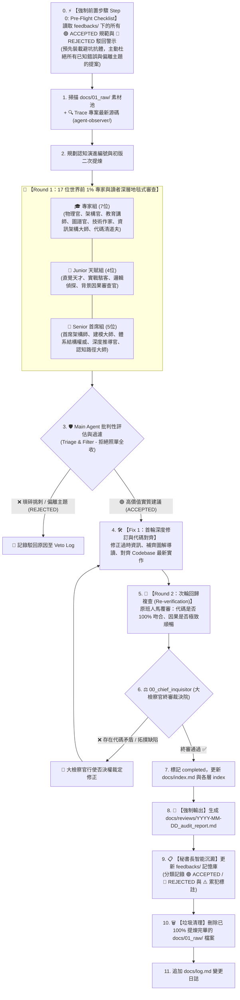

# 🧠 LLM Wiki Distiller (全球前 1% 頂尖多角色深層對抗審查、真相溯源與自我進化 Skill)

> [!IMPORTANT]
> **🌟 根本核心原則：Wiki 是終點，不是中間站！**
> 1. `docs/02_wiki/` 是面向全人類好讀、好學、深度抽象且高度互連的 **「長效知識中樞」**。
> 2. **嚴禁在 Wiki 筆記內文中出現審查角色的名字**！Wiki 是純粹、客觀、沉穩的世界級技術資產。
> 3. **每張架構圖/時序圖/流程圖下方，必須配備手把手的「圖表深度精讀指南」**。
> 4. **🗑️ Raw 素材消化即刪除 (Digest & Delete Policy)**：一旦 `01_raw/` 內的素材被 100% 提煉、核實並整合進 `02_wiki/`，**該 Raw 檔案必須立即刪除**，絕不留存冗餘過渡檔案！
> 5. **🧬 反饋記憶與自我進化閉環 (Continuous Learning & Feedbacks)**：
>    * **⚡ 強制第一步 (Step 0)**：每次寫作**開局必須先讀取 `feedbacks/` 中的 ACCEPTED 規範與 REJECTED 警示**，主動避開已知陷阱；
>    * 審查結束後，**由「秘書長 (Chief Secretary)」執行智能去重、標註 ACCEPTED/REJECTED 與累犯記錄**，沉澱入 `feedbacks/`！
> 6. **📜 強制輸出全景審查報告書 (Mandatory Audit Report Output)**：每次雙輪審查後，**必須在 `docs/reviews/YYYY-MM-DD_<topic>_audit_report.md` 產出全景審查報告書**。
> 7. **🔍 代碼真相溯源鐵律 (Codebase Truth-Tracing)**：必須主動 Trace 專案當前的實際代碼（`agent-observer/`）核驗事實。

---

## 🔄 核心自我進化、雙輪提煉與審查流水線

---

## 👥 審查官與讀者角色全矩陣 (`roles/`)

### 🎓 1. 頂尖領域專家與架構大師 (World-Class Experts & Ontologists)
* **⚖️ 大檢察官** ([`00_chief_inquisitor.md`](./roles/00_chief_inquisitor.md))：全局仲裁院院長、代碼真實性驗收、建議否決權行使、審查報告簽署與終審簽核。
* **📋 秘書長 / 反饋記憶官** ([`08_chief_secretary_feedback_archivist.md`](./roles/08_chief_secretary_feedback_archivist.md))：**【自我進化核心】** 統整所有建議，查重聚合，更新 `feedbacks/`（標註 ACCEPTED/REJECTED 與累犯記錄）。
* **🔍 實證代碼驗證官** ([`07_code_fact_checker_and_pruner.md`](./roles/07_code_fact_checker_and_pruner.md))：Trace `agent-observer/` 實際代碼核對事實，揪出過時假說。
* **🏛️ 資訊架構師與知識本體論專家·維克多** ([`06_information_architect_vault_ontologist.md`](./roles/06_information_architect_vault_ontologist.md))：審查目錄正交性（MECE）、評估同類概念合併（Merge）與目錄層級。
* **✍️ 首席技術作家與細節審查官** ([`05_technical_writer_detail_auditor.md`](./roles/05_technical_writer_detail_auditor.md))：審查敘述厚度、每張圖的手把手導讀、杜絕正文人名。
* **🔬 推論物理官** ([`01_theoretical_physicist.md`](./roles/01_theoretical_physicist.md))：Attention 數學、KV 顯存公式推導、Prefill/Decode 物理時序。
* **🏛️ 系統架構官** ([`02_system_architect.md`](./roles/02_system_architect.md))：Context 5 維度分類、雙層 SQLite 狀態機、LCP 演算法。
* **🎓 頂級技術教育家·艾咪** ([`03_tech_educator_lecturer.md`](./roles/03_tech_educator_lecturer.md))：審查開場 Hook、知識坡度與啟發式教學節奏。
* **🔗 圖譜審查官** ([`04_obsidian_knowledge_graph_linter.md`](./roles/04_obsidian_knowledge_graph_linter.md))：雙向鏈接 `[[Page]]`、全庫 0 孤島、Frontmatter。

---

### 👶 2. 世界前 1% 天賦新人工程師讀者團 (`roles/readers/`)
* **🔍 背景脈絡與因果審查官·小莫** ([`junior_04_narrative_and_context_auditor.md`](./roles/readers/junior_04_narrative_and_context_auditor.md))：專查作者是否偷懶簡略、是否預設讀者懂、因果銜接是否跳躍。
* **直覺探索型天才·小明** ([`junior_01_curious_newbie.md`](./roles/readers/junior_01_curious_newbie.md))：好奇「直覺本質」，拒絕黑話，抓出定義不清與缺乏背景鋪墊的盲點。
* **極限駭客實戰家·阿豪** ([`junior_02_hands_on_explorer.md`](./roles/readers/junior_02_hands_on_explorer.md))：好奇「具體實現」，抓出代碼步驟缺失、指令不完整與缺少預期輸出的盲點。
* **形式邏輯偵探·小華** ([`junior_03_logic_detective.md`](./roles/readers/junior_03_logic_detective.md))：好奇「因果推導」，抓出因果邏輯跳躍、省略中間步驟與未說明的邊界情境。

---

### 🧓 3. 世界前 1% 首席架構師與體系結構大師 (`roles/readers/`)
* **🧠 系統拓撲與認知路徑架構師·雷蒙** ([`senior_05_vault_learning_path_architect.md`](./roles/readers/senior_05_vault_learning_path_architect.md))：嚴查編號背後的心智演進鏈，確保讀完 01 順暢解鎖 02。
* **🔍 深度推導與因果連續性審查官·格雷格** ([`senior_04_deep_dive_continuity_auditor.md`](./roles/readers/senior_04_deep_dive_continuity_auditor.md))：專查技術推導連續性、工程細節完備度與硬體因果代價。
* **基礎架構首席架構師·老陳** ([`senior_01_tradeoff_explorer.md`](./roles/readers/senior_01_tradeoff_explorer.md))：好奇「決策 Tradeoffs 與極限代價」，要求客觀的替代方案比較表格與生產環境失效模式分析。
* **系統設計與領域建模大師·凱文** ([`senior_02_architecture_visualizer.md`](./roles/readers/senior_02_architecture_visualizer.md))：好奇「全域架構、時序演進與資料流」，要求宏觀清晰的架構圖與手把手圖解指南。
* **LLM 內核與體系結構權威·大衛** ([`senior_03_precision_explainer.md`](./roles/readers/senior_03_precision_explainer.md))：好奇「微架構硬體瓶頸與精確度」，要求嚴密數學推導、單位標註與 Big-O 複雜度。
