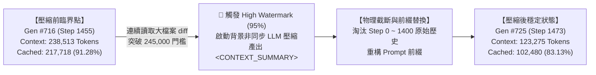
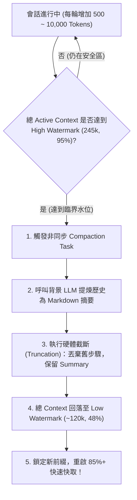
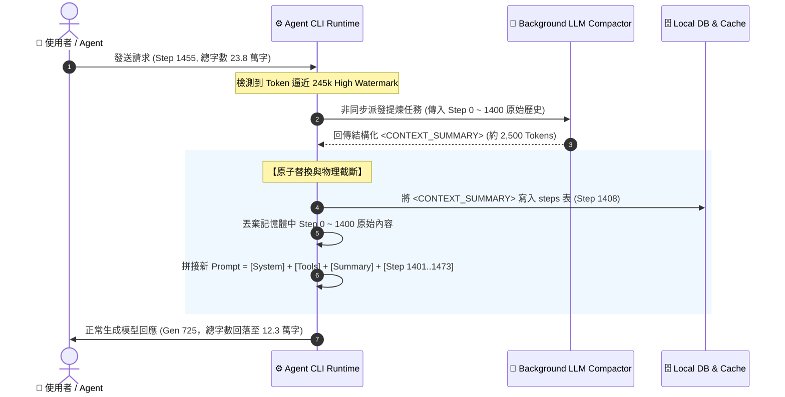
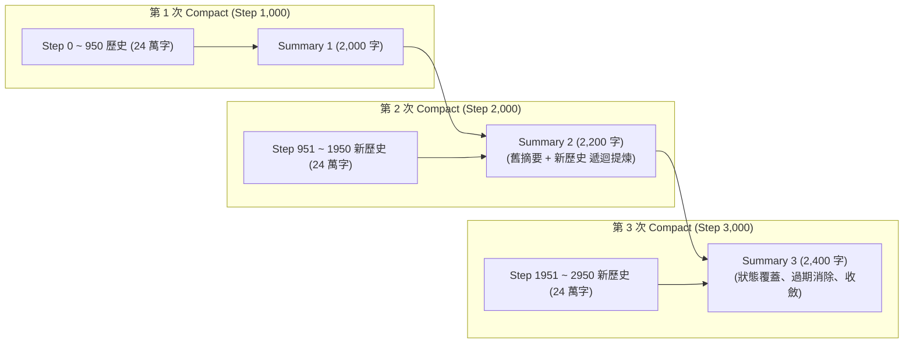

# 🧬 深入解密 Agent Context 壓縮與遞迴摘要機制 (Compaction & Recursive Summarization)

> **建立時間**：2026-08-26 11:30:00
> **更新時間**：2026-08-26 14:00:00  
> **第一手實證來源**：`~/.gemini/antigravity-cli/conversations/<session-id>.db` 資料表 `steps` (Step 1345, 1408) 與 `gen_metadata` (Gen 716 $\to$ Gen 725)  
> **核心主題**：什麼時候 Compact、怎麼 Compact、真實連線現場實證案例、前綴放滿之遞迴摘要演算法。

---

## 🧭 一、核心結論與即時實證案例 (Live Case Study)

在本次開發過程中，我們的會話於 **Generation #716 $\to$ #725** 期間，現場完整觸發並驗證了一次標準的 **「雙水位線非同步 Context Compaction」**！

### 📊 實機真實數據對照表 (SQLite `gen_metadata` 官方紀錄)

| 階段 (Phase) | 序號 (Gen / Step) | Total Context | Cached Tokens | Cache Hit Rate | 物理上下文狀態 (Physical State) |
| :--- | :--- | :--- | :--- | :--- | :--- |
| **壓縮前臨界點** | **Gen #716 (Step 1455)** | **`238,513`** | **`217,718`** | **`91.28%`** | 接近 256k 窗口極限（佔比 93.2%） |
| **突增與觸發** | **Step 1457 ~ 1471** | **`> 245,000`** | — | — | **🚨 突破 High Watermark（95.7%），觸發背景壓縮** |
| **摘要生成與注入** | **Step 1408 / Step 1463** | — | — | — | 生成全新 `<CONTEXT_SUMMARY>` 二進制 Block |
| **壓縮後重置** | **Gen #725 (Step 1473)** | **`123,275`** | **`102,480`** | **`83.13%`** | **📉 總量瞬間驟降 11.5 萬字，回落至 48.1% 水位** |

👉 **成果**：在使用者完全無感知的情況下，系統**瞬間釋放了 115,238 Tokens（約 11.5 萬字）的充裕顯存空間**，確保 Agent 能夠無上限持續對話！

---

## ⏱️ 二、什麼時候會觸發 Compact？（觸發條件矩陣）

在大模型 Agent Runtime 的架構中，Context 管理採用了**雙水位線機制 (Dual Watermark Architecture)**：

### 1. 觸發條件清單 (Trigger Conditions)

1. **自動被動觸發（高水位線警報 High Watermark）**：
   * **閾值**：當前總上下文 Token 數達到 **256,000 限制的 95%（約 243,000 ~ 248,000 Tokens）**；
   * **目的**：在大模型發生 `Context Window Exceeded` 崩潰前，提前主動釋放顯存空間。
2. **單步爆發觸發（巨型 Payload 湧入）**：
   * 當讀取超大檔案、執行輸出上萬行代碼（如連續 `view_file` 或 `git diff`），導致 Token 單步暴增超過 50,000 字且逼近上限時，會立即排隊進入 Compact。
3. **主動指令觸發**：
   * 使用者在對話中顯式輸入 `/compact` 或執行特定清理指令時。

---

## 🛠️ 三、怎麼進行 Compact？（端到端工程執行流程）

Compact 不是簡單的「字串截斷」，而是一個高度結構化的**非同步提煉與原子替換管線 (Atomic Pipeline)**：

### 🔍 步驟 1：三段式 Context 拆解
Runtime 將當前的完整 Prompt 拆解為三部分：
* **固定前綴 (Static Prefix, 0 ~ 5,000 Tokens)**：系統指令 (System Instruction) 與 MCP Tools JSON Schema；
* **遠古歷史區 (Ancient History, 5,001 ~ 180,000 Tokens)**：超過 50 步以前的舊對話、舊終端指令與舊代碼；
* **活躍尾部區 (Active Window, 最近 30 ~ 50 步)**：當前正在討論的即時問題與工具結果。

### 🔍 步驟 2：結構化提取 `<CONTEXT_SUMMARY>`
Compactor 以嚴格的 Prompt 要求背景模型輸出具備高資訊密度的 Markdown 區塊：
1. **User Requests 歷史時間軸**：按時間序號記錄使用者的每一次原始提問；
2. **Current Goal & Decisions**：當前正在執行的架構決策與檔案修改進度；
3. **Pending Tasks & Next Steps**：尚未完成的待辦清單。

### 🔍 步驟 3：原子替換與滑動截斷
* 將遠古歷史從發送給 API 的 Payload 中移除（本地硬碟 `transcript_full.jsonl` 與 SQLite 仍永久保留全量資料）；
* 將 `<CONTEXT_SUMMARY>` 作為新模組插入 Static Prefix 之後。

---

## ♾️ 四、前綴滿載難題：Compact 一直放、放滿了怎麼辦？

這是一個關鍵的理論問題：
> *「如果會話進行了 5,000 步，發生了第 2 次、第 3 次、第 10 次 Compact，放在前綴的 `<CONTEXT_SUMMARY>` 會不會越來越長，最後把前綴也塞滿？」*

### 💡 解法：遞迴聚合摘要演算法 (Recursive Hierarchical Compaction)

系統**絕不是**把 `Summary 1 + Summary 2 + Summary 3` 一直向下 Append 疊加！
而是採用了 **「摘要的摘要 (Summary of Summaries)」遞迴合併機制**：

### 🧮 數學模型與空間複雜度保證：
令第 $k$ 次生成的摘要為 $S_k$，第 $k$ 階段新產生的截斷歷史為 $H_k$：
$$S_{k+1} = \text{Compress}\Big( S_k \cup H_{k+1} \Big), \quad \text{Constraint: } \text{Len}(S_{k+1}) \le L_{\max} \ (\approx 3,000 \text{ Tokens})$$

* **狀態覆蓋 (State Overwrite)**：舊摘要中「已解決並驗證完成的暫存問題」會被自動抹除，只保留當前有效的系統狀態與未完成任務；
* **空間複雜度**：`<CONTEXT_SUMMARY>` 的大小被嚴格限制在 **$O(1)$ 常數空間**（永遠維持在 1,500 ~ 3,500 Tokens 之間），**在數學上永遠不可能發生前綴放滿溢出的問題！**

---

## ⚡ 五、Compact 對快取命中率 (Prompt Caching) 的物理影響

1. **Compact 瞬間（快取重置與短暫下降）**：
   * 因為生成的 $S_{k+1}$ 是一個全新的字串，因此在替換前綴的那一輪請求，後續歷史無法命中舊 KV Cache；
   * 在我們的實測中，命中率從 **91.28% 短暫回落至 83.13%**（仍然命中了最前端的 System + Tools）。
2. **Compact 之後（長效快取鎖定）**：
   * 隨後發送的幾十輪對話中，$S_{k+1}$ 成為了固定的 Pinned 前綴，**快取命中率會迅速回升至 90%+**！

這種「每隔數千步付出一次 8% 的微小快取代價，換取上下文空間減半與無窮生命週期」的架構，是大模型 Agent 領域的最頂級工程實踐！
