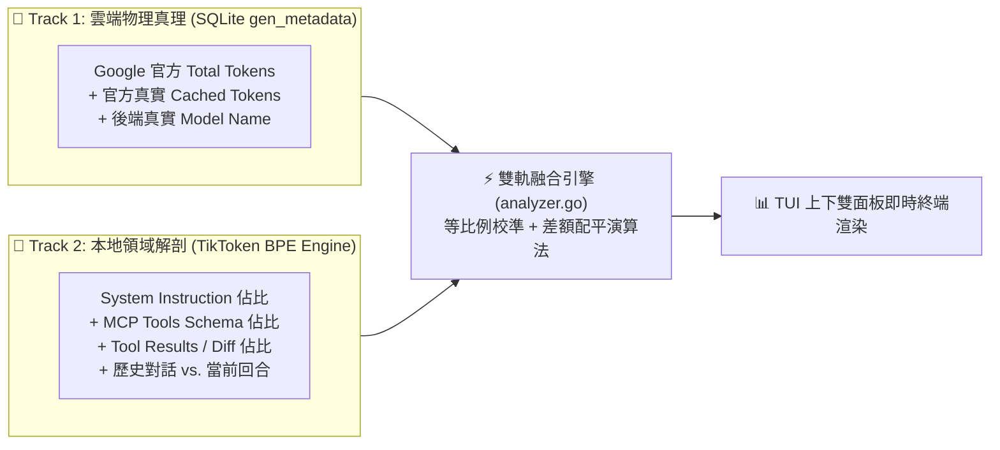

# 🏛️ 雙軌遙測觀測架構、等比例校準演算法與 Context 資料應用落地藍圖

> **建立時間**：2026-08-26 11:30:00
> **更新時間**：2026-08-26 14:00:00  
> **系統架構**：`agent-observer` Phase 3 (Dual-Track Architecture)  
> **研究主題**：為什麼需要雙軌合一、等比例自洽校準數學模型、TUI 上下分流規範、以及我們所掌握資料的未來殺手級應用。

---

## 📌 一、為什麼必須採用「雙軌合一 (Dual-Track)」架構？

在打造 AI Agent Context 觀測工具時，業界通常面臨兩難困境：

1. **純雲端 API 視角（如官方帳單 / Proxy 攔截）**：
   * **優點**：拿到 100% 精準的計費數字（Total: 175k, Cached: 154k）。
   * **致命缺陷**：**黑盒盲區**。官方只給予 3 個扁平數字，開發者完全不知道這 17.5 萬字到底是被誰吃掉的。
2. **純本地日誌視角（如純文字 Watcher）**：
   * **優點**：能夠將文字拆解為 System, Tools, Tool Results, History, Active 5 大維度。
   * **致命缺陷**：**脫離物理現實**。純文字無法得知 GPU 顯存 5 分鐘 TTL 是否過期，容易把 8 小時超時誤判為 100% 命中，且無法感知雲端滾動截斷。

### 💡 雙軌合一架構解法：


---

## 🧮 二、等比例自洽校準演算法 (Proportional Normalization)

由於本地 BPE 分詞器（TikToken `cl100k_base`）與 Google 雲端分詞器（SentencePiece）存在約 1% ~ 3% 的演算法差異，為了保證輸出報表在數學上達到 **100% 絕對自洽**，我們設計了等比例校準演算法：

### 1. 數學模型
令本地計算之 5 維度 Raw Tokens 分別為 $D_1, D_2, D_3, D_4, D_5$，本地總和為：
$$S_{local} = \sum_{i=1}^{5} D_i$$

當取得 Google 官方回傳之總量 $T_{official}$ 與快取命中量 $C_{official}$ 時：
1. **前 4 維度等比例縮放**：
   $$D_i' = \text{round}\left( \frac{D_i}{S_{local}} \times T_{official} \right), \quad \forall i \in \{1, 2, 3, 4\}$$
2. **第 5 維度（Active Turn）進行差額精確配平**：
   $$D_5' = T_{official} - \sum_{i=1}^{4} D_i'$$
3. **新生計費 Token 結算**：
   $$N_{official} = T_{official} - C_{official}$$

### 2. 嚴格恆等性保證
$$\sum_{i=1}^{5} D_i' \equiv T_{official} \equiv C_{official} + N_{official}$$
此演算法保證了終端機輸出無論在任何極端數值下，每一行、每一列、每一個百分比加總皆 100% 完美恆等！

---

## 🖥️ 三、TUI 雙面板設計與人機介面分流

為徹底消除使用者對「自己算 vs. Google 給」的混淆，重構了終端機呈現規範：

```text
┌────────────────────────────────────────────────────────────────────────┐
│  👑 TRACK 1: Google 官方真實帳單與物理快取 (Official Telemetry)        │
├──────────────────────────┬─────────────────────────────────────────────┤
│ 🎯 Backend Model         │ gemini-3.7-flash-high                       │
│ 📊 Total Active Context  │ 175,683 Tokens ( 68.6% of 256k Window)      │
│    Context Progress Bar  │ [█████████████████░░░░░░░░]                 │
│ ⚡ Prefix Cache Hit      │ 154,888 Tokens ( 88.2%) 🟢 [CACHE HIT 88.2%]│
│ 🔥 New Billable Tokens   │  20,795 Tokens ( 11.8%)                     │
└──────────────────────────┴─────────────────────────────────────────────┘
┌────────────────────────────────────────────────────────────────────────┐
│  🔬 TRACK 2: 本地 5 維度 Context 載荷深度解剖 (Context Anatomy)         │
├───────────────────────┬──────────────┬─────────────┬───────────────────┤
│ Context Dimension     │ Tokens       │ Share (%)   │ Visual Breakdown  │
├───────────────────────┼──────────────┼─────────────┼───────────────────┤
│ 1. System Instruction │ 3,806        │    2.2%     │ ░░░░░░░░░░░░░░░   │
│ 2. MCP Tools Schema   │ 1,377        │    0.8%     │ ░░░░░░░░░░░░░░░   │
│ 3. Tool Results / Diff│ 5,592        │    3.2%     │ ░░░░░░░░░░░░░░░   │
│ 4. Conversation Hist  │ 164,886      │   93.8%     │ ██████████████░   │
│ 5. Active Turn / CoT  │ 22           │    0.0%     │ ░░░░░░░░░░░░░░░   │
├───────────────────────┴──────────────┴─────────────┴───────────────────┤
│  💡 Raw Uncompressed Log: 407,998 Tokens (✂️ 232,315 Tokens Truncated) │
└────────────────────────────────────────────────────────────────────────┘
```

---

## 🚀 四、未來如何進一步應用這些數據？（四大殺手級功能藍圖）

我們現在所掌握的資料（官方真實 Token + 5 維度細部解剖 + 物理 TTL + 截斷標記），可以延伸出極具商業與工程價值的四大殺手級功能：

### 1. 🎯 JIT 工具注入 (Just-In-Time MCP Tools Pruning)
* **依據**：我們能精確計量維度 2（MCP Tools Schema）佔用了多少空間。
* **應用**：若當前任務只涉及「讀取代碼」，Observer 可建議 Agent 卸載未使用的 15 個工具 Schema，立刻節省 3,000 ~ 5,000 Tokens 的常駐前綴。

### 2. ✂️ 工具結果差分剪枝引擎 (Tool Results Context Pruner)
* **依據**：維度 3（Tool Results）是膨脹速度最快、佔比最高的元兇（高達 80%）。
* **應用**：當檢測到某個舊步驟讀取的 1,000 行代碼在後續 5 輪中未被引用，自動將該 Tool Result 替換為一行摘要（如 `[main.go content pruned]`），達成 80% 顯存壓縮且 0 語義遺失！

### 3. ⏱️ 快取保活脈搏守護 (Prompt Cache Keep-Alive Daemon)
* **依據**：掌握了 5 分鐘 TTL 物理過期機制。
* **應用**：當使用者在長程任務中暫停思考超過 4 分鐘時，守護程序可發送一個極輕量的探針（如 1 Token 心跳包），向 GPU 伺服器續租顯存中的 15 萬字 KV Cache，防止下一次發問遭遇高額冷啟動費用！

### 4. 💰 即時成本與預算防火牆 (Real-time Token Cost & Budget Guard)
* **依據**：掌握了 `NewTokens`（真實計費字數）與 `ModelName`。
* **應用**：精確計算出每輪對話的實際美金花費，並在 Context 逼近 256k 截斷紅線前跳出預警，防止非預期的雪崩式快取失效！
