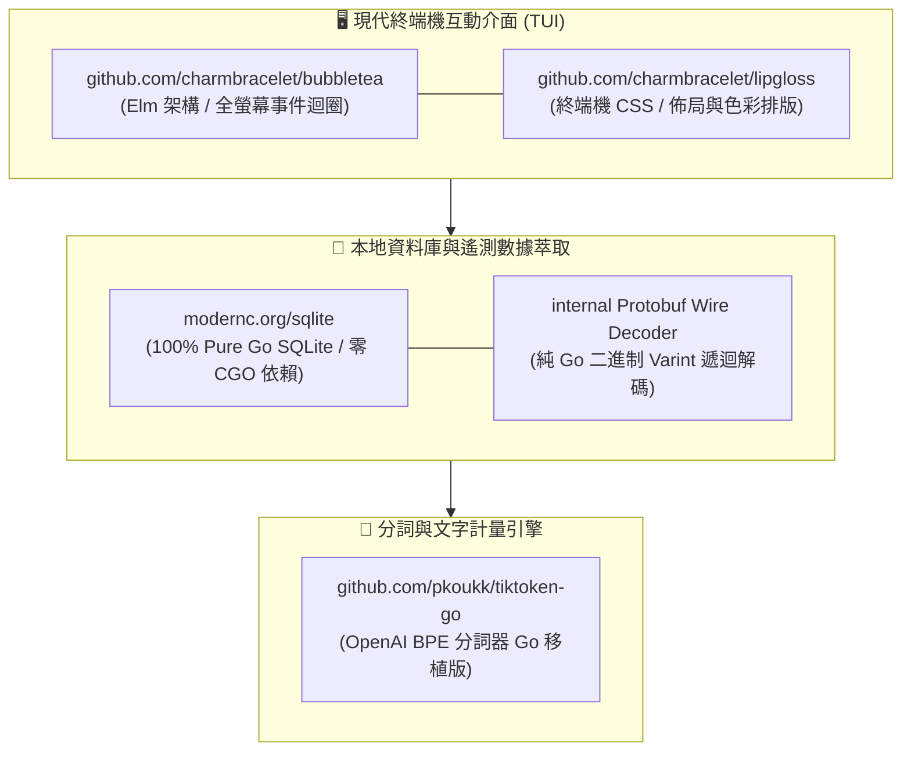

# 📚 Go 現代 TUI、資料庫與分詞套件深度教學指南 (Learning Deep Dive)

> **建立時間**：2026-08-26 11:30:00
> **更新時間**：2026-08-26 14:00:00  
> **適用目標**：未來系統學習 Go 語言高效能全螢幕 TUI、零 CGO 資料庫、BPE 分詞與 Protobuf 逆向解碼的實戰寶典。  
> **涵蓋核心套件**：`bubbletea`, `lipgloss`, `modernc.org/sqlite`, `tiktoken-go`, 以及手刻 `Protobuf Wire Format`。

---

## 🧭 一、核心技術棧與套件全景圖

在打造 `agent-observer` 時，我們精選了現代 Go 語言生態系中最頂級、零外部 C 依賴、開箱即用的現代化套件：

---

## 🎨 二、`github.com/charmbracelet/bubbletea` (現代 TUI 核心框架)

### 1. 它是什麼？
`Bubble Tea` 是由 Charm 團隊打造的 Go 語言全螢幕終端機框架，被譽為「Go 語言中的 React/Elm」。著名的 `k9s`、`lazygit`、`glow` 等頂級 CLI 工具背後都深受其思想啟發。

### 2. 核心原理：The Elm Architecture (TEA)
Bubble Tea 將終端機應用嚴格拆解為 **三位一體 (Model-Update-View)**：
* **`Model` (狀態模型)**：儲存畫面上所有的數據（如當前頁面、選中的 Step、歷史清單、焦點欄位、滾動偏移）；
* **`Update` (事件處理器)**：接收外部事件（鍵盤按鍵 `tea.KeyMsg`、視窗縮放 `tea.WindowSizeMsg`、後台非同步資料 `tea.Msg`），計算並回傳**「全新狀態的 Model」**；
* **`View` (純字串渲染器)**：一個純函數，將當前的 Model 狀態轉化為一個包含 ANSI 顏色的多行字串。
* **Alternate Screen Buffer**：啟動時向終端機發送 ANSI 控制碼切換至專屬畫布，退出時乾淨還原，**完全不會在原本的 Shell 中留下捲動垃圾日誌**。

---

## 💅 三、`github.com/charmbracelet/lipgloss` (終端機 CSS 樣式排版)

### 1. 它是什麼？
`Lipgloss` 是配合 Bubble Tea 使用的宣告式樣式庫，專門用來定義終端機的邊框、文字顏色、背景色、對齊、外距 (Margin) 與內距 (Padding)，被稱為「終端機的 CSS」。

### 2. 核心原理與滿版佈局 (100% Full-Screen Layout)
傳統終端機色彩需手動拼接複雜的 ANSI 跳脫字元。Lipgloss 將其抽象化為鏈式 API，並支援自適應滿版：
* **寬度無縫填滿**：左欄寬度 `32%`，右欄寬度 `m.width - listWidth - 4`，兩欄緊密貼合、無邊界浪費；
* **高度永久鎖定**：`.Height(fixedHeight).MaxHeight(fixedHeight)` 搭配空行填充（Line Padding），保證文字長度變動時**框線絕對靜止、零抖動**。

---

## 🗄️ 四、`modernc.org/sqlite` (純 Go 零 CGO SQLite 引擎)

由 `modernc` 社群開發的 **100% Pure Go 實作的 SQLite 驅動程式**。不需要 CGO (`CGO_ENABLED=0`)，跨平台編譯零痛點。
* **非阻塞唯讀最佳實踐**：使用 URI 參數 `file:<path>?mode=ro&_journal=WAL`，保證**讀寫分離、零鎖表、零崩潰**。

---

## 🧮 五、`github.com/pkoukk/tiktoken-go` (BPE 高效分詞引擎)

OpenAI 官方開源分詞工具 `tiktoken` 的純 Go 移植版，支援 `cl100k_base` 與 `o200k_base`，單核心每秒可處理數十萬字，專門用於 5 維度文字拆解。

---

## 🔬 六、Protobuf Wire Format 手刻解碼原理

解析二進制 BLOB 中的 `Varint (7-bit LEB128)` 與 `WireType`，透過遞迴演算法直接挖出 `TotalTokens`、`CachedTokens` 與 `ModelName`。

---

## 🚀 七、`agent-observer` TUI 實機操作手冊與雙欄焦點導航 (Usage Manual)

在 `v0.4.1` 中，我們全面支援 **100% 滿版無縫雙欄排版** 與 **Vim 原生滾動熱鍵**：

### 1. 核心快捷鍵總表 (Keymap Reference)

| 按鍵 (Key) | 所在視圖 (Context) | 觸發動作 (Action) |
| :--- | :--- | :--- |
| **`1`** 或 **`d`** | 任何視圖 | 切換至 **【📊 雙軌即時儀表板 (Live Dashboard)】** |
| **`2`** 或 **`h`** | 任何視圖 | 切換至 **【📜 歷史步驟瀏覽器 (History Explorer)】** |
| **`Tab`** / **`Enter`** / **`→`** / **`l`** | 歷史視圖 (左欄焦點) | **將焦點移入右側詳細檢視器 (Focus Right Pane)** |
| **`Tab`** / **`Esc`** / **`←`** / **`h`** | 歷史視圖 (右欄焦點) | **將焦點切換回左側步驟清單 (Focus Left Pane)** |
| **`↑` / `↓`** (或 **`k` / `j`**) | 歷史視圖 (左欄焦點) | **在左側清單切換選中的 Step**（右側內容連動更新） |
| **`↑` / `↓`** (或 **`k` / `j`**) | 歷史視圖 (右欄焦點) | **在右側詳細內容中上下捲動 1 行** |
| **`Ctrl + u`** / **`Ctrl + d`** | 歷史視圖 | **⭐ 【Vim 原生】半頁快速上下捲動 (Half-Page Scroll)** |
| **`Ctrl + b`** / **`Ctrl + f`** | 歷史視圖 | **⭐ 全頁快速翻頁 (Full-Page Scroll / PgUp / PgDn)** |
| **`g` (Home)** / **`G` (End)** | 歷史視圖 | 快速跳至最舊 / 最新步驟（或滾動至最頂/最底） |
| **`q`** 或 **`Ctrl+C`** | 任何視圖 | **安全退出 TUI 應用**（乾淨還原終端機視窗） |

---

### 2. 歷史瀏覽器滾動鎖死 Bug 修復原理 (Scroll Boundary Clamp)

* **Bug 根源**：過去按下 `↓` 時 `detailScroll` 無限制累加至數百，導致滾到底部後必須按數百次 `↑` 才能往上滾動（假死現象）。
* **修復方案**：在 `Update` 迴圈中以 `maxScroll = totalLines - availableLines` 嚴格限制邊界：
  $$0 \le \text{detailScroll} \le \max(0, \text{totalLines} - \text{availableLines})$$
* **成果**：滾動到最後一行立即鎖定，按一下 `↑` 或 `Ctrl+u` **立刻瞬間往上捲動，絲滑無比！**
