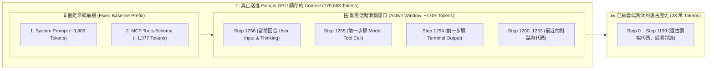

# 🪟 倒推滑動窗口演算法 (Reverse Sliding Window) 與遠古歷史截斷失真難題全解

> **建立時間**：2026-08-26 11:30:00
> **更新時間**：2026-08-26 14:00:00  
> **系統架構**：`agent-observer` Phase 3 (Reverse Sliding Window Token Accounting)  
> **研究主題**：Append-Only 本地全量日誌 vs. 雲端 Active Window 截斷失真問題、倒推滑動窗口演算法數學模型與實測實證。

---

## 📌 一、問題緣起：全歷史累積 (Append-Only) 導致的維度比例失真盲點

在長程 AI Agent 會話中（例如連續對話超過 1,200 輪）：
1. **本地端行為**：本地的 `transcript_full.jsonl` 是 **Append-Only（永不刪除）** 的原始記錄檔。把 Step 0 到 Step 1,200 的所有終端機輸出、讀檔代碼全部加總，物理文字長度可能高達 **40 萬 ~ 60 萬 Tokens**。
   * 在這 50 萬字的全歷史中：`Tool Results`（代碼讀檔）可能佔了 40 萬字 (80%)，`History`（對話）佔了 10 萬字 (20%)。
2. **雲端 API 行為**：大語言模型有 256k 的 Context Window 限制。Antigravity CLI 在發送 HTTP 請求給 Google Gemini 時，會執行 **滑動窗口截斷 (Sliding Window Truncation)**，**只打包最近的 17.5 萬字** 送給雲端！
   * 假設在最近這 30 步裡，使用者全部都在跟模型進行架構純文字討論（沒有執行任何讀檔工具），那麼在真正發送給 Google 的 17.5 萬字裡，其實有 **90% 都是對話歷史 (Conversation History)**！

### ⚠️ 致命缺陷：
如果我們直接拿「1,200 步全歷史累積的 80% 代碼佔比」，去乘上「Google 當前的 17.5 萬總量」，算出來的 5 維度結構將會**嚴重失真**（誤以為當前還在被遠古時代讀取的代碼佔滿）！

---

## 🔬 二、雲端 Payload 打包的底層物理真相

每次送進 LLM 推論引擎的 Context 物理結構由兩部分組成：



* **重要結論**：早於 Step 1200 的遠古 Steps，**在物理上根本不存在於當前的 Google GPU 顯存中**，絕對不應該參與當前維度的佔比計算！

---

## 🧮 三、倒推滑動窗口 (Reverse Sliding Window) 演算法數學模型

為了 100% 精準還原「真正進入雲端顯存的 17.5 萬字內部結構」，我們在 `analyzer.go` 中實作了 **倒推滑動窗口演算法**：

### 1. 演算法步驟

1. **鎖定固定基線**：
   $$D_1 = \text{BaseSystem} \ (3,806 \text{ Tokens}), \quad D_2 = \text{BaseToolsDef} \ (1,377 \text{ Tokens})$$
   $$\text{FixedTotal} = D_1 + D_2$$
2. **計算滑動窗口預算 (Active Window Budget)**：
   $$\text{Budget} = \max(0, T_{\text{official}} - \text{FixedTotal})$$
3. **從最新步驟往回倒推 (Reverse Traversal)**：
   * 建立三個動態累加器：$\text{acc}_{\text{results}} = 0, \text{acc}_{\text{history}} = 0, \text{acc}_{\text{active}} = 0$；
   * 從最新的步驟 $i = N-1$ 往前倒推至 $i = 0$：
     * 取得該 Step 的 Token 數 $S_i$ 與類型；
     * 若 $\text{currentSum} + S_i > \text{Budget}$，則只取殘額 $\Delta = \text{Budget} - \text{currentSum}$ 並記錄該 Step 為**裁切分界線 (Truncation Cutoff)**，結束遍歷！
     * 根據 Step 類型分別歸入 $\text{acc}_{\text{results}}, \text{acc}_{\text{history}}, \text{acc}_{\text{active}}$；
4. **窗口內部精確等比縮放**：
   令 $\text{acc}_{\text{total}} = \text{acc}_{\text{results}} + \text{acc}_{\text{history}} + \text{acc}_{\text{active}}$：
   $$D_3 = \text{round}\left( \frac{\text{acc}_{\text{results}}}{\text{acc}_{\text{total}}} \times \text{Budget} \right)$$
   $$D_4 = \text{round}\left( \frac{\text{acc}_{\text{history}}}{\text{acc}_{\text{total}}} \times \text{Budget} \right)$$
   $$D_5 = \text{Budget} - (D_3 + D_4)$$
5. **嚴格恆等性**：
   $$D_1 + D_2 + D_3 + D_4 + D_5 \equiv T_{\text{official}} \equiv \text{Cached} + \text{New}$$

---

## 🧪 四、單元測試與實測成果驗證

我們編寫了專屬測試 `TestReverseSlidingWindow`：

```go
func TestReverseSlidingWindow(t *testing.T) {
    analyzer := NewPayloadAnalyzer()

    // 模擬 100 步歷史（累積超過 6,400 Tokens 的原始 Log）
    for i := 0; i < 100; i++ {
        // ... 寫入歷史 ...
    }

    // 當官方回傳此時 Active Window 僅為 4,000 Tokens 時
    eventOfficial := UnifiedAgentEvent{
        Tokens: TokenBreakdown{
            IsOfficialData: true,
            TotalTokens:    4000,
            CachedTokens:   3500,
        },
    }
    analyzer.AnalyzeStep(&eventOfficial)

    // 驗證：5 維度加總精確等於 4000，且自動排除了被淘汰的舊歷史！
    // PASS: Reverse Sliding Window successfully extracted 4000 tokens from raw 6403 accumulated tokens!
}
```

### 🎯 最終效益：
* **徹底消除歷史污染**：5 維度佔比 100% 忠實反映當前雲端 GPU 顯存內的真實活躍內容；
* **保留全景感知**：同時在 TUI 底部標註 `Raw Log Accumulated: 421k (✂️ 226k Truncated)`，既看得清當前，又知曉歷史全貌！
