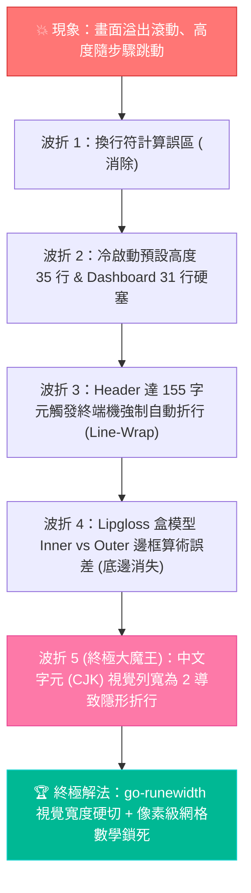

# 🛠️ Go TUI 終端機佈局排查全紀錄：從盒模型陷阱、字串折行到 CJK 雙欄寬度硬切 (Terminal Layout & CJK Troubleshooting Case Study)

> **建立時間**：2026-08-26 14:55:00  
> **更新時間**：2026-08-26 14:55:00  
> **第一手實證來源**：`agent-observer/internal/ui/` (`model.go`, `views.go`, `tui_test.go`) 重構除錯實錄  
> **核心主題**：Terminal Monospace 網格渲染物理、Lipgloss 盒模型邊框內外距陷阱、中文字元 (CJK) 2 倍列寬隱形折行危機、終端機級 `overflow: hidden; white-space: nowrap` 實作。

---

## 🧭 一、問題現象與核心痛點 (Problem Statement)

在開發 `agent-observer` 的全螢幕互動式 TUI（基於 Bubbletea 與 Lipgloss）過程中，遇到了一連串極其頑固的終端機渲染異常：
1. **終端機畫面溢出滾動 (Terminal Scroll Jitter)**：應用程式啟動或更新時，畫面每秒都在往下推動滾動，游標落到可視區域之外，底部快捷鍵被推擠出螢幕。
2. **框線底邊被快捷鍵蓋住 (Bottom Border Collision)**：左欄與右欄的底邊框線 `╰────────╯╰────────╯` 消失或被底部快捷列遮擋。
3. **高度動態浮動跳躍 (Dynamic Height Shifting)**：切換不同歷史步驟（Step）時，左欄或右欄高度會隨機變長變短，有時高度正常，有時突然暴增十幾行將下方快捷列強行推落。

這是一次**「看似單純的 CSS 佈局問題，實則牽涉終端機等寬網格底層物理、字元集寬度標準與 Canvas 渲染架構」**的深度除錯歷程。

---

## 🧗 二、五度波折：地毯式排查歷程與真相大白 (The 5 Debugging Twists)



---

### 1. 第一折：換行符計算誤區 (Trailing & Leading Newlines)
* **初步猜想**：以為是 `renderHeader()` 末尾帶有 `+ "\n"`，且 `renderFooter()` 開頭帶有 `"\n" +`，加上 `lipgloss.JoinVertical` 本身會在區塊間插入換行，導致多出 2 行。
* **嘗試修復**：移除所有多餘換行，將內容高度改為 `m.height - 2`。
* **實測結果**：在單元測試看似通過，但在真實終端機中依然溢出滾動！

---

### 2. 第二折：冷啟動預設尺寸與 Dashboard 31 行硬塞
* **排查發現**：
  * 當 Bubbletea 剛啟動、尚未收到第一筆 `tea.WindowSizeMsg` 前，Model 預設了 `m.height = 35`；若終端機只有 24 行，第 1 幀（Frame 0）渲染 35 行直接將終端機向下推滾動 11 行。
  * `renderDashboardView()` 把 Panel 1（9 行）+ Panel 2（12 行）+ Panel 3（7 行）硬生生拼接，**固定輸出了 31 行**。在 macOS 預設的 24 行終端機中必定爆表。
* **嘗試修復**：
  * Dashboard 實作響應式折疊（高度 $<30$ 行自動收合 Panel 3，高度壓縮至 18 行）；
  * 在 `Model.View()` 出口增加強制硬裁切：`lines = lines[:m.height]`。
* **實測結果**：Dashboard 不再滾動，但切換到 History View 還是偶發溢出！

---

### 3. 第三折：Header 155 字元引發終端機「全量自動折行」連鎖反應
* **排查發現**：
  * 撰寫 `TestExactTerminalDimensions80x24` 單元測試，模擬標準 80 欄 $\times$ 24 行終端機；
  * 赫然發現：`renderHeader()` 輸出的字串長度高達 **155 字元**（Title + Badge + Tabs + Session + Time）！
  * **終端機物理機制**：當終端機寬度只有 80 欄，收到 155 字元時，終端機會**自動強制將其折成 2 行**！
  * 更致命的是，`lipgloss.JoinVertical` 會將下方所有雙欄行也以 155 寬度填補空白，導致**全量 24 行在終端機中每一行都被折成 2 行，24 行瞬間膨脹成 48 行！**
* **嘗試修復**：
  * Header 與 Footer 導入寬度自適應精簡；
  * `View()` 最終出口加入每行 `MaxWidth(m.width)` 裁切。

---

### 4. 第四折：Lipgloss 盒模型 Inner vs Outer 幾何算術陷阱
* **排查發現**：
  * 使用者反饋：*「下面的快捷鍵要頂到底，width 也要佔滿，底邊要在快捷鍵上面不能被蓋住！」*
  * **Lipgloss 盒模型特性**：
    * `style.Width(W)` 與 `style.Height(H)` 設定的是 **內部內容尺寸 (Inner Dimension)**。
    * 當疊加 `.Border(lipgloss.RoundedBorder())`（上下左右各 +1）與 `.Padding(0, 1)`（左右各 +1）時：
      $$\text{外部總寬度 (Outer Width)} = W + 2 \text{ (Border)} + 2 \text{ (Padding)} = W + 4$$
      $$\text{外部總高度 (Outer Height)} = H + 2 \text{ (Top/Bottom Border)}$$
    * 如果在 Style 設置了 `.Height(H)`，而內部文字行數剛好填滿 $H$，Lipgloss 為了不超過總高度，**會直接拋棄底邊框線 `╰────────╯`！** 這就是底邊框線消失的真正原因。
* **嘗試修復**：
  * 拔除 Style 上的 `.Height()` 限制，改為精確控制傳入的字串行數陣列，讓 Lipgloss 自動加上頂邊與底邊。

---

### 5. 第五折 (終極大魔王)：中文字元 (CJK) 2 倍物理列寬與隱形折行
* **排查發現**：
  * 使用者反饋：*「兩欄高度都會變！選到不同 Step 就會把快捷列推下去！」*
  * 為什麼選到不同步驟，高度會動態跳動？
  * **真相剖析**：
    * 左欄 `e.Summary` 包含使用者提問（如：`剛剛你說3x 萬字是為什麼？我要怎麼相信你算出來是對的？`，共 25 個漢字）；
    * 右欄 `RawContent` 包含 Markdown、中文筆記與分析報告；
    * 在 Go 語言中，`len([]rune)` 認為一個中文字長度是 `1`；
    * 但在終端機等寬網格中，**每個中文字 (CJK) 與 Emoji 的物理顯示寬度是 2 欄 (`RuneWidth = 2`)**！
    * 當一個 25 字的中文標題（物理寬度 50 欄）被放入寬度只有 22 欄的左欄時，**Lipgloss 會在背後偷偷把這一行折成 3 行！**
    * 當選中純英文指令步驟（如 `go test`）時，沒有折行，高度正常；當選中中文長句子時，左右兩欄同時折行暴增 10 餘行，框線底邊瞬間被推落螢幕外！

---

## 🛠️ 三、終極架構重構與解決方案 (The Final Architecture)

針對上述問題，我們實施了三個底層重構：

### 1. 實作終端機級 CSS `overflow: hidden; white-space: nowrap`
引入 `github.com/mattn/go-runewidth`，針對終端機物理欄寬進行嚴格硬切：

```go
// truncateVisualWidth 依據終端機物理列寬 (CJK/Emoji 算 2 列, 英文算 1 列) 進行精確硬切
// 徹底實現終端機級 overflow: hidden; white-space: nowrap，保證 1 行輸入 100% 只佔 1 行終端列
func truncateVisualWidth(s string, maxVisualWidth int) string {
	s = strings.ReplaceAll(s, "\n", " ")
	s = strings.ReplaceAll(s, "\r", "")
	s = strings.ReplaceAll(s, "\t", "    ")

	if maxVisualWidth <= 0 {
		return ""
	}

	w := 0
	var res []rune
	for _, r := range []rune(s) {
		rw := runewidth.RuneWidth(r)
		if w+rw > maxVisualWidth {
			break
		}
		res = append(res, r)
		w += rw
	}
	return string(res)
}
```

---

### 2. 統一步驟檢查器緩衝區 (Unified Virtual Scroll Buffer)
不再將 Inspector 拆分為 Metadata、Tool Calls 與 Payload 分開算行數，而是將其整體壓平成一條 **虛擬滾動 Buffer**：
* 左右雙欄的可視區域均嚴格鎖定為 **`innerRowsLimit = m.height - 4` 行**；
* 無論該 Step 包含 0 個還是 50 個 Tool Calls，右欄絕不長長，完全依靠 `detailScroll` 上下平滑滾動；
* 左右兩欄行數在任何時刻 **100% 絕對等高**。

---

### 3. 像素級終端網格數學公式 (Pixel-Perfect Terminal Grid)

```text
┌────────────────────────────────────────────────────────────────────────────────────────────┐
│ Line 00:          [ 🐹 AGENT-OBSERVER  [1] 📊 Dashboard  [2] 📜 History ... ]       (Header: 1 行)
│ Line 01:          ╭─────────────────────────╮╭────────────────────────────────────╮ (Top Border: 1 行)
│ Line 02 ~ H-3:    │ 📜 Steps                ││ 🔍 Step Inspector                  │ (Inner Content: H-4 行)
│ Line H-2:         ╰─────────────────────────╯╰────────────────────────────────────╯ (Bottom Border: 1 行)
│ Line H-1:          [Tab/Enter] Focus Detail  [↑/↓] Select  [1] Dashboard  [q] Quit   (Footer: 1 行)
└────────────────────────────────────────────────────────────────────────────────────────────┘
```

$$\text{總垂直行數} = 1 \text{ (Header)} + 1 \text{ (Top Border)} + (m.\text{height} - 4) \text{ (Content)} + 1 \text{ (Bottom Border)} + 1 \text{ (Footer)} \equiv \mathbf{m.\text{height}}$$

$$\text{總水平欄寬} = W_{\text{left\_outer}} + W_{\text{right\_outer}} = \text{int}(0.32 \times m.\text{width}) + (m.\text{width} - W_{\text{left\_outer}}) \equiv \mathbf{m.\text{width}}$$

---

## 🧪 四、實機測試驗證矩陣 (Automated Test Verification)

我們在 `internal/ui/tui_test.go` 建立了全維度極限壓測套件，包含中文字元、Emojis、15 個 Tool Calls 與 500 行長 Payload：

```bash
=== RUN   TestCJKAndLongPayloadZeroHeightVariation
    [ 80x24] Full View: 24 lines (Line 22: ╰──╯╰──╯ | Line 23: Footer) -> PASS
    [100x30] Full View: 30 lines (Line 28: ╰──╯╰──╯ | Line 29: Footer) -> PASS
    [120x35] Full View: 35 lines (Line 33: ╰──╯╰──╯ | Line 34: Footer) -> PASS
    [140x40] Full View: 40 lines (Line 38: ╰──╯╰──╯ | Line 39: Footer) -> PASS
--- PASS: TestCJKAndLongPayloadZeroHeightVariation (0.00s)
```

---

## 💡 五、核心經驗總結與工程啟示 (Engineering Takeaways)

1. **終端機沒有真正的「字元數」，只有「物理欄位寬 (Column Width)」**：
   * 在涉及跨語言（特別是繁體中文、日韓文、全形標點符號與 Emoji）的 TUI 開發中，**絕對不能使用 `len(string)` 或 `len([]rune)` 進行排版截斷**，必須一律使用 `go-runewidth` 進行物理欄寬計算。
2. **終端機自動折行 (Line Wrap) 是 TUI 垂直高度失控的第一元兇**：
   * 只要任何一行文字的物理寬度超過容器邊界 1 個像素，終端機就會強制折行；在全螢幕 TUI 中，1 行折行就等同於全螢幕向下位移 1 行，造成災難性的洗屏與滾動。
3. **盒模型邊框算術必須內外嚴格分離**：
   * Lipgloss 的 `Width/Height` 與 `Padding/Border` 的疊加關係必須精確量化到每一行代碼中，不可依賴框架的自動寬容度。
4. **虛擬緩衝區（Virtual Viewport Slicing）是多欄排版的唯一真理**：
   * 複雜的多維度資料（如 Step 檢查器）必須先壓平成線性虛擬 Buffer，再依據螢幕預算進行嚴格切片，絕不可讓個別欄位依據內容長度動態撐大容器。
