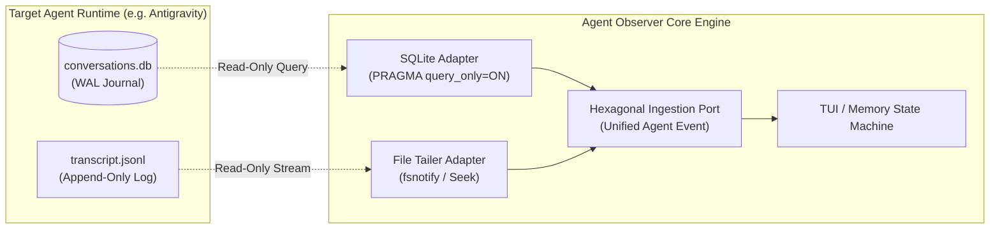
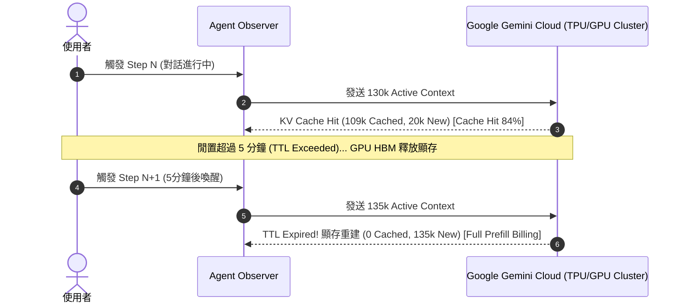

# Agent Session 資料庫架構、六角架構適配器模式與 TTL 記憶體淘汰機制深度剖析

- **建立時間**: 2026-08-27 01:30:00
- **更新時間**: 2026-08-27 01:30:00
- **模組歸屬**: `02_architecture` / `01_theory`
- **狀態**: `RAW_INTAKE` (待 wiki-distiller 二次提煉)

---

## 🎯 核心問題與背景討論

在開發 `agent-observer` 的即時觀測引擎時，我們深入討論了三個關鍵的架構與系統設計核心問題：
1. **資料存取本質**：目前 Observer 呈現的歷史與遙測數據，是直接 Query 目標 Agent（如 Google Gemini / Antigravity）的底層資料庫，還是我們自身有一套獨立的資料庫在背後進行蒐集與持久化？
2. **多 Agent 支援與六角架構 (Hexagonal Architecture)**：當未來系統需要同時支援 Claude Code、OpenCode、Codex、Cursor、Aider 等多種異質 Agent 時，是否應該引入一套專屬的分析型資料庫？六角架構在其中扮演什麼角色？
3. **Session 生命週期與 TTL / 垃圾回收機制**：本地磁碟的 Session 歷史檔案是否會被系統自動 Garbage Collect (GC)？這與雲端 GPU 顯存中的 KV Cache TTL (Time-To-Live) 超時淘汰機制有何本質區別？

---

## 🏛️ 架構解析一：目前資料讀取模型（Zero-Intrusion Read-Only Ingestion）

### 1. 現行機制：以唯讀 WAL 模式直接對接底層資料源
目前 `agent-observer` 採取**零侵入性（Zero-Intrusion）、無中介資料庫（No Intermediary DB）**的即時監聽架構：
* **Google Gemini SQLite 遙測庫**：以純 Go (`modernc.org/sqlite`) 連線 `~/.gemini/antigravity-cli/conversations/conversations.db`，設定 `PRAGMA query_only = ON;` 與 `PRAGMA journal_mode = WAL;`，以只讀方式萃取 `gen_metadata` 內的 Protobuf BLOB 遙測（包含官方 Token 計費與 Prefix Cache 命中率）。
* **會話日誌庫**：直接監聽 `~/.gemini/antigravity-cli/brain/<session-id>/.system_generated/logs/transcript.jsonl`，透過 Tail 讀取逐行 JSONL 獲取 Tool Calls、Payload 與思維鏈。

---

## 🧩 架構解析二：六角架構 (Hexagonal Architecture) 與專屬 Sink DB 的取捨

### 1. 六角架構的邊界解耦（Ports and Adapters Pattern）
在六角架構下，**Core Domain 絕對不依賴任何外部 Agent 的具體存儲格式**：
* **Core Unified Domain**：只認識 `core.UnifiedAgentEvent` 與 `core.TokenBreakdown`。
* **Adapter 層**：負責將各家 Agent 的特有日誌格式轉換為 Core 規範：
  * `antigravity_adapter`: 將 Gemini SQLite BLOB + JSONL $\to$ `UnifiedAgentEvent`
  * `claude_code_adapter`: 將 Claude Code JSON/Stream Logs $\to$ `UnifiedAgentEvent`
  * `codex_adapter`: 將 Codex Exec Traces $\to$ `UnifiedAgentEvent`

### 2. 為何現階段不需要專屬中介 DB，但未來可能需要「分析型儲存池 (Analytical Sink DB)」？

| 維度 | 現階段（直接 Adapter Stream 讀取） | 未來進階（獨立 Sink DB，如 DuckDB/SQLite） |
| :--- | :--- | :--- |
| **即時性 (Latency)** | 毫秒級（直接從檔案/WAL 讀取，零拷貝） | 需經過 Ingestion Pipeline 寫入後再 Query |
| **存儲開銷 (Storage)** | 零額外磁碟開銷（純記憶體狀態機維護） | 需額外佔用磁碟存儲複製後的事件 |
| **跨 Session 統計** | 需手動遍歷多個檔案進行聚合 | 可直接下 SQL 做跨會話成本分析、趨勢圖與 Token 排名 |
| **多 Agent 統一持久化** | 僅支援觀測當前掛載的 Session | 可將不同 Agent 的歷史彙整至單一分析庫中做離線研讀 |

> **決策結論**：
> 現階段 TUI 專注於「即時雙軌遙測與會話回放」，採用純 In-Memory State Machine + Adapter 直讀是最輕量、零延遲且無依賴的最佳解法；未來若擴展至「歷史花費報表、團隊 Token 審計儀表板」時，可於 Core 外部掛載 `DuckDB Storage Sink` 作為 Secondary Adapter。

---

## ⏳ 架構解析三：本地 Append-Only 日誌 vs GPU KV Cache TTL 淘汰機制

### 1. 本地磁碟 Session 日誌：永遠不被垃圾回收 (No Local TTL)
* 本地 `transcript.jsonl` 與 SQLite 記錄為 **Append-Only（只增不減）**，除非使用者手動清理，否則永遠保留在本地磁碟。
* 隨時間推移，本地累積的 Raw Log 可能達到數十萬甚至數百萬字元（例如 40 萬 Tokens）。

### 2. 雲端 GPU HBM KV Cache：硬性 5 分鐘 TTL 超時淘汰 (GPU Memory TTL)
* Google Gemini 服務端為了顯存資源利用率，針對用戶連線的 Prefix KV Cache 設定了 **~5 分鐘的 TTL (Time-To-Live)**。
* **物理現象**：
  * **活躍交互中（< 5 分鐘）**：請求命中 GPU HBM 中的 KV Cache，Cache Hit Rate 高達 80%~95%，New Tokens 僅計算新輸入部分。
  * **閒置超時（> 5 分鐘）**：GPU 顯存自動淘汰該 Session 的 KV Cache。下一次對話發送時，雖然本地 Context 依然完整，但 GPU 必須重新將 16.5 萬字的完整歷史全量進行 Prefill 矩陣計算，產生 **TTL Cold Start（冷啟動）**，該輪 New Tokens 驟增且 Cache 歸零。

