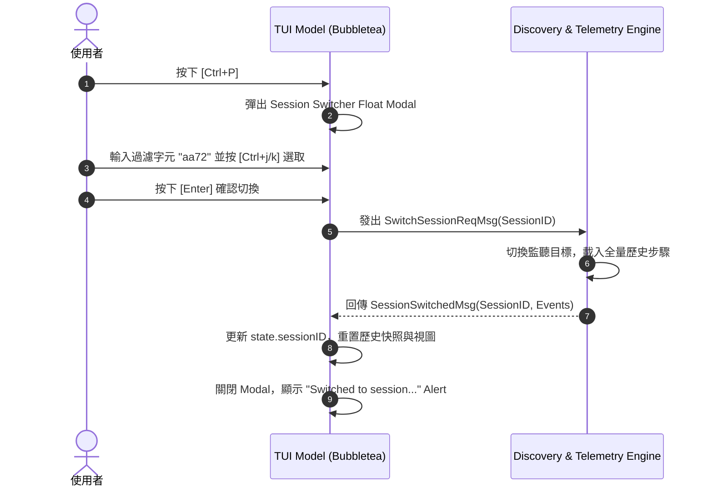

# 全域會話快切浮動面板 (Session Quick Switcher) 與動態發現機制實作

- **建立時間**: 2026-08-27 01:31:00
- **更新時間**: 2026-08-27 01:31:00
- **模組歸屬**: `02_architecture`
- **狀態**: `RAW_INTAKE` (待 wiki-distiller 二次提煉)

---

## 🎯 需求場景與痛點

在使用 `agent-observer` 監控 AI Agent 的過程中，使用者經常在多個工作區或歷史 Session 之間切換。過去 observer 只能在 CLI 啟動時指定單一 Session ID 或自動綁定最新會話，若想觀察另一個會話必須 `Ctrl+C` 退出程式後重新帶參數啟動。

為實現「**免重啟、隨時快速穿梭任意會話**」的無縫體驗，我們設計並實作了全域會話快切浮動面板（Session Quick Switcher）與動態會話探索器（Dynamic Discovery Engine）。

---

## 🏗️ 系統架構與動態探索管線

### 1. 會話探索器 (`internal/adapters/antigravity/discovery.go`)
探索器自動掃描本地 Antigravity 會話目錄池：
* 掃描路徑：`~/.gemini/antigravity-cli/conversations/` 與 `~/.gemini/antigravity-cli/brain/`。
* 萃取元數據：
  * `SessionID`: 會話唯一 UUID（如 `aa726359-08e2-4687-a15c-073a2f4a705b`）
  * `LastModified`: 最後修改時序，並按時間戳進行**降序排列 (Newest First)**
  * `StepCount`: 歷史步驟數（讀取 SQLite `steps` 表或 JSONL 行數）
  * `SizeMB`: 檔案大小 (MB)

```go
type SessionInfo struct {
	SessionID    string
	Title        string
	DBPath       string
	LogPath      string
	LastModified time.Time
	StepCount    int
	SizeMB       float64
}
```

### 2. 狀態機與訊息驅動切換管線



---

## ⌨️ 互動與 Vim-First 鍵盤操作體系

為了保證終端機極客的沉浸體驗，Session Switcher 採用 **Vim-First** 鍵盤設計：
1. **呼叫與關閉**：在任何視圖（Dashboard / History / Docs）隨時按下 **`Ctrl+P`** 即可呼叫或收合面板；按 **`Esc`** 亦可立即取消；
2. **即時模糊搜尋**：直接鍵入字元即時對 Session ID、標題或路徑進行大小寫不敏感過濾；
3. **雙模式游標移動**：
   * 在輸入搜尋詞時：支援 **`Ctrl+j` / `Ctrl+k`**、**`Ctrl+n` / `Ctrl+p`** 或 **`Tab` / `Shift+Tab`** 移動選取游標；
   * 在搜尋列為空時：支援原汁原味的 Vim **`j` / `k`** 與方向鍵 **`↑` / `↓`**；
4. **選中即掛載**：按下 **`Enter`** 即可在 10 毫秒內動態切換底層資料庫連線並重繪整個 TUI。

---

## 🧪 實機單元測試驗證

在 `internal/ui/tui_test.go` 中建立了完整的狀態機測試案例：
* `TestSessionSwitcherModalRenderingAndFilter`: 驗證彈窗渲染、`Ctrl+P` 快捷切換與搜尋過濾；
* `TestSessionSwitcherKeyboardNavigationAndActions`: 驗證 `Ctrl+j/k` 游標移動、Backspace 恢復列表與 Esc 取消；
* `TestDirectSessionSwitchMsgState`: 驗證 `SessionSwitchedMsg` 到達時，UI 歷史快照、最新事件與狀態列是否精準重置。
