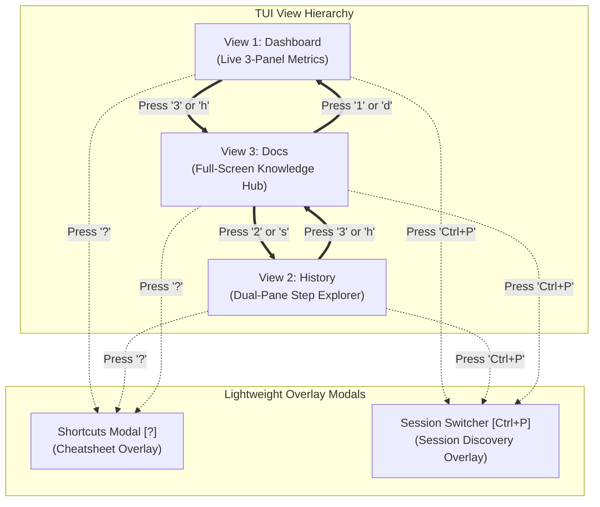

# 快捷鍵浮動面板與架構定義獨立頁面解耦架構設計

- **建立時間**: 2026-08-27 01:34:00
- **更新時間**: 2026-08-27 01:34:00
- **模組歸屬**: `02_architecture`
- **狀態**: `RAW_INTAKE` (待 wiki-distiller 二次提煉)

---

## 🎯 需求演進與職責分離 (Separation of Concerns)

在初期版本中，我們曾嘗試將「快捷鍵說明」與「Context 5 維度名詞釋義」混合在同一個 Help 浮動面板中。但在實際操作體驗中發現了兩個根本衝突：
1. **使用場景衝突**：
   * **快捷鍵查閱（Shortcuts）**：屬於**高頻、短暫、即用即收**的操作（按 `?` 瞄一眼，按 `Esc` 立即回原畫面繼續工作）；
   * **名詞與架構研讀（Docs）**：屬於**低頻、沉浸式、長篇閱讀**的學習（深入了解 Total Active Context、Raw Log Accumulated、Active Turn / CoT 與滑動窗口原理）；
2. **空間與擴充性衝突**：
   * 浮動面板（Float Modal）高度受限，若塞入長篇名詞定義，會造成彈窗過高遮擋背景，或無法支援長文本搜尋；
   * 若未來名詞定義持續擴充（例如新增 20 個架構術語），彈窗將不堪負荷。

因此，我們做出了架構重構決定：**將 Shortcuts 獨立為輕量浮動面板，將 Architecture Docs 升級為全螢幕獨立第 3 視圖 (`[3] Docs`)**。

---

## 🏗️ 雙模組架構設計



---

## 📖 View 3 Docs 的四大核心機制

### 1. 5 大維度與核心指標完整收錄 (`internal/ui/docs_view.go`)
* **5 Dimensions of Context Anatomy (Track 2)**: System Instruction, MCP Tools Schema, Tool Results / Diff, Conversation Hist, Active Turn / CoT.
* **Core Metrics & Ground Truth Billing (Track 1)**: Total Active Context, Prefix Cache Hit, New Billable Tokens, Raw Log Accumulated, TTL Cold Start.
* **Context Mechanics & Memory Physics**: Context Compaction, Reverse Sliding Window, Longest Common Prefix.

### 2. Vim-First 即時搜尋過濾器 (`/`)
* 按下 **`/`** 進入即時搜尋模式，鍵入關鍵字（如 `/cot`、`/accumulated`、`/compaction`），系統即時過濾 Category、Key 與 Desc；
* 按下 **`Enter`** 或 **`Esc`** 結束輸入，立即切換至滾動瀏覽模式；
* 按下 **`Esc`** 可一鍵清空搜尋條件。

### 3. 虛擬滾動緩衝區 (Virtual Scroll Buffer)
* 當搜尋或全量文檔行數超過螢幕高度時，採用 Viewport 虛擬切片演算法：
  $$\text{endLine} = \text{currentScroll} + \text{availableLines}$$
* 支援 **`j` / `k`**（逐行滾動）、**`Ctrl+d` / `Ctrl+u`**（翻半頁）與 **`g` / `G`**（跳至首尾）。

### 4. 嚴格定高盒模型防禦 (Strict Zero-Height Variation)
* 無論文檔包含 10 行還是 1000 行，外框高度永遠嚴格鎖定在 `innerRowsLimit = m.height - 4`；
* 空行自動以空字串補齊，超出版面自動虛擬滾動，保證外框大小絕對恆定，底框線與 Footer 永遠 100% 貼合螢幕底端。

---

## 🧪 單元測試驗證 (`TestView3DocsPageRenderingAndSearch`)

```go
func TestView3DocsPageRenderingAndSearch(t *testing.T) {
    m := NewModel("test-session", false)
    m.width = 100
    m.height = 30

    // 1. 按 '3' 切換至 Docs 視圖
    updated, _ := m.Update(tea.KeyMsg{Type: tea.KeyRunes, Runes: []rune("3")})
    m = updated.(Model)
    if m.activeView != ViewDocs {
        t.Fatalf("Expected activeView=ViewDocs, got %v", m.activeView)
    }

    // 2. 按 '/' 啟動搜尋並輸入 "cot"
    updated, _ = m.Update(tea.KeyMsg{Type: tea.KeyRunes, Runes: []rune("/")})
    m = updated.(Model)
    for _, r := range "cot" {
        updated, _ = m.Update(tea.KeyMsg{Type: tea.KeyRunes, Runes: []rune{r}})
        m = updated.(Model)
    }
    if !strings.Contains(m.View(), "Active Turn / CoT") {
        t.Errorf("Expected filtered view to contain 'Active Turn / CoT'")
    }
}
```
