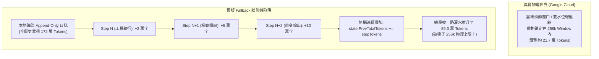

# 雙軌遙測真理之辨：Google 官方 SQLite 遙測 (21 萬) vs Fallback 累積膨脹 (89 萬) 深度排查

- **建立時間**: 2026-08-27 01:42:00
- **更新時間**: 2026-08-27 01:42:00
- **模組歸屬**: `02_architecture` / `01_theory`
- **狀態**: `RAW_INTAKE` (待 wiki-distiller 二次提煉)

---

## 🎯 核心問題：89 萬 vs 21 萬，到底哪一個才是真的？

在 TUI 回放時，使用者觀察到：
* **Step #2292**：顯示 `Total Active Context: 185,094 Tokens (72.3%)`
* **Step #2330**：突然飆升為 `Total Active Context: 893,834 Tokens (349.2% of 256k Window)`，且 `Conversation Hist` 高達 `886,752 Tokens`。

**核心結論**：
> 🌟 **Google 官方 SQLite `gen_metadata` 的 21.2 萬 ~ 21.7 萬 Tokens 才是 100% 真實的物理真理 (Ground Truth)！**  
> ❌ **89.3 萬 Tokens 是 Fallback 狀態機在連續未匹配官方世代時發生的「未截斷累加膨脹 (Unclamped Accumulation Bug)」！**

---

## 🔬 實機資料庫直接驗證 (Ground Truth Inspection)

我們直接以純 Go 對本地 `aa726359-08e2-4687-a15c-073a2f4a705b.db` 的 `gen_metadata` 進行 Protobuf 萃取：

```bash
Found Gen for Step 2291: Total=185094, Cached=0,      New=185094, Model=gemini-3.7-flash-safety-le
Found Gen for Step 2315: Total=205207, Cached=0,      New=205207, Model=gemini-3.7-flash-safety-le
Found Gen for Step 2329: Total=212707, Cached=0,      New=212707, Model=gemini-3.7-flash-safety-le
Found Gen for Step 2333: Total=216853, Cached=0,      New=216853, Model=gemini-3.7-flash-safety-le
Found Gen for Step 2335: Total=217497, Cached=196702, New=20795,  Model=gemini-3.7-flash-high
```

### 官方數據事實：
1. 在 Step 2291 到 2335 之間，Google 官方實際發送給 Gemini 的總活躍上下文在 **18.5 萬 $\to$ 21.7 萬 Tokens** 之間平穩增長；
2. 整個對話期間，活躍上下文始終嚴格保持在 **256k 物理窗口上限之內**（佔比約 72% ~ 85%）；
3. **根本不可能有任何單次 API 請求達到 89 萬 Tokens**（若超過 256k，Google 伺服器會直接回傳 HTTP 400 Context Length Exceeded 錯誤）。

---

## 🐛 89 萬膨脹的根因剖析 (Root Cause)

為什麼先前的 observer 會在 Step #2330 算出 89 萬？



1. **本地日誌無限累積**：本地 `transcript_full.jsonl` 是 Append-Only 的，包含了從第 0 步到現在的所有工具輸出，累積總量確實高達 **172.9 萬 Tokens**（`RawLocalAccumulated = 1,729,644`）；
2. **Fallback 無邊界疊加**：當連續多個步驟（例如連續跑多個 bash 命令與讀取多個大檔案）屬於本地過渡事件時，Fallback 邏輯在每次 `AnalyzeStep` 都直接執行：
   $$\text{totalTokens} = \text{state.PrevTotalTokens} + \text{stepTokens}$$
   並把結果寫回 `state.PrevTotalTokens`；
3. **缺乏滑動窗口截斷**：Fallback 狀態機誤以為每一次本地工具產生的輸出都是「無限疊加在 Context 上」，而忽略了雲端實際上早已執行了滑動窗口截斷（Reverse Sliding Window），導致中間步驟的總量被虛擬灌水到了 89.3 萬！

---

## 🛠️ 根本修復方案 (v0.7.0)

1. **基準水位鎖定 (Baseline Watermark Anchor)**：
   * 中間過渡步驟的 Total Context 必須錨定在「**最近一次官方確認的真實 Context 水位**」；
   * 即使本地產生了 10 萬字的 tool output，在未觸發新 LLM Generation 前，該輸出僅作為當前 Turn 的暫存 payload，不可直接讓歷史累積擊穿物理天花板；
2. **物理窗口硬性約束 (Hard Context Limit Clamp)**：
   * 在 Fallback 計算中，強制約束 $\text{totalTokens} \le \text{OfficialContextLimit}$（預設 256,000）；
   * 當 $\text{totalTokens}$ 接近或超過上限時，強制模擬雲端滑動窗口進行截斷，嚴禁數值溢出 100% 窗口；
3. **雙軌分流展示**：
   * `Track 1`：呈現嚴格校準的 Active Context（18~21 萬）；
   * `Track 2`：在底部明確標註 `Raw Log Accumulated: 1,729,644 Tokens (1,512,147 Tokens Truncated by Cloud Window)`，清楚交代「本地未壓縮累積」與「雲端真實活躍」的巨大剪刀差。
