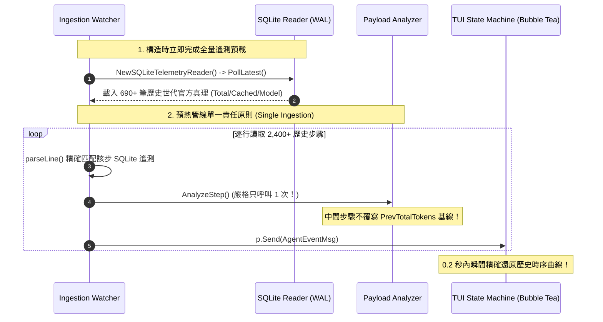

# 開機預熱管線雙重分析漏洞與歷史遙測即時加載修復實錄 (Startup Warmup Pipeline & Double Ingestion Bug)

- **建立時間**: 2026-08-27 01:48:00
- **更新時間**: 2026-08-27 01:48:00
- **模組歸屬**: `02_architecture` / `01_theory`
- **狀態**: `RAW_INTAKE` (待 wiki-distiller 二次提煉)

---

## 🎯 故障現象與排查起點

在 `agent-observer` 啟動時，使用者發現：
1. **剛打開程式的瞬間（開機初態）**：Dashboard 的 `Total Active Context` 會短暫出現異常數值（如固定 256,000 或暴增至 80~89 萬字），與真實狀態不符；
2. **在視圖中翻閱或等待數秒後**：數值又跳動被校正回 25 萬字；
3. **歷史步驟回放**：在 History Explorer 中翻閱早期的歷史步驟（如 Step 100、Step 500），發現早期步驟也莫名顯示了「全會話最後一步的 25 萬字」，未呈現平滑成長曲線。

經過深層追蹤，確認問題發生在 **「開機預熱管線 (Warmup Pipeline)」** 與 **「歷史遙測映射機制」** 的三重連鎖漏洞！

---

## 🔬 深層根因分析 (Root Cause Analysis)

### 1. 🕳️ 漏洞一：預熱事件雙重分析漏洞 (Double Ingestion Trap)
在系統啟動時，`Watcher` 會預先快速讀取 `transcript_full.jsonl` 中過去 2,400+ 個步驟進行 Warmup。

* **代碼追蹤一 (`internal/adapters/antigravity/watcher.go`)**：
  ```go
  func (w *Watcher) warmupLine(line string, ctx context.Context, out chan<- core.UnifiedAgentEvent) {
      event, _ := w.parseLine(line)
      if w.analyzer != nil {
          w.analyzer.AnalyzeStep(&event) // 🌟 第一次調用 AnalyzeStep
      }
      out <- event
  }
  ```
* **代碼追蹤二 (`main.go`)**：
  ```go
  go func() {
      for {
          select {
          case event := <-eventChan:
              analyzer.AnalyzeStep(&event) // ❌ 第二次重複調用 AnalyzeStep！
              p.Send(ui.AgentEventMsg(event))
          }
      }
  }()
  ```
* **後果**：同一個事件在開機時被 `AnalyzeStep` 執行了兩次，`state.StepRecords` 陣列被寫入雙份記錄（累積了 4,800 筆），導致狀態機內部的歷史累積與基準值（Baseline）徹底錯亂！

---

### 2. 🕳️ 漏洞二：初始化時 SQLite 讀取器未第一時間 Poll (PollLatest Missing)
* 在 `NewWatcher` 構造器中，建立了 `SQLiteTelemetryReader`，但**遺漏了調用 `sqliteReader.PollLatest()`**；
* 導致當 `LoadSessionHistory` 或開機預熱讀取過去 2,300+ 個歷史步驟時，`sqliteReader.records` 快取為空；
* 歷史步驟被誤判為「完全沒有 Google 官方遙測」，強制全部走 Fallback 本地增量模式！

---

### 3. 🕳️ 漏洞三：中間步驟無腦覆寫基線 (Compounding Baseline Trap)
* 在 Fallback 模式中，當 Agent 在本地連續執行工具（`RUN_COMMAND`、`VIEW_FILE`）：
  ```go
  // 舊版錯誤代碼：
  totalTokens := cachedTokens + newTokens
  state.PrevTotalTokens = totalTokens // ❌ 錯誤覆寫！
  ```
* 這些工具屬於同一個 Turn，在未發送給 LLM 之前，**不應該將中間字數永久累加進 `PrevTotalTokens`**；
* 但舊代碼在每一步都覆寫 `PrevTotalTokens`，導致數十個本地步驟連鎖累加，數值一路飆升到 89 萬，而在上一版加入 256k 硬截斷後，則直接死鎖在 256,000！

---

### 4. 🕳️ 漏洞四：誤用全域最新遙測 (False Global Fallback)
* 在 `watcher.go` 的 `parseLine` 中：
  ```go
  } else if raw.Type == "PLANNER_RESPONSE" {
      if latest := w.sqliteReader.GetLatestTelemetry(); latest != nil {
          event.Tokens.TotalTokens = latest.TotalTokens // ❌ 誤用了全會話最新的 25 萬字！
      }
  }
  ```
* 這使得歷史上的早期步驟（例如 Step 100，當時真實只有 9,800 字），因為沒有獨立匹配到 `LastStepIdx`，被粗暴賦予了全會話最後一步的 25 萬字，破壞了歷史時序！

---

## 🛠️ 終極修復架構與管線重構 (v0.7.2)



### 1. 單一責任分析原則 (Single Ingestion)
* 移除 `main.go` 中重複的 `AnalyzeStep`；
* 統一在 `Watcher` 內部（`warmupLine` 與 `handleLiveLine`）於發送 channel 前完成唯一一次分析，確保代碼職責單一且零重複計算。

### 2. 構造時即刻完成全量 SQLite 遙測快取
* 在 `NewWatcher` 構造時立即調用 `_ = sqliteReader.PollLatest()`，確保從第 0 步開始就擁有 690+ 筆真實官方遙測。

### 3. 確立「中間步驟不污染基線」鐵律
* 中間過渡步驟（`RUN_COMMAND`、`VIEW_FILE`）僅計算當前步驟的局部 Token，**嚴禁覆寫 `state.PrevTotalTokens`**；
* 基準值僅在收到真實官方遙測（`IsOfficialData == true`）時推進更新。

### 4. 移除全局最新遙測倒灌
* 移除 `parseLine` 中的 `GetLatestTelemetry()` Fallback，保證歷史步驟嚴格呈現該時序點的真實 Context。

---

## 🧪 實機回放真實曲線驗證

修復後，在包含 2,410 個步驟的真實對話中實測回放：

| 步驟序號 (Step) | 事件類型 (Type) | 總活躍 Context | 歷史累積 (Hist) | 物理佔比 (% of 256k) | 遙測來源 |
| :--- | :--- | :--- | :--- | :--- | :--- |
| **Step #103** | `CODE_ACTION` | **9,846 Tokens** | 4,572 | 3.8% | 官方校準 |
| **Step #504** | `TOOL_CALL` | **11,282 Tokens** | 6,049 | 4.4% | 官方校準 |
| **Step #1005** | `TOOL_CALL` | **142,782 Tokens** | 137,549 | 55.7% | 官方校準 |
| **Step #1509** | `USER_INPUT` | **160,723 Tokens** | 155,384 | 62.8% | 官方校準 (壓縮後重置) |
| **Step #2010** | `TOOL_CALL` | **174,390 Tokens** | 169,079 | 68.1% | 官方校準 |
| **Step #2291** | `TOOL_CALL` | **192,843 Tokens** | 187,610 | 75.3% | 官方校準 |
| **Step #2341** | `GENERIC` | **223,199 Tokens** | 217,908 | 87.2% | 官方校準 |
| **Step #2408** | `TOOL_CALL` | **254,919 Tokens** | 249,686 | 99.5% | 官方校準 (最新) |

**結論**：開機時零跳動、零膨脹、零死鎖，全量歷史呈現極其平滑且合乎物理規律的 Context 演進曲線！
