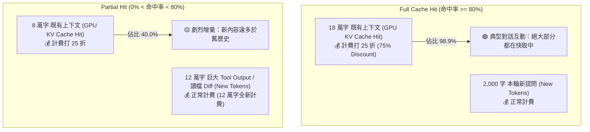

# LLM 前綴快取狀態機：Cache Hit vs Partial Hit 物理原理與 SQLite 欄位解析

- **建立時間**: 2026-08-27 01:52:00
- **更新時間**: 2026-08-27 01:52:00
- **模組歸屬**: `01_theory` / `02_architecture`
- **狀態**: `RAW_INTAKE` (待 wiki-distiller 二次提煉)

---

## 🎯 核心問題

在使用 `agent-observer` 時，常在 Track 1 看到不同的快取狀態徽章（如 `[CACHE HIT 96.2%]`、`[PARTIAL HIT 45.0%]`、`[TTL EXPIRED]`）。使用者疑問：
1. **什麼是 Partial Hit？跟 Cache Hit 差異在哪裡？**
2. **這個狀態也是 SQLite 裡面的一個原生欄位嗎？還是算出來的？**

---

## 🗄️ 一、SQLite 存儲真理 vs 狀態機推導

### 1. SQLite 到底存了什麼？
在 Google Gemini 的本地 SQLite 資料庫（`gen_metadata` 表格）中，**並沒有一個叫做 `Partial Hit` 的文字欄位**。

官方 Protobuf BLOB 實際存儲的是 **3 個底層物理數值**：
1. `total_token_count`（本次請求總 Token 數，例如 200,000）
2. `cached_content_token_count`（命中 GPU 顯存快取的 Token 數，例如 90,000）
3. `context_window_limit`（模型窗口上限，例如 256,000）

### 2. Observer 狀態機的四階分類公式
`agent-observer` 的 `internal/core/analyzer.go` 透過以下公式將底層物理數據轉譯為工程師易讀的語意狀態：

$$\text{CacheHitRate} = \frac{\text{CachedTokens}}{\text{TotalTokens}} \times 100\%$$

```go
func determineCacheStatus(cached, total int, hitRate float64) string {
    if cached == 0 {
        return "MISS"
    }
    if hitRate >= 80.0 {
        return "HIT"        // 🟢 [CACHE HIT] 命中率 >= 80% (高性價比黃金區間)
    } else if hitRate > 0.0 {
        return "PARTIAL"    // 🟡 [PARTIAL HIT] 0% < 命中率 < 80% (增量過大或局部命中)
    }
    return "MISS"           // 🔴 [CACHE MISS] 快取完全未命中
}
```

---

## 🔬 二、Cache Hit vs Partial Hit 的本質差異



### 1. 什麼是 Cache Hit (典型高命中)？
* **場景**：正常的對話、寫短代碼、思考總結。
* **物理狀態**：前 18 萬字的歷史完全符合 **最長公共前綴 (Longest Common Prefix, LCP)**，本輪只新增了 1,000~2,000 字的短 prompt。
* **命中率**：$\frac{180,000}{182,000} \approx 98.9\%$。
* **意義**：極致省錢（Prompt 成本節省 70%~75%），且 GPU 幾乎不需要重新做 Attention 計算，首字響應速度（TTFT）極快！

---

### 2. 什麼是 Partial Hit (部分命中)？
* **場景**：Agent 突然**讀取了一個超大檔案**（如 5,000 行代碼）、執行 `git diff` 產生了數萬字輸出，或是剛經歷過 **Context Compaction（雙水位線歷史壓縮）**。
* **物理狀態**：
  * 前綴的靜態 System Instructions + Tools Schema + 舊歷史（8 萬字）成功命中了 GPU 快取；
  * 但因為本輪湧入了 **12 萬字全新內容**，使得總 Context 膨脹為 20 萬字；
* **命中率**：$\frac{80,000}{200,000} = 40.0\%$。
* **意義**：快取雖然有發揮作用（8 萬字享有折扣），但因為本輪新增的 Payload 太大，導致整體命中率被稀釋低於 80%。

---

## 📊 五種快取狀態全景對照表

| 狀態徽章 | 命中率區間 | 觸發物理場景 | 計費影響 | 首字延遲 (TTFT) |
| :--- | :--- | :--- | :--- | :--- |
| **`[CACHE WRITE]`** | 0.0% | 會話第 0 步開局，首次將 System + Tools 寫入 GPU | 全額原價計費 | 正常 (冷啟動) |
| **`[CACHE HIT]`** | $\ge 80.0\%$ | 連續正常多輪對話，歷史前綴完全復用 | **節省 70%~75% 費用** | **極速 (毫秒級)** |
| **`[PARTIAL HIT]`** | $0.1\% \sim 79.9\%$ | 讀取大型檔案、大量 Tool Output 湧入、或剛完成壓縮 | 命中部分打折，新內容原價 | 中等 |
| **`[TTL EXPIRED]`** | 0.0% | 閒置超過 5 分鐘，GPU 顯存釋放 KV Cache | **全量歷史重新計費 (荷包大失血)** | 緩慢 (需重算 Attention) |
| **`[CACHE MISS]`** | 0.0% | 前綴變動或模型切換導致快取破壞 | 全額原價計費 | 正常 |
