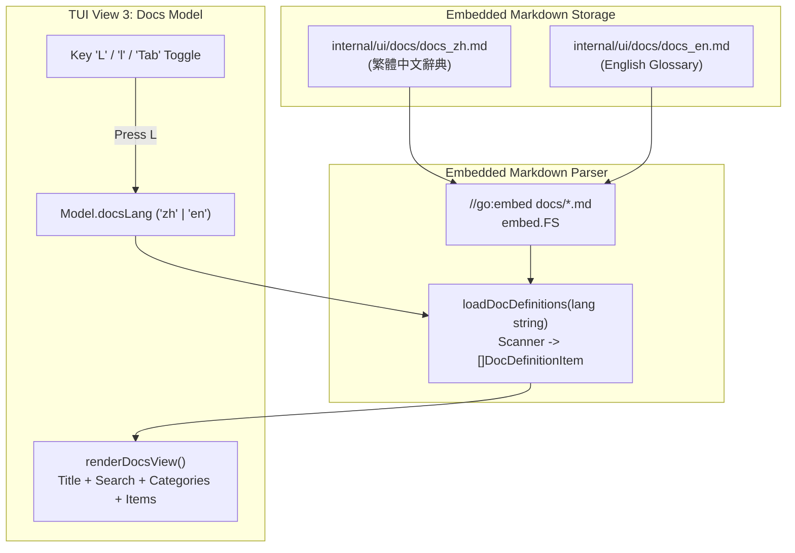

# Docs 頁面多語言 Markdown 嵌入架構與快取標籤辭典 (Docs i18n Embedded Markdown & Cache Badge Glossary)

- **建立時間**: 2026-08-27 01:57:00
- **更新時間**: 2026-08-27 01:57:00
- **模組歸屬**: `02_architecture`
- **狀態**: `RAW_INTAKE` (待 wiki-distiller 二次提煉)

---

## 🎯 需求場景

使用者在研讀架構定義頁面（`[3] Docs`）時提出兩項重要擴充需求：
1. **補齊快取狀態標籤辭典**：將 `[CACHE HIT]`、`[PARTIAL HIT]`、`[CACHE WRITE]`、`[TTL EXPIRED]`、`[CACHE MISS]` 的精確物理意義與計費影響完整收錄至 Docs 頁面；
2. **多語言架構支援 (i18n)**：支援「繁體中文」與「英文」雙語切換，且在代碼設計上將不同語言的文檔解耦為獨立 Markdown 檔案（`docs_zh.md`、`docs_en.md`），透過 Go `embed` 機制無損編譯進單一執行檔。

---

## 🏗️ 系統架構：Go `embed.FS` 驅動的動態 Markdown 載入器



### 1. 獨立語言檔案分流 (`internal/ui/docs/`)
* **`docs_zh.md`**：繁體中文辭典，收錄 5 大維度、Track 1 官方帳單、5 大快取標籤與滑動窗口物理機制；
* **`docs_en.md`**：英文原版辭典，包含對應的英文專業術語與定義；
* 採用標準 Markdown 格式：
  ```markdown
  ## 快取狀態標籤與計費語意 (Cache Status Badges & Semantics)
  * **[CACHE HIT]** : 前綴快取命中率 >= 80.0%。高性價比黃金狀態...
  * **[PARTIAL HIT]** : 前綴快取命中率介於 0.1% ~ 79.9%...
  ```

### 2. 零外部依賴單一二進制編譯 (`internal/ui/docs_view.go`)
利用 Go 1.16+ 引入的標準庫 `embed.FS`，在編譯時期將 `docs/*.md` 封裝進靜態記憶體：
```go
//go:embed docs/*.md
var docsFS embed.FS

func loadDocDefinitions(lang string) []DocDefinitionItem {
    filename := "docs/docs_zh.md"
    if lang == "en" {
        filename = "docs/docs_en.md"
    }
    data, err := docsFS.ReadFile(filename)
    // 透過 Scanner 逐行萃取 Category 與 Key/Desc 結構體...
}
```

### 3. 一鍵鍵盤切換與自適應 UI
* 在 Docs 視圖中，按下 **`L`**、**`l`** 或 **`Tab`** 即可在 **`[L: 繁體中文]`** 與 **`[L: English]`** 之間無縫切換；
* 標題列、過濾提示詞、查無結果訊息與底部快捷鍵（`[L] Lang (繁中)`）均隨語言動態響應切換。

---

## 🧪 單元測試驗證 (`TestView3DocsPageRenderingAndSearch`)

在 `internal/ui/tui_test.go` 中建立了涵蓋雙語載入與搜尋的完整測試：
1. **預設繁中檢驗**：驗證標題為 `架構名詞釋義與上下文辭典`，並包含快取狀態定義；
2. **`L` 鍵切換英文**：驗證標題即刻變更為 `ARCHITECTURE & CONTEXT DEFINITIONS`；
3. **即時過濾檢驗**：驗證 `/cache` 搜尋過濾出 `[CACHE HIT]` 與 `[PARTIAL HIT]`，`/cot` 搜尋過濾出 `Active Turn / CoT`。
