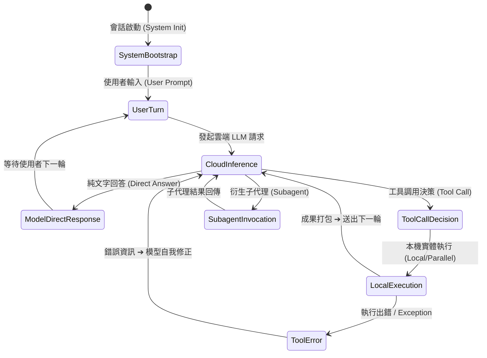

# 🌐 通用 Agent 狀態機矩陣與跨工具可移植性架構企劃書 (Universal Agent FSM & Cross-Tool Portability Plan)

> **版本**：v3.0 (涵蓋全流程 7 大邊界時序、角色四分法、跨 Agent 工具抽象與零耦合適配器架構)  
> **關聯文件**：`docs/01_raw/2026-08-27_130141_universal_agent_fsm_and_portability_plan.md`

---

## 🧭 一、 全場景 Agent 狀態機矩陣 (The 7 Real-World Execution Paths)

在真實世界的所有 AI Agent 工具（包括 Antigravity、Claude Code、Cursor、OpenCode、OpenAI Agents）中，事件流絕非只有單一的 `run_command ➔ tool_call`，而是涵蓋以下 **7 大核心時序路徑**：



---

### 📊 7 大時序狀態轉移矩陣表 (Full State Transition Matrix)

| 時序場景 | 步驟鏈條 (Step Flow) | 角色與 Scope 標註 | Parent 錨定原則 | 帳單與 Token 歸屬 |
| :--- | :--- | :--- | :--- | :--- |
| **路徑 1：純對話 Q&A**<br/>(無工具呼叫) | `[USER_INPUT]` $\to$ `[MODEL_RESPONSE]` | `USER` $\to$ `CLOUD` | `MODEL_RESPONSE.Parent = USER_INPUT` | 包含 Prompt + 回應文字，無 Local 暫存 |
| **路徑 2：標準單工具調用** | `[USER_INPUT]` $\to$ `[TOOL_CALL]` $\to$ `[RUN_COMMAND]` $\to$ `[MODEL_RESPONSE]` | `USER` $\to$ `CLOUD` $\to$ `LOCAL` $\to$ `CLOUD` | `RUN_COMMAND.Parent = TOOL_CALL`<br/>`MODEL_RESPONSE.Consumed = [RUN_COMMAND]` | 本地離線執行 $\to$ 在下一個 `MODEL_RESPONSE` 結算計費 |
| **路徑 3：平行多工具呼叫**<br/>(Parallel Tool Execution) | `[TOOL_CALL (3 tools)]`<br/>$\to$ `[VIEW_FILE_1]`<br/>$\to$ `[VIEW_FILE_2]`<br/>$\to$ `[RUN_COMMAND_3]`<br/>$\to$ `[PLANNER_RESPONSE]` | `CLOUD`<br/>$\to$ `LOCAL`<br/>$\to$ `LOCAL`<br/>$\to$ `LOCAL`<br/>$\to$ `CLOUD` | 3 個 `LOCAL` 步驟的 Parent **全部錨定在同一個 `TOOL_CALL`**；<br/>下一個 `CLOUD` 步驟的 `ConsumedSteps = [1, 2, 3]` | 3 個工具的本地輸出 Token 累加，在下一個雲端步驟一次性結算！ |
| **路徑 4：工具執行出錯與自我修正**<br/>(Tool Error & Retry) | `[TOOL_CALL]` $\to$ `[ERROR_RESULT]` $\to$ `[PLANNER_RESPONSE (Retry)]` | `CLOUD` $\to$ `LOCAL (Error)` $\to$ `CLOUD` | `ERROR_RESULT.Parent = TOOL_CALL` | 錯誤日誌 (stderr) 也是 Context 的一部分，計入下一輪 New Tokens |
| **路徑 5：系統開局與歷史加載**<br/>(System Init / Checkpoint) | `[CONVERSATION_HISTORY]` $\to$ `[CHECKPOINT]` $\to$ `[USER_INPUT]` | `SYSTEM` $\to$ `SYSTEM` $\to$ `USER` | 無 Parent (Root Steps) | 歸類為 `SystemTokens` 與基底 History |
| **路徑 6：使用者中途插話 / 打斷**<br/>(User Mid-Turn Injection) | `[TOOL_CALL]` $\to$ `[USER_INPUT (Interrupt)]` $\to$ `[PLANNER_RESPONSE]` | `CLOUD` $\to$ `USER` $\to$ `CLOUD` | 清空先前暫存的 Pending Tool，重新以 `USER_INPUT` 為錨點 | 使用者新 Prompt 與先前未完成的狀態合併 |
| **路徑 7：子代理衍生呼叫**<br/>(Subagent Dispatch) | `[INVOKE_SUBAGENT]` $\to$ `[SUBAGENT_TRANSCRIPT]` $\to$ `[PLANNER_RESPONSE]` | `CLOUD` $\to$ `SUBAGENT` $\to$ `CLOUD` | 記錄子代理 Session ID 與父層關係 | 子代理獨立計費，摘要回傳至父層 ActiveTurn |

---

## 🏛️ 二、 跨 Agent 工具可移植性架構 (Universal Decoupled Architecture)

為了保證這套心智模型與狀態機能**毫無阻礙地移植給 Claude Code、OpenCode、Aider、Cursor**，我們採用 **「四分法語意模型 (The 4 Universal Scopes)」** 與 **「適配器模式 (Adapter Pattern)」**：

### 1. 核心層：通用四分法語意 (Core Universal Scopes)
在 `internal/core/types.go` 定義所有 AI Agent 通用的 4 大維度：

```go
type StepScope string

const (
    ScopeUserInteraction ScopeScope = "USER"   // 👤 使用者主動輸入、互動按鈕回應
    ScopeCloudInference  ScopeScope = "CLOUD"  // ☁️ 雲端 LLM 生成、思考鏈、工具決策
    ScopeLocalExecution  ScopeScope = "LOCAL"  // 💻 本機實體執行 (Shell, Diff, File, LSP)
    ScopeSystemBootstrap ScopeScope = "SYSTEM" // ⚙️ 系統開局、Prompt 注入、歷史 Checkpoint
)
```

### 2. 跨工具架構分層 (Decoupling Architecture)

```text
┌──────────────────────────────────────────────────────────────────────────────────┐
│                         🖥️ AGENT-OBSERVER TUI (Views & UI)                       │
│    (只認 UniversalAgentEvent、Scope: USER/CLOUD/LOCAL/SYSTEM 與 Parent 關聯)     │
└────────────────────────────────────────┬─────────────────────────────────────────┘
                                         │ 100% 統一資料合約 (Unified Event Contract)
┌────────────────────────────────────────┴─────────────────────────────────────────┐
│                    🧠 CORE ENGINE (Universal Linkage State Machine)              │
│      - O(N) 線性狀態機處理通用 7 大時序                                          │
│      - 負責算力估算、雙態轉換 (Staged ➔ Billed)、Parent/Consumed 雙向鏈條        │
└────────────────────────────────────────┬─────────────────────────────────────────┘
                                         │
        ┌────────────────────────────────┼────────────────────────────────┐
        ▼                                ▼                                ▼
┌───────────────────────┐┌───────────────────────┐┌───────────────────────┐
│ 🔌 Antigravity Adapter││ 🔌 Claude Code Adapter││ 🔌 OpenCode Adapter   │
│ - 讀取 transcript.jsonl││ - 讀取 .claude/log   ││ - 讀取 opencode JSON  │
│ - 解析 SQLite db      ││ - 提取 costUSD/tokens ││ - 提取 raw messages   │
│ ➔ 轉化為 UniversalEvent││ ➔ 轉化為 UniversalEvent││ ➔ 轉化為 UniversalEvent│
└───────────────────────┘└───────────────────────┘└───────────────────────┘
```

---

## 💡 三、 為什麼這樣設計「極度好移植」？

1. **業界標準統一 (Standard Message Protocol)**：
   * 無論是 Google Antigravity、Anthropic Claude Code、還是 OpenAI Agent，底層協議都是標準的 `user` / `assistant` / `tool` / `system` 四種 Role；
   * 我們的 `Scope` 正好 1:1 對應這四種 Role，**完全沒有任何 Antigravity 特有的私有綁定**！
2. **UI 零硬編碼 (Zero Hardcoding in UI)**：
   * UI 層（`views.go`、`model.go`）完全不知道底層日誌是 Protobuf 還是 JSON，它只依據 `Scope`（`CLOUD` 顯示藍色雲端標籤、`LOCAL` 顯示綠色本機標籤）與 `ParentStepIdx` 進行渲染；
3. **新增 Agent 只要寫 1 個 Adapter (Plug & Play)**：
   * 未來要支援 **Claude Code**：只需在 `internal/adapters/claudecode/` 解析 Claude 的 JSON 日誌，產出帶有 `USER/CLOUD/LOCAL` 的事件，狀態機與 UI 完全不用改動一行動態程式碼！

---

## 🛠️ 四、 具體技術實作分工

### 1. `internal/core/types.go` [MODIFY]
* 定義 `StepScope`（`USER`, `CLOUD`, `LOCAL`, `SYSTEM`）；
* 在 `UnifiedAgentEvent` 新增 `Scope`, `ParentStepIdx`, `PackagedInStepIdx`, `ConsumedStepIndices`。

### 2. `internal/core/state_machine.go` [NEW]
* 抽出純邏輯的通用狀態機 `StepLinkageTracker`，涵蓋 7 大邊界時序（平行工具、錯誤重試、使用者插話、純對話）。

### 3. `internal/adapters/antigravity/` [MODIFY]
* Watcher 與 Discovery 在解析日誌時，將事件交由 `StepLinkageTracker` 處理，賦予統一的 Scope 與 Parent 關聯。

### 4. `internal/ui/` [MODIFY]
* History Explorer 與 Inspector 依據 `Scope` 呈現自解釋的雙軌標籤與計費管線追蹤。
