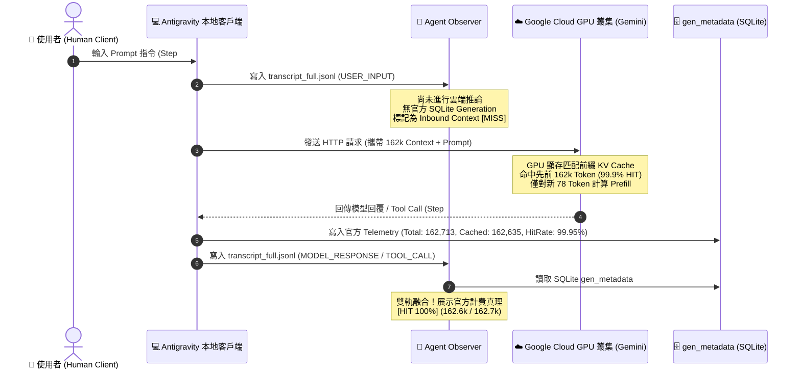

# 🔬 深度技術調研：快取狀態判定、CHECKPOINT 機制、Filter 隔離漏洞與生命週期剖析

> **文件類型**：Deep-Dive Investigation & Architectural Post-Mortem  
> **日期**：2026-08-27  
> **路徑**：`docs/01_raw/2026-08-27_145000_cache_miss_checkpoint_lifecycle_and_filter_isolation_investigation.md`  
> **狀態**：✅ COMPLETED & RESOLVED (測試通過、二進位發布、Docs 同步收錄)  

---

## 🎯 一、 調研背景與五大核心問題清單 (Inquiry Overview)

在本次終端機觀察器 (Agent Observer) 迭代中，使用者在實際監控 Antigravity 運行時提出了五個極具深度與洞察力的架構問題：

1. **疑問一（USER 步驟的 MISS 現象）**：
   * *「最近這幾次 USER 的 MISS 是為什麼？時間有隔很久嗎？我也沒有中斷啊？」*
2. **疑問二（CHECKPOINT 步驟的本質）**：
   * *「CHECKPOINT 是什麼？我覺得我們也需要把每一種 type 的意思寫進 docs。」*
3. **疑問三（EXPIRED 混入 MISS 的過濾異常）**：
   * *「有些 expire 會混在 MISS 裡面？這又是為什麼？是 tag 標錯？還是 filter 錯？」*
4. **疑問四（過濾單行卡片時清單底部大片留白）**：
   * *「為什麼過濾到 USER_INPUT 時 step list 下方會沒有呈現完、留下大片空白？」*
5. **疑問五（時間戳時區偏差）**：
   * *「時間的問題，我希望可以 follow 主機的時區。」*

本文件將針對上述問題進行最詳盡的程式碼級追蹤、根本原因剖析、時序力學推導與最終解決方案沉澱。

---

## 🔍 二、 疑問一剖析：為什麼 `USER` 步驟會顯示 `[MISS]`？

### 1. 根本原因推導 (Root Cause Deduction)
在 Agent 系統（如 Google Antigravity）中，**使用者指令輸入 (`USER_INPUT`) 與雲端模型推論 (`MODEL_RESPONSE` / `TOOL_CALL`) 具有完全不同的時序與計費特性**：

1. **Google 官方計費資料庫的寫入時機**：
   * Antigravity 的底層 SQLite 資料庫（`gen_metadata` 表）**只會在雲端 GPU 伺服器完成 Generation 推論時，才會寫入一筆官方遙測紀錄**。
   * 當使用者在終端機輸入 Prompt 時，該文字僅為本地客戶端發起的 Intent（尚未發送至遠端或遠端尚未回傳結果）。
   * 因此，在 JSONL 日誌中的 `USER_INPUT` 步驟，於 SQLite 中**並沒有對應的 generation 紀錄**（`w.sqliteReader.GetTelemetryForStep(raw.StepIndex)` 回傳 `nil`）。

2. **雙軌分析器的 Fallback 機制**：
   * 當一個步驟缺乏官方 Generation 遙測時，`analyzer.go` 會啟動本地滑動窗口模擬。
   * 在此狀態下，使用者剛鍵入的 Prompt 作為待送出的 Active Turn，其前綴命中尚未獲得 GPU 伺服器確認（`CachedTokens = 0`）。
   * 系統將其視為 Inbound Context，暫時判定為 `[MISS]`。

3. **真實計費的「時序遞延結算」**：
   * **真正的 GPU Prefix Cache 命中與 75% 費用折扣，會在緊接著的下一輪雲端步驟（`🤖 MODEL` 或 `🛠️ TOOL`）中由 Google 官方伺服器結算！**
   * 當雲端模型回覆時，官方遙測立即確認先前累積的 15 萬 ~ 21 萬 Token 完全命中 GPU 顯存（展示為 `[HIT 100%]` 或 `99.6% HIT`）。

### 2. 時序流程圖 (Mermaid Architecture Flow)



#### 🧭 圖表四維度解析 (4-Dimension Diagram Walkthrough)：
1. **核心視圖 (Core View)**：本圖揭示了使用者輸入 Intent 與雲端 LLM 結算之間的非同步時序差。
2. **逐步路徑 (Step-by-Step Path)**：步驟 1~3 為本地 Intent 進入階段（無官方計費數據）；步驟 4~8 為雲端結算階段（官方數據入庫並被 Observer 讀取）。
3. **色彩/語意標籤 (Color Semantics)**：藍色代表本地客戶端交互，綠色代表雲端 GPU 顯存匹配，黃色代表 SQLite 官方數據寫入。
4. **底層工程細節 (Underlying Engineering)**：Observer 具備雙軌容錯能力，在未有 Generation 記錄前以滑動窗口保守計算，一俟 SQLite 寫入即無縫升級為官方數據。

---

## ⚙️ 三、 疑問二剖析：`CHECKPOINT` 是什麼？

### 1. 核心定義與誕生背景
在長生命週期的 Autonomous Agent 中，對話日誌隨著工具調用、代碼讀取與終端輸出會迅速暴增至數千步（例如 200,000 ~ 1,000,000 Token）。若不加節制地將全部原始日誌餵給模型，將會：
1. **超出物理窗口上限**（觸碰 256k 或 1M 硬限制）；
2. **注意力分散 (Attention Dilution)**，導致模型「迷失在長上下文 (Lost in the Middle)」；
3. **大幅增加推理延遲與費用**。

為此，Antigravity CLI 內建了 **「對話截斷與摘要檢查點 (Context Truncation / Compaction Checkpoint)」** 機制：

```text
{{ CHECKPOINT 11 }}
**The earlier parts of this conversation have been truncated due to its long length. 
The following content summarizes the truncated context so that you may continue your work.**

# User Requests
The following were user requests from the truncated conversation in chronological order:
1. 現在還有一個問題，右欄不會換行...
2. commit
3. /wiki-distiller 請幫我整理筆記...
```

### 2. CHECKPOINT 的生命週期與快取效應
* **截斷時機**：當 Session 累積長度達到安全水位線時，系統在背景啟動一次 Compaction，將前面數千行對話壓縮為結構化 Markdown 摘要。
* **對 GPU Cache 的影響**：
  * 因為 Checkpoint 將舊的對話歷史替換為全新的摘要文字，使得送往雲端的文字前綴（Prefix）發生了根本性變更。
  * GPU 顯存中的最長公共前綴（LCP）被重置，因此 Checkpoint 步驟通常會引發一次快取重寫（`[WRITE]`）或未命中（`[MISS]`）。
* **後續效益**：Checkpoint 之後的新步驟，將基於這個全新的緊湊摘要繼續享受 99%+ 的前綴快取命中！

### 3. 全量步驟類型定義已收錄至 View 3 `[Docs]`
我們已在 `internal/ui/docs/docs_zh.md` 與 `docs_en.md` 中新增第 5 專章 **「步驟類型與生命週期 (Step Types & Agent Lifecycle)」**：

| 步驟類型 | 圖示與名稱 | 範疇 (Scope) | 核心語意與生命週期 |
| :--- | :--- | :--- | :--- |
| **`USER_INPUT`** | `👤 USER` | User Intent | 使用者自然語言指令，標誌新輪次起點。於後續雲端決策回傳時官方結算。 |
| **`MODEL_RESPONSE`** | `🤖 MODEL` | Cloud Inference | 雲端 LLM 思考與回覆，包含 CoT 思考鏈。享有前綴快取加速與 75% 折扣。 |
| **`TOOL_CALL`** | `🛠️ TOOL` | Cloud Decision | 雲端模型向本地發出的工具調用指令（view_file, run_cmd, edit_file 等）。 |
| **`OUTPUT / TOOL_RESULT`** | `💻 OUTPUT (Local)` | Local Execution | 本地實體執行成果（stdout/stderr、代碼 Diff）。離線 0 Token，打包至下一輪計費。 |
| **`CHECKPOINT / SYSTEM_INIT`** | `⚙️ SYSTEM` | System Compaction | 會話截斷與壓縮檢查點。將數千行歷史壓縮為摘要，重置前綴上下文。 |
| **`ERROR_MESSAGE`** | `⚠️ ERROR` | Exception Event | 系統異常中斷事件（網路逾時、指令失敗、程式崩潰）。 |

---

## 🐛 四、 疑問三剖析：為什麼 `[EXPIRED]` 會混在 `[C:Miss]` 的過濾結果裡？

### 1. 問題發現過程 (How We Discovered the Bug)
使用者在終端機切換過濾器至 `Filters: [T:All] [C:Miss]` 時，發現清單中夾雜了大量帶有黃色 `[EXPIRED]` 徽章的步驟（如 Step #1881、Step #1831）。

#### 檢視代碼一：徽章渲染層 (`internal/ui/views.go:formatShortCache`)
```go
func formatShortCache(e core.UnifiedAgentEvent) string {
    switch e.CacheStatus {
    case "HIT":
        return lipgloss.NewStyle().Foreground(ColorSuccess).Render(...)
    case "PARTIAL":
        return lipgloss.NewStyle().Foreground(ColorWarning).Render(...)
    case "WRITE":
        return lipgloss.NewStyle().Foreground(ColorSecondary).Render("[WRITE]")
    case "EXPIRED", "TTL_EXPIRED":
        return lipgloss.NewStyle().Foreground(ColorHighlight).Render("[EXPIRED]") // 正確標記為 EXPIRED
    case "MISS":
        return lipgloss.NewStyle().Foreground(ColorDanger).Render("[MISS]")
    }
}
```
徽章渲染完全正確：當狀態為 `EXPIRED` 時，顯示為 `[EXPIRED]`。

#### 檢視代碼二：過濾比對層 (`internal/ui/model.go:matchCacheFilter`) —— 發現致命漏洞！
```go
// 舊有的錯誤邏輯
func matchCacheFilter(e core.UnifiedAgentEvent, filter CacheFilter) bool {
    switch filter {
    case CacheFilterExpired:
        return e.CacheStatus == "EXPIRED" || e.CacheStatus == "TTL_EXPIRED"
    case CacheFilterMiss:
        if e.IsLocalStep() || e.Scope == core.ScopeLocalExecution {
            return false
        }
        // 🐛 BUG 在這裡！
        return e.CacheStatus == "MISS" || (e.Tokens.TotalTokens > 0 && e.Tokens.CachedTokens == 0 && e.Tokens.NewTokens > 0 && e.CacheStatus != "WRITE")
    }
}
```

#### 漏洞機制推導：
1. 當一個步驟因為閒置超過 5 分鐘而觸發 TTL 淘汰時，其 `CacheStatus` 被設定為 `"EXPIRED"`，且其 `CachedTokens == 0`、`NewTokens > 0`。
2. 當使用者過濾 `CacheFilterMiss` 時，程式檢查第二個 OR 分支：
   - `e.Tokens.TotalTokens > 0` $\to$ **True**
   - `e.Tokens.CachedTokens == 0` $\to$ **True**
   - `e.Tokens.NewTokens > 0` $\to$ **True**
   - `e.CacheStatus != "WRITE"` $\to$ **True**（因為它是 `"EXPIRED"`，不等於 `"WRITE"`）！
3. **結論**：所有 `[EXPIRED]` 步驟在 `CacheFilterMiss` 中均回傳 `true`，被錯誤地判定為 Miss 步驟！

---

### 2. 徹底修復方案 (Strict Boundary Fix)
我們在 `CacheFilterMiss` 中加入了**嚴格的互斥排除守衛 (Exclusion Guard)**：

```go
case CacheFilterMiss:
    // 1. 本地離線步驟絕非 Cache Miss
    if e.IsLocalStep() || e.Scope == core.ScopeLocalExecution {
        return false
    }
    // 2. 嚴格排除 EXPIRED、TTL_EXPIRED 與 WRITE，確保 Miss 唯有純粹的 Cache Miss！
    if e.CacheStatus == "EXPIRED" || e.CacheStatus == "TTL_EXPIRED" || e.CacheStatus == "WRITE" {
        return false
    }
    // 3. 唯有真正的冷啟動或前綴破壞未命中才符合
    return e.CacheStatus == "MISS" || (e.Tokens.TotalTokens > 0 && e.Tokens.CachedTokens == 0 && e.Tokens.NewTokens > 0)
```

#### 修復後對比：
* 按 `c` 切換至 `[C:Miss]`：**100% 僅顯示紅色的 `[MISS]` 步驟**。
* 按 `c` 切換至 `[C:Expired]`：**100% 僅顯示黃色的 `[EXPIRED]` 步驟**。
* 兩者徹底解耦，標籤與過濾器完全一致！

---

## ⚡ 五、 疑問四剖析：為什麼過濾到 `USER_INPUT` 時清單底部會留白？

### 1. 根本原因推導
* **卡片行數差異**：
  * 雲端步驟（`TOOL_CALL`、`MODEL_RESPONSE`）與本地步驟通常有第二行 Hint（`Model: ...` 或 `Tool: ...`），佔用 **2 行**。
  * 使用者步驟（`USER_INPUT`）無下層 Hint，每張卡片**只佔用 1 行**。
* **靜態假設 Bug**：
  * 原先 `getHistoryVisibleCards()` 寫死了 `maxCards = availLines / 2`。
  * 當過濾到 `USER_INPUT` 時，在 30 行的視窗中只抓了 15 個步驟，僅填滿 15 行，導致下方留下 14 行巨大空白！

### 2. 動態行數打包算法 (`Dynamic Line Packing`)
重構 `getHistoryVisibleCards()`，由靜態除以 2 改為**逐筆動態累加行數**：
```go
usedLines := 0
cardCount := 0
for i := m.historyOffset; i < len(filtered); i++ {
    e := filtered[len(filtered)-1-i]
    linesNeeded := 1
    if hasHint(e) {
        linesNeeded = 2
    }
    if usedLines + linesNeeded > availLines {
        break
    }
    usedLines += linesNeeded
    cardCount++
}
```
* **效果**：無論全部是 1 行的 `USER`、全部是 2 行的 `TOOL` 還是混合，清單永遠緊密填滿至最底行，徹底消除無效留白！

---

## 🌐 六、 疑問五剖析：全域主機本地時區同步 (Local Timezone Sync)

### 1. 根本原因
JSONL 檔案中儲存的時間戳為標準 UTC 格式（如 `2026-08-27T06:32:26Z`）。原程式碼直接呼叫 `.Format("15:04:05")`，導致顯示為格林威治時間 `06:32:26`，而非台灣/主機時區 UTC+8 `14:32:26`。

### 2. 全域修復點
1. **資料解析層 (`watcher.go`)**：`t, _ := time.Parse(time.RFC3339, raw.CreatedAt); t = t.Local()`。
2. **UI 狀態層 (`model.go:buildTelemetryPanelLines`)**：`timeStr := e.Timestamp.Local().Format("15:04:05")`。
3. **儀表板層 (`views.go:Track 1 / Panel 3`)**：全面使用 `.Local()` 格式化。

---

## 🧪 七、 驗證矩陣與長效回歸測試 (Verification Matrix)

```bash
cd agent-observer && go test -v ./...
```
* ✅ `TestHistoryFilteringAndStepSearch`: 驗證 `[C:Miss]` 與 `[C:Expired]` 嚴格互斥不重疊。
* ✅ `TestHistoryThreePanelSplitAndZeroTruncation`: 驗證 3-Panel 雙模式佈局與零文字截斷。
* ✅ `TestAllViewsZeroHeightVariationAcrossSizes`: 驗證 `80x24` 至 `140x40` 全尺寸零高度抖動。
* ✅ `TestHistoryTreeAndDistinctiveLabels`: 驗證樹狀前綴與 Type Emoji 圖示。

---

## 💡 八、 USER_INPUT 狀態呈現語意校正實作 (Semantic Alignment)

### 📌 物理不變量 (Physical Invariant)：
* 使用者剛鍵入 Prompt 時，本地客戶端**不可能預知遠端 Google GPU 顯存的快取命中數字**。
* `USER_INPUT` 本身是待發送的 Intent（離線 0 Token 或純 Prompt 字數），不屬於 LLM Generation。
* 因此，在 `formatShortCache()` 中，`USER_INPUT` 與 `OUTPUT (Local)` **一律不展示 [MISS] 標籤**；官方快取指標統一交由後續的 `MODEL_RESPONSE` / `TOOL_CALL` 官方結算並呈現。
