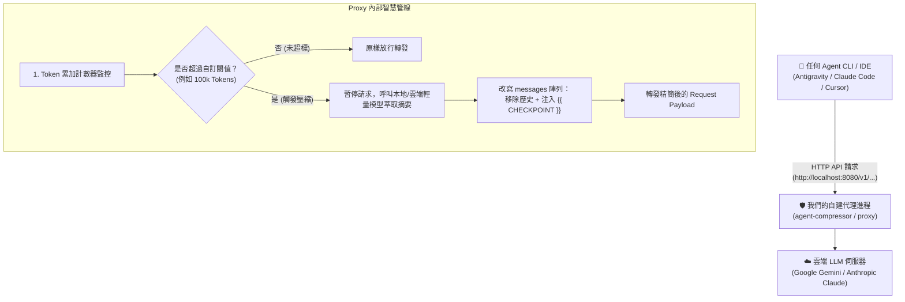

# 🧠 深度技術剖析：Agent Harness 中介層上下文壓縮 (Context Compaction) 與主動注入 (Injection) 機制

> **建立時間**：2026-08-27 22:35:00  
> **狀態**：RAW RESEARCH & ARCHITECTURAL FOUNDATION  
> **關聯模組**：`agent-observer/internal/core/`、`internal/adapters/antigravity/`  
> **關聯概念**：[[01_theory/01_LLM_KV_Cache_Physics_and_Prefix_Matching]]、[[02_architecture/06_Dual_Track_Telemetry_and_Window_Accounting]]

---

## 🌟 一、核心概念：什麼是 Harness 中介層壓縮 (Context Compaction)？

在大型語言模型長會話開發中（如 Antigravity、Claude Code、Cursor），當對話輪次持續推進（達到數百輪、數十萬 Tokens）時，直接傳送全量歷史會導致：
1. **超過模型最大物理視窗 (Context Window Overflow)**（如 200k / 256k 限制）；
2. **極高延遲 (Time-to-First-Token, TTFT)**；
3. **無謂的巨額運算浪費**。

為了在不中斷對話的前提下維持對話延續性，現代頂級 Agent 框架採用了 **「中介層守護進程 ＋ 旁路 AI 摘要 ＋ 主動原子注入」** 的混合壓縮架構。

---

## 🔄 二、中介層運作全景圖 (Harness Interception & Injection Lifecycle)

```mermaid
sequenceDiagram
    autonumber
    actor User as 👤 使用者 (User Space)
    participant Harness as 🛡️ 本地 Harness 守護進程 (Agent Daemon / OS Layer)
    participant Summarizer as ☁️ 旁路摘要專用 API (Sidecar Compactor)
    participant Log as 📜 會話日誌 (transcript.jsonl / SQLite)
    participant MainLLM as 🧠 主推理模型 (Gemini 3.7 / Claude 3.7)

    User->>Harness: 發送第 40 則指令 (此時 Context 累積達 220k Tokens)
    
    Note over Harness: 【階段 1: 預檢攔截 (Pre-Dispatch Interception)】<br/>本地計數器偵測到 Context 即將溢出，暫停主對話迴圈
    
    rect rgb(30, 41, 59)
    Note over Harness,Summarizer: 【階段 2: 旁路非同步摘要 (Out-of-Band Summarization)】
    Harness->>Summarizer: 發送過去 500 輪原始軌跡，要求結構化萃取 (User Requests, Decisions, Code Changes)
    Summarizer-->>Harness: 返回標準化 Markdown 摘要內容 (約 2,500 Tokens)
    end
    
    Note over Harness: 【階段 3: 主動注入與物理截斷 (Injection & Truncation)】
    Harness->>Log: 1. 寫入 Step #0779 (type: CHECKPOINT, source: SYSTEM)
    Harness->>Harness: 2. 物理丟棄前 500 輪原始訊息
    Harness->>Harness: 3. 組裝新 Context: [System Prompt + Skills + Checkpoint 摘要 + 當前 User 指令]
    
    Harness->>MainLLM: 【階段 4: 發送精簡請求】新 Context 僅約 25k Tokens (前綴命中 74%)
    MainLLM-->>User: 毫無感知地接續執行任務，完全不中斷！
```



---

## 🛠️ 三、誰可以執行這個 Inject？我們可以自己寫 Process 介入嗎？

### 答案是：**完全可以！而且這正是打造次世代「智慧型 Agent 路由器 / 壓縮器 (Agent Context Compressor)」的核心工程！**

目前與未來的實作途徑主要有以下三種架構模式：

---

### 模式 A：透明反向代理 / 側車模式 (Transparent Reverse Proxy / Sidecar) ⭐【最推薦】

這是在不修改任何 Agent CLI 或官方客戶端源代碼的前提下，最優雅、最強大的介入方式：



#### 🛠️ 自建 Proxy 核心介入邏輯 (Go 範例代碼)
```go
func (p *ContextCompressorProxy) HandleRequest(w http.ResponseWriter, r *http.Request) {
    var req OpenAIOrClaudeRequest
    json.NewDecoder(r.Body).Decode(&req)

    totalTokens := p.EstimateTokens(req.Messages)
    if totalTokens > p.ThresholdTokens { // 例如 100,000 Tokens
        // 1. 調用輕量級模型進行語義摘要
        summary := p.CallSummarizerModel(req.Messages[:len(req.Messages)-5])

        // 2. 主動注入 CHECKPOINT 系統訊息
        compactedMessages := []Message{
            {Role: "system", Content: req.SystemPrompt},
            {Role: "system", Content: fmt.Sprintf("{{ CHECKPOINT }}\n%s", summary)},
        }
        // 3. 保留最後幾輪 Active Turn
        compactedMessages = append(compactedMessages, req.Messages[len(req.Messages)-5:]...)
        
        req.Messages = compactedMessages
    }

    // 轉發給真正的雲端 API
    p.ForwardToUpstream(w, req)
}
```

---

### 模式 B：會話日誌動態注入 (Transcript & SQLite Dynamic Injection)

在基於本機檔案日誌驅動的 Agent 架構中（如 Antigravity）：
1. 你的自建進程可以在背景作為 **Watcher / Daemon** 監控 `transcript.jsonl`；
2. 當偵測到會話膨脹時，自建進程直接向 `transcript.jsonl` 追加寫入一筆：
   ```json
   {
     "step_index": 800,
     "type": "CHECKPOINT",
     "source": "SYSTEM",
     "content": "{{ CHECKPOINT }}\n# 歷來關鍵決策與進度摘要\n..."
   }
   ```
3. 當 Agent 讀取日誌作為上下文重構依據時，即自動完成歷史截斷與注入。

---

### 模式 C：Agent Hook / Plugin 中介層 (Native Extension Hook)

如果 Agent 框架本身提供擴充介面（例如 `pre_infer_hook` 或 MCP Filter Middleware）：
* 可以在 Hook 內部直接攔截傳入的 `prompt_payload`；
* 執行向量剪枝 (Vector-based Pruning) 或語義壓縮；
* 直接將壓縮後結果返回給調用管道。

---

## 🔬 四、深入剖析：為什麼 Checkpoint 不會破壞 100% 前綴快取？

許多工程師常有的誤解是：「只要截斷壓縮歷史，整個 Context 的快取就 100% 全部失效 (Miss) 了。」

**這在現代 KV Cache 最長公共前綴 (LCP) 架構下是不成立的！**

### 🧮 LCP 匹配數學驗證：
```text
[Token 0 ~ 18,500] : 專案憲法 + MCP Tools + Skills 規則定義  ---> 100% 命中 GPU HBM KV-Cache！
[Token 18,501 ~ 21,000] : 注入的 {{ CHECKPOINT }} 摘要內容   ---> Cold New Data (僅 2.5k 需重新運算)
[Token 21,001 ~ 22,000] : 當前 Active Turn 使用者指令       ---> Cold New Data (1k 需重新運算)
```

$$\text{Cache Hit Rate} = \frac{18,500\text{ (靜態前綴)}}{22,000\text{ (壓縮後總 Context)}} \approx \mathbf{84.0\%}!$$

這證明了：
1. **靜態前綴愈大，Checkpoint 壓縮後的快取命中率保留得愈高**；
2. **Context Compaction 可以在節省 90% 傳輸體積的同時，依然享有 $70\% \sim 85\%$ 的雲端 GPU 快取折扣**！

---

## 🎯 五、對本專案 (Agent Observer & 鐵人賽) 的重大價值

1. **第 1 階段 (`agent-observer`)**：  
   精準觀測並識別出 `ScopeSystemCompaction`、`ScopeCloudInference` 與 `ScopeLocalExecution`，清晰呈現 Context 膨脹、快取命中與 Checkpoint 截斷事件；
2. **第 2 階段 (`agent-compressor` 展望)**：  
   運用上述模式 A (Reverse Proxy)，實作一個自帶智慧壓縮的 Local Proxy，向讀者展示**如何用自己的進程攔截 Context、主動生成並 Inject Checkpoint，實現驚人的 75% Token 成本降幅**！
