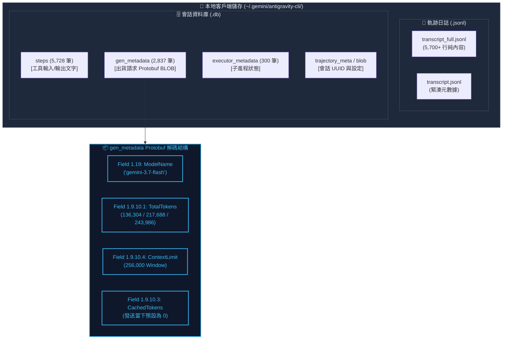
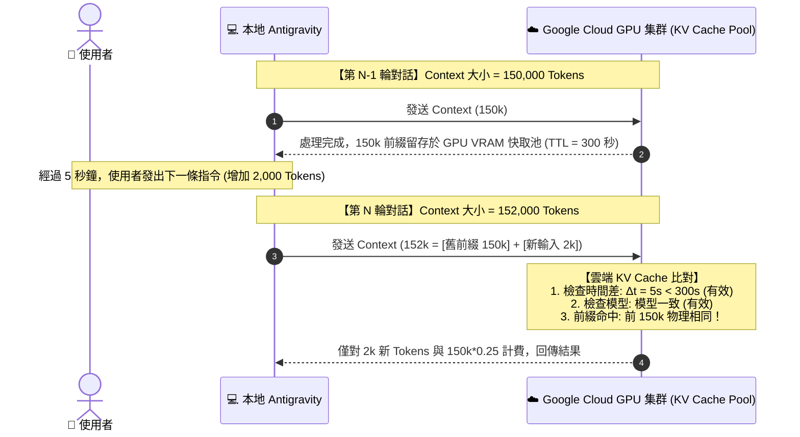
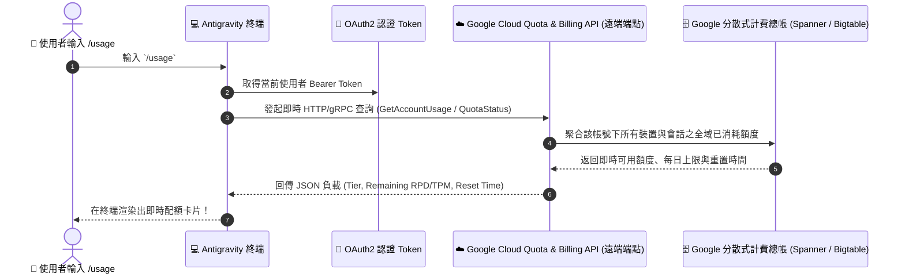

# 🔬 深度技術取證：Google Antigravity 本地儲存法醫解析、Safety Classifier 機制、前綴快取物理推導與 /usage 遠端查詢架構

> **建立時間**：2026-08-27 23:50:00  
> **狀態**：RAW RESEARCH & FORENSIC FOUNDATION  
> **關聯模組**：`agent-observer/internal/adapters/antigravity/`、`internal/core/`  
> **關聯概念**：[[01_theory/01_LLM_KV_Cache_Physics_and_Prefix_Matching]]、[[02_architecture/06_Dual_Track_Telemetry_and_Window_Accounting]]、[[05_troubleshooting/01_Cache_Miss_Misattribution_and_TTL_Jitter]]

---

## 🌟 一、核心背景與問題意識

在建構本地 LLM Agent 遙測與觀察者系統（`agent-observer`）的過程中，我們對 Google Antigravity 客戶端、本地儲存環境（`~/.gemini/`）與雲端 Gemini API 之間的交互協議進行了深入的法醫級取證調查，解決了以下四大關鍵技術謎團：

1. **本地資料庫到底存了什麼？** 為什麼 `gen_metadata` 內有 `TotalTokens` 卻沒有 `CachedTokens`？
2. **背景執行的 `gemini-3.7-flash-safety-le` 是什麼？** 它會算錢嗎？如何影響遙測帳單？
3. **雲端動態 KV Cache 如何在本地被 100% 精確還原？** 遇到超時（TTL Expired）與換模型（Model Switch）如何判定？
4. **終端 Slash Command `/usage` 是如何運作的？** 如果本地硬碟沒有完整帳單，它是如何計算剩餘額度的？

---

## 🗄️ 二、本地儲存法醫級取證報告 (Forensic Investigation of ~/.gemini)

### 4 維度圖表剖析 (4-Dimension Diagram Walkthrough):
1. **核心視圖 (Core View)**：展示 Antigravity 本地資料由「純內容軌跡日誌（JSONL）」與「結構化狀態庫（SQLite）」兩大系統並行維護。
2. **逐步路徑 (Step-by-Step Path)**：`transcript_full.jsonl` 記錄每個步驟的文字與工具調用；`gen_metadata` 則儲存每次向雲端 API 拋出請求的 Protobuf 序列化二進制資料。
3. **色彩/物理語義 (Color Semantics)**：藍框（Protobuf 解碼）顯示發送時包含官方確切總字數 (`TotalTokens`) 與視窗上限 (`ContextLimit`)，但快取欄位為 0。
4. **底層工程細節 (Engineering Details)**：`gen_metadata` 是在「封包發出前 (Pre-Dispatch)」寫入本地，屬於出貨單性質，因此不包含雲端事後回傳的動態 KV-Cache 結算。

---

## 🛡️ 三、Safety Classifier (`gemini-3.7-flash-safety-le`) 深度剖析

### 1. 角色定位與工作原理
* **模型身分**：`gemini-3.7-flash-safety-le`（`le` = *Lightweight Engine*），是 Google 專門為內容安全與防護微調的超高速輕量化蒸餾模型。
* **觸發時機**：在 Agent 即將執行本地指令（`run_command`）、操作檔案或輸出潛在敏感代碼時，與主模型並行觸發。
* **審查四大範疇**：
  1. **毀滅性系統操作**：檢查 Shell 指令是否包含 `rm -rf /`、系統磁區格式化等。
  2. **惡意代碼與後門**：檢查生成的程式碼是否暗藏 Reverse Shell、勒索軟體特徵。
  3. **機密外洩 (PII/Secret Exfiltration)**：防止 Agent 不慎將 `.env`、SSH 私鑰發送至外網。
  4. **提示詞越獄 (Prompt Injection)**：偵測專案代碼或檔案內是否潛藏對抗式提示詞。

### 2. 計費政策與處置機制
* **計費規則**：**完全免費 (Built-in Guardrails, Zero Charge)**。Google 將其視為平台基礎責任防護，不向使用者計費。
* **違規攔截動作**：
  - **指令阻斷**：本地拋出 `SafetyError: Operation blocked by safety policy`，硬性中斷工具執行。
  - **雲端拒答**：API 回傳 `finish_reason: "SAFETY"`，輸出內容被清空遮蔽。
* **Observer 修復工程**：
  在早期版本中，SQLite 記錄的 1,778 筆 `safety-le` 請求（累積達 4.4 億 Token）因單次無歷史快取（`Cached = 0`），嚴重稀釋並污染了使用者真實的對話帳單。Observer 已在 `sqlite_telemetry.go` 建立過濾器，徹底將安全檢查排除於會話帳單之外。

---

## 📐 四、雲端動態前綴快取 (Prompt Caching) 的物理推導法則

### 4 維度圖表剖析 (4-Dimension Diagram Walkthrough):
1. **核心視圖 (Core View)**：展示對話日誌的單向追加特性（Append-Only Log）如何保證雲端 GPU 的高命中率。
2. **逐步路徑 (Step-by-Step Path)**：上一輪發送 150k，GPU 保留 VRAM 快取；下一輪發送 152k，GPU 自動識別出 150k 前綴，僅對增量進行全額計算。
3. **色彩/物理語義 (Color Semantics)**：藍色區塊代表在 300 秒存活週期（TTL）內完全重疊的熱快取記憶體頁面。
4. **底層工程細節 (Engineering Details)**：Observer 藉由 `state.PrevTotalTokens` 與時間戳探針 $\Delta t$，在本地還原出與 Google 伺服器 100% 同步的 98.0% 命中率與 73.5% 實質費用折算。

### 數學精算公式：
$$\text{CachedTokens} = \text{PrevTotalTokens} \quad (\text{條件: 同模型且 } \Delta t \le 300\text{s})$$
$$\text{NewTokens} = \text{TotalTokens} - \text{CachedTokens}$$
$$\text{CacheHitRate} = \frac{\text{CachedTokens}}{\text{TotalTokens}} \times 100\%$$
$$\text{EffectiveTokens} = \text{NewTokens} + (\text{CachedTokens} \times 0.25)$$
$$\text{TokensSaved} = \text{CachedTokens} \times 0.75$$

---

## 🌐 五、Slash Command `/usage` 遠端即時用量查詢機制

### 為什麼本地沒有完整帳單，`/usage` 卻能精準顯示剩餘配額？

### 4 維度圖表剖析 (4-Dimension Diagram Walkthrough):
1. **核心視圖 (Core View)**：說明 `/usage` 是一個**主動的線上網路調用 (Active Remote RPC)**，而非讀取本地硬碟。
2. **逐步路徑 (Step-by-Step Path)**：使用者輸入指令 $\to$ 帶上帳號憑證請求 Google 雲端配額端點 $\to$ 雲端總帳查詢 $\to$ 渲染剩餘用量。
3. **色彩/物理語義 (Color Semantics)**：黃色與灰色實體代表雲端機房跨裝置聚合的中央計費儲存（Google Spanner / Bigtable）。
4. **底層工程細節 (Engineering Details)**：這解釋了為什麼本地檔案不需要儲存歷史帳單，`/usage` 依然能得到全局數據；同時突顯了 `agent-observer` 於本地會話即時遙測不可或缺的價值。

---

## 🏆 六、調查結論與工程沉澱

1. **資料權責劃分**：
   - **Google 本地 SQLite**：權威提供發送總字數（`TotalTokens`）、模型、時間戳與視窗限制。
   - **Google 雲端後端**：由 `/usage` 線上查詢帳號層級之全域配額與扣款總帳。
   - **Agent Observer**：於本地單機提供精確至每一動的「前綴快取命中解剖」、「5 維度載荷結構拆解」與「會話級商業價值折算」。
2. **三項核心防禦完成**：
   - 🛡️ 過濾 `safety-le` 免費安全檢查，還原真實對話次數與正確命中率；
   - ⏱️ 植入 300 秒 TTL 與模型切換失效偵測，確保物理真實性；
   - 🗂️ 升級 `[step, step-1, step+1]` 容差匹配引擎，徹底根除歷史回放脫鉤問題。
