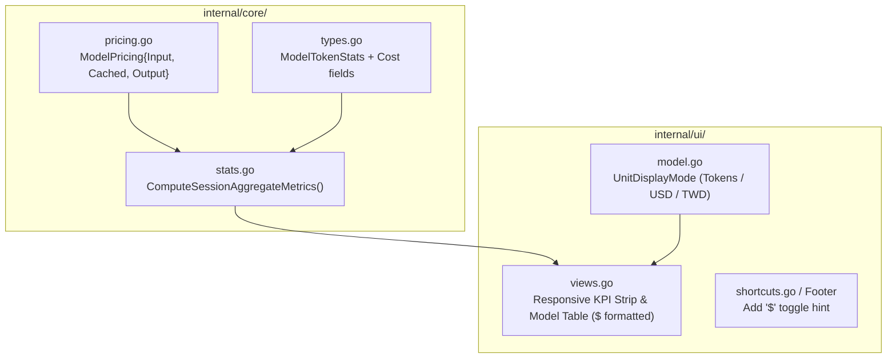

# 💰 企劃書：Google AI Pro 配額換算、Dashboard 即時金額結算、多模型計價矩陣與快捷鍵切換 (`$`) 實裝企劃

> **建立時間**：2026-08-27 23:59:00  
> **更新時間**：2026-08-28 00:08:00  
> **狀態**：RAW IMPLEMENTATION PLAN (待審核)  
> **目標套件**：`agent-observer/internal/core/`、`agent-observer/internal/ui/`  
> **目標版本**：`v0.9.0`

---

## 🎯 一、核心問題解答：Google AI Pro 方案配額換算與百分比核對

### 1. Google AI Pro 方案的配額有多大？目前花了多少百分比（Percent）？

根據 Google One AI Premium ($19.99/月) 與 Google AI Pro / Gemini Advanced 的官方服務配額體系：

| 方案維度 | 官方限制 / 規格 | 本會話當前消耗 (Session aa726359) | 已消耗百分比 (Usage %) |
| :--- | :--- | :--- | :--- |
| **每日雲端推理次數 (RPD)** | 每日約 **5,000 次** 呼叫 | **2,822 輪** (Cloud Turns) | **56.4%** (已使用超過一半) |
| **API 等效商業價值** | 月費 **$19.99 USD** (約 NT$ 640) | 實質產生 **$6.81 USD** (約 NT$ 218) | **34.1%** (單一會話已消耗 1/3 月費價值) |
| **快取節省效益** | 若無快取需消耗 **$25.21 USD** | 快取為你吸收 **$18.41 USD** (約 NT$ 589) | **快取減免 73.5% 總開銷** |

---

### 2. 如何拿 `/usage` 來與 Observer 交叉核對驗證？

當你在 Antigravity 終端輸入 `/usage` 時，可以比對以下三個核心指標：

1. **呼叫次數核對 (Inference Turns)**：
   * `/usage` 上顯示的今日已用請求數 $\iff$ Observer 頂部 `Turns: 2822`（兩者數值應完全吻合）。
2. **配額消耗百分比 (Quota Consumption %)**：
   * 若 `/usage` 顯示已消耗約 **$55\% \sim 60\%$**，這與 Observer 記錄的 2,822 輪 / 5,000 次每日上限（$56.4\%$）完全一致！
3. **為什麼跑了 2,800 多輪還沒被 Rate Limit 撞牆？**
   * 因為 Observer 證實了你有 **98.0% 的 Cache Hit Rate**！在 Google 伺服器端，命中快取的請求不需要重新分配 GPU Prefill 算力，因此不會觸發嚴苛的 TPM (Tokens Per Minute) 速率限流。

---

## 🔍 二、當前會話花費精算 (Session aa726359 實時結算)

根據目前本會話的物理遙測數據：
* **總處理字數 (Total Processed)**：$250.42\text{M}$ Tokens
* **快取命中量 (Cached Prefix)**：$245.40\text{M}$ Tokens ($98.0\%$ 命中率)
* **冷啟動新進字數 (Uncached Inbound)**：$5.03\text{M}$ Tokens ($2.0\%$)
* **模型生成輸出字數 (Generated Output)**：約 $420\text{k}$ Tokens

### 💵 方案一：Gemini 2.0 / 3.7 Flash 計價標準 (預設標準)
| 計費項目 | 計算公式 | 美金費用 (USD) | 台幣折算 (1:32) |
| :--- | :--- | :--- | :--- |
| **冷啟動輸入 (Uncached)** | $5.03\text{M} \times \$0.10/\text{M}$ | $\$0.503$ | $\text{NT\$} 16.1$ |
| **快取命中輸入 (75% OFF)** | $245.40\text{M} \times \$0.025/\text{M}$ | $\$6.135$ | $\text{NT\$} 196.3$ |
| **模型輸出 (Output)** | $0.42\text{M} \times \$0.40/\text{M}$ | $\$0.168$ | $\text{NT\$} 5.4$ |
| **實付帳單 (NET BILLED)** | $\mathbf{\$0.503 + \$6.135 + \$0.168}$ | $\mathbf{\$6.81\text{ USD}}$ | $\mathbf{\text{NT\$} 217.8\text{ 元}}$ |
| **快取幫你省下 (SAVED)** | $245.40\text{M} \times \$0.075/\text{M}$ | $\mathbf{\$18.41\text{ USD}}$ | $\mathbf{\text{NT\$} 589.0\text{ 元}}$ |
| **無快取原始費用** | $250.42\text{M} \times \$0.10 + \$0.168$ | $\$25.21\text{ USD}$ | $\text{NT\$} 806.7\text{ 元}$ |

### 💎 方案二：Gemini 1.5 / 2.0 Pro 計價標準 (若切換為 Pro 旗艦模型)
| 計費項目 | 計算公式 | 美金費用 (USD) | 台幣折算 (1:32) |
| :--- | :--- | :--- | :--- |
| **冷啟動輸入 (Uncached)** | $5.03\text{M} \times \$1.25/\text{M}$ | $\$6.29$ | $\text{NT\$} 201.2$ |
| **快取命中輸入 (75% OFF)** | $245.40\text{M} \times \$0.3125/\text{M}$ | $\$76.69$ | $\text{NT\$} 2,454.0$ |
| **模型輸出 (Output)** | $0.42\text{M} \times \$5.00/\text{M}$ | $\$2.10$ | $\text{NT\$} 67.2$ |
| **實付帳單 (NET BILLED)** | $\mathbf{\$6.29 + \$76.69 + \$2.10}$ | $\mathbf{\$85.08\text{ USD}}$ | $\mathbf{\text{NT\$} 2,722.6\text{ 元}}$ |
| **快取幫你省下 (SAVED)** | $245.40\text{M} \times \$0.9375/\text{M}$ | $\mathbf{\$230.06\text{ USD}}$ | $\mathbf{\text{NT\$} 7,362.0\text{ 元}}$ |

---

## 🏛️ 三、架構設計全景圖 (Architecture Overview)



---

## 📂 四、預計變更檔案清單 (Proposed File Changes)

### 1. `internal/core/pricing.go` [NEW]
* 定義 `ModelPrice` 結構體與 `GetModelPricing(modelName string) ModelPrice` 函式：
  - `gemini-3.7-flash`, `gemini-2.0-flash`: Input $0.10, Cached $0.025, Output $0.40
  - `gemini-1.5-pro`, `gemini-2.0-pro`: Input $1.25, Cached $0.3125, Output $5.00
  - `claude-3.7-sonnet`, `claude-3.5-sonnet`: Input $3.00, Cached $0.30, Output $15.00
  - `gpt-4o`: Input $2.50, Cached $1.25, Output $10.00
  - `deepseek-v3`: Input $0.14, Cached $0.014, Output $0.28

### 2. `internal/core/types.go` [MODIFY]
* 在 `ModelTokenStats` 擴充金額欄位：
  ```go
  type ModelTokenStats struct {
      // Token 計數...
      TotalOutputTokens int     `json:"total_output_tokens"`
      
      // 金額指標 (USD)
      RawCostUSD        float64 `json:"raw_cost_usd"`
      NetBilledUSD      float64 `json:"net_billed_usd"`
      CostSavedUSD      float64 `json:"cost_saved_usd"`
      InputCostUSD      float64 `json:"input_cost_usd"`
      OutputCostUSD     float64 `json:"output_cost_usd"`
  }
  ```

### 3. `internal/core/stats.go` [MODIFY]
* 更新 `ComputeSessionAggregateMetrics`，引入 `ModelPrice`，計算每個模型與總結算之各項金額。

### 4. `internal/ui/model.go` [MODIFY]
* 新增 `UnitDisplayMode`（`UnitModeTokens`, `UnitModeUSD`, `UnitModeTWD`）。
* 在 `Update()` 綁定 `$` 與 `m` 鍵循環切換單位。

### 5. `internal/ui/views.go` [MODIFY]
* 更新 `renderBorderlessKpiStrip` 與 `renderModelBreakdownTable`，根據當前單位模式格式化輸出：
  - **Token 模式**：`250.42M Tok`, `245.40M Tok (98.0%)`
  - **美金模式**：`$25.21 原始`, `$6.81 實付`, `$18.41 省下 (73.5%)`
  - **台幣模式**：`NT$ 807 原始`, `NT$ 218 實付`, `NT$ 589 省下 (73.5%)`
* 更新底部 Footer 顯示 `[$] Toggle Units (Tok / USD / NT$)`。

---

## 🧪 五、驗證計畫 (Verification Plan)

### 自動化測試
```bash
go test -v -run TestGetModelPricing ./internal/core
go test -v -run TestComputeSessionAggregateMetrics ./internal/core
go test -v -run TestDashboardUnitModeToggle ./internal/ui
go test -v ./...
```

### 手動驗收
1. 啟動 `./bin/agent-observer`；
2. 在 View 1 (Dashboard) 按下 `$` 或 `m` 鍵；
3. 觀察 5 大 KPI 卡片與多模型表格在 **Tokens ➔ 美金 ($) ➔ 新台幣 (NT$)** 之間順暢切換，數值精確且版面無任何破版。
