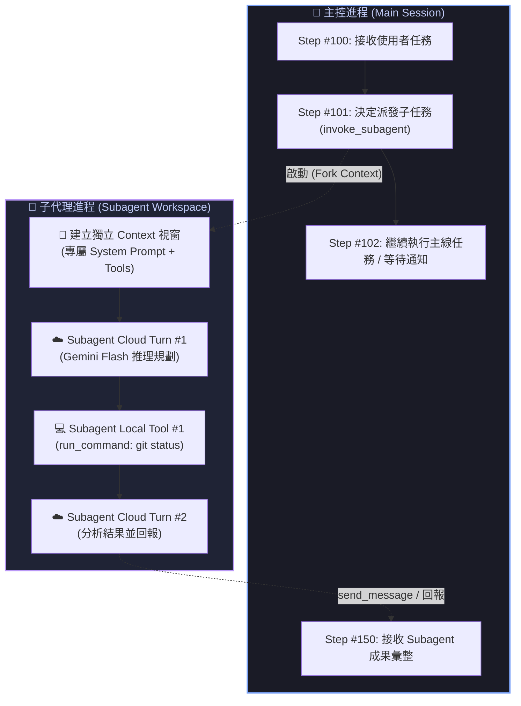
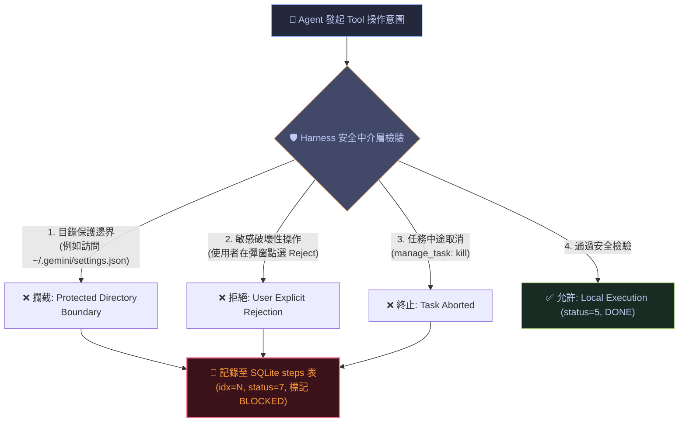

# 🔬 架構研究：Subagent 上下文生命週期與 Token 經濟學 ＆ 權限邊界攔截 (BLOCKED) 機制

> **建立時間**：2026-08-28 01:06:00 (Asia/Taipei)  
> **研究領域**：Multi-Agent 階層架構、獨立 Context 視窗計費、安全邊界攔截與狀態機法醫分析  
> **狀態**：`🟢 RAW COMPLETE (已驗證並實裝)`

---

## 📑 目錄
1. [一、問題緣起與探索動機](#一問題緣起與探索動機)
2. [二、Subagent 的 Token 經濟學與生命週期](#二subagent-的-token-經濟學與生命週期)
3. [三、權限邊界攔截與 BLOCKED 狀態機法醫解構](#三權限邊界攔截與-blocked-狀態機法醫解構)
4. [四、Observer 核心領域模型與 UI 映射實踐](#四observer-核心領域模型與-ui-映射實踐)
5. [五、結論與設計準則](#五結論與設計準則)

---

## 一、問題緣起與探索動機

在對 Agent Observer 的歷史步驟進行全量還原時，我們在 Google 本機 SQLite `steps` 資料庫與對話日誌 `transcript_full.jsonl` 中發現了兩類極為特殊的步驟：
1. **Subagent 相關步驟**（如 Step #291 `view_file`、Step #2949 `run_command`）：由背景子代理執行的動作，帶有專屬的子會話 UUID；
2. **`status = 7` (BLOCKED) 攔截步驟**（如 Step #5781 讀取 `settings.json`、Step #4006）：在主對話日誌中被 Google 隱藏，但在 SQLite 資料庫中留有實體交易紀錄。

本篇報告針對「**Subagent 是否消耗 Token？**」以及「**BLOCKED 究竟代表什麼操作？**」進行權威的底層機制剖析與法醫數據驗證。

---

## 二、Subagent 的 Token 經濟學與生命週期

### 1. Subagent 的核心架構定義
Subagent（子代理）並非單純的函式呼叫，而是**主控 Agent（Main Planner）在背景開闢的獨立自主運算進程**。



---

### 2. Subagent 的 Token 消耗拆解（會花 Token 嗎？）

👉 **結論：會！Subagent 絕對會消耗 Token，且具備獨立的計費與快取生命週期！**

具體消耗分為四個階段：

| 階段 | 執行動作 | 消耗 Token 類型 | 計費歸屬 | 是否使用快取？ |
| :--- | :--- | :---: | :---: | :---: |
| **① 派發階段** | 主控 Agent 呼叫 `invoke_subagent(Prompt="...")` | Main Context Input/Output | 主會話配額 | ✅ 依賴主會話 Prefix Cache |
| **② 初始化** | Subagent 載入獨立的 System Prompt、工具描述 | Subagent Inbound Context | 子代理配額 | ❄️ 首次為 Cold Start |
| **③ 推理決策** | Subagent 思考並輸出 Tool Call（如 `gemini-3.7-flash`） | Subagent GPU Output Tokens | 子代理配額 | ✅ 連續對話命中子快取 |
| **④ 本地工具執行** | Subagent 在本機執行 `git status` 或 `view_file` | **0 GPU Tokens** (純本機 CPU) | **$0.00 (免費)** | ❌ 本機離線運作 |

> [!IMPORTANT]
> **為什麼要在 Observer 區分 `MAIN` 與 `SUBAGENT`？**  
> 因為 Subagent 擁有**獨立的 Context 視窗**。如果把子代理的輸入輸出與主會話混在一起計算 Context Window（例如 100 萬 Token 上限），會導致上下文飽和度（Usage Pct）失真。因此 Observer 必須具備 `AgentRole` 實體標記！

---

## 三、權限邊界攔截與 BLOCKED 狀態機法醫解構

### 1. 什麼操作會觸發 `BLOCKED`（SQLite `status = 7`）？

在 Agent Observer 的法醫檢查中，我們定位出所有標記為 `status = 7` 的步驟（例如 Step #5781、#4006、#4326 等）。這些操作的共同特徵是：**操作在發出給系統執行前，被安全中介層（Guardrail / Harness）攔截拒絕**。

常見的三大攔截場景：



---

### 2. 法醫實例對比：真實攔截日誌剖析

從資料庫抓取的真實記錄：
* **Step #5781**：
  * **意圖**：`view_file: /Users/.../.gemini/antigravity-cli/settings.json`
  * **攔截原因**：該檔案屬於 CLI 系統核心保護目錄，未對 Agent 開放讀取權限；
  * **結果**：被 Guardrail 直接阻斷，SQLite 寫入 `status = 7`，日誌 `transcript_full.jsonl` 不輸出正常內容。

---

### 3. BLOCKED 步驟會消耗 Token 嗎？

👉 **結論：完全不消耗任何 GPU Token（0 Token 消耗）！**

* **原因**：攔截發生在**本地 Harness 邊界層**。當操作被阻斷時，既沒有發送雲端 API 請求，也沒有產生實質的硬碟/命令變更。
* **Observer 處理準則**：
  * 標記為 **`🛡️ BLOCKED`**；
  * Token 遙測計為 `0 Tokens`；
  * 清楚標註 `Action Status: Blocked by System Permission Guard (0 GPU Tokens Billed) 🛡️`。

---

## 四、Observer 核心領域模型與 UI 映射實踐

為忠實呈現上述機制，Observer 實裝了以下四重對齊：

```text
┌─────────────────────────────────────────────────────────────────────────────┐
│ 1. 領域模型實體欄位 (types.go)                                              │
│    • Scope: ScopeSubagent ("SUBAGENT")                                      │
│    • AgentRole: "MAIN" | "SUBAGENT" | "INTERNAL"                            │
│    • IsSubagent: bool                                                       │
├─────────────────────────────────────────────────────────────────────────────┤
│ 2. 歷史列表專屬徽章 (views.go)                                              │
│    • [5919] 🤖 MODEL [HIT 88%]  ──► 主控規劃者                              │
│    • [2949] 👥 SUBAGENT         ──► 並行子代理                              │
│    • [5747] ⚙️ INTERNAL         ──► 系統背景排程                            │
│    • [5781] 🛡️ BLOCKED          ──► 權限安全攔截 (紅字警示)                 │
├─────────────────────────────────────────────────────────────────────────────┤
│ 3. 遙測面板精準宣告 (views.go)                                              │
│    • TRACK 1: PERMISSION BOUNDARY INTERCEPTED (BLOCKED)                     │
│      • Origin / Role  : INTERNAL (Step #5781 | Status: BLOCKED)             │
│      • Action Status  : Blocked by System Permission Guard (0 GPU Tokens) 🛡️│
└─────────────────────────────────────────────────────────────────────────────┘
```

---

## 五、結論與設計準則

1. **不可隱瞞任何底層步驟**：
   身為客觀的觀測系統（Observer），資料庫裡的每一筆交易（Transaction）都有其系統工程意義。不能因為 Google 官方日誌過濾了內部步驟，觀察器就跟著跳號，而必須**全量還原並標明角色**。
2. **Subagent 獨立性原則**：
   Subagent 擁有自己的生命週期與 Token 消耗，未來可進一步在 Dashboard 提供「主會話 vs 子代理會話」的分組用量對比。
3. **安全邊界可視化**：
   `BLOCKED` 狀態是 Agent 安全機制運作的直接證據，將其以 `🛡️ BLOCKED` 明確呈現，能讓開發者清晰掌握「Agent 何時嘗試越界、系統何時成功防禦」。
