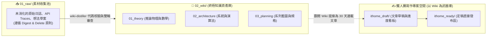

# 💎 Obsidian 知識庫拓撲架構、版本控制白名單與專案協同憲法設計

> [!NOTE]
> 本文件記錄了 2026-08-26 本專案在 **Obsidian Vault 宏觀拓撲**、**資訊架構認知路徑**、**Git 版本控制白名單** 與 **專案協同憲法 (AGENTS.md)** 的完整設計原則與底層決策，作為日後技術分享或規範參考的原始素材。

---

## 🏛️ 一、知識庫宏觀架構與「Wiki 終點論」

傳統專案常將筆記庫與文章輸出混在一起，導致文檔變成粗糙的中間站。本專案確立了三權分立的架構公理：



### 💡 核心三大設計公理：
1. **Wiki is the Destination, Not an Intermediate Station (Wiki 是終點，不是中間站)**：
   * `02_wiki/` 是長效、精煉、易讀且高度互連的最高品質資產；`ithome_draft/` 才是短期專案寫作空間。
2. **Digest & Delete Policy (消化即刪除)**：
   * `01_raw/` 是暫存池，一旦 100% 提煉進 `02_wiki/`，原始檔案立即安全刪除，杜絕版本冗餘與技術債。
3. **Cognitive Numbering Pathway (大腦認知演進編號)**：
   * 編號（`01_`, `02_`, `03_`）嚴格代表大腦心智模型的層層遞進順序（`01_theory` 物理基石 $\to$ `02_architecture` 系統落地 $\to$ `03_planning` 產品全景），嚴禁隨意或按時間編號。

---

## 💎 二、Obsidian Git 版本控制白名單設計 (Strict Whitelist)

Obsidian 內部會自動產生大量容易造成多設備同步衝突的暫存狀態檔案（如分頁位置、游標行號、圖譜拖拽座標、第三方主題大檔案）。

### 🛡️ 實作策略：默認全域忽略 + 明確白名單
在 [`.gitignore`](file:///Users/daniel_y_yang/Documents/self/ithome2026/.gitignore) 中採用嚴格白名單：

```gitignore
# 1. 默認全域忽略所有 .obsidian 內部暫存檔
docs/.obsidian/*
.obsidian/*

# 2. 嚴格白名單：僅放行 4 個核心設定檔
!docs/.obsidian/app.json                  # 全寬模式 (readableLineLength: false)
!docs/.obsidian/appearance.json           # 主題名稱與顏色偏好
!docs/.obsidian/core-plugins.json         # 官方外掛清單
!docs/.obsidian/community-plugins.json    # 社群外掛清單
```

> **工程優勢**：日常點擊分頁、移動圖譜、換主題產生的瑣碎變動 100% 被 Git 忽略，徹底根除 Git Merge Conflict！

---

## 📜 三、專案最高協同憲法 (`AGENTS.md`)

在專案根目錄建立了不可篡改的最高憲法 [`AGENTS.md`](file:///Users/daniel_y_yang/Documents/self/ithome2026/AGENTS.md)，強制所有 AI Agent 遵守：

1. **🌐 語言憲法 (Language Policy)**：
   * **Codebase / Backend / Logs (Strictly English Only)**：`agent-observer/` 內所有源碼、結構體、變數、註解、Terminal Log 必須 100% 使用英文，**嚴禁任何中文註解與中文 Log**！
   * **Documentation (`docs/`)**：面向人類研讀與參賽，以繁體中文撰寫。
2. **💎 Obsidian 白名單憲法**：僅允許 4 個核心設定檔進 Git。
3. **🧠 知識庫憲法**：
   * 貫徹 Digest & Delete；
   * 強制 Step 0 檢閱 `feedbacks/`；
   * 正文 100% 杜絕審查員人名；
   * 每張 Mermaid 圖表強制配備 4 維度文字深度導讀。
