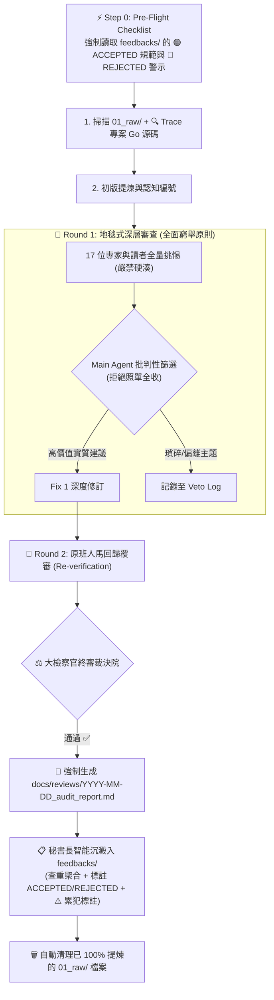

# 🧠 Wiki-Distiller 自研技能：多角色深層對抗審查與自我進化系統設計

> [!NOTE]
> 本文件記錄了 2026-08-26 本專案在 **AI Agent 自研技能開發**、**17 位世界前 1% 審查天團** 與 **自我進化反饋庫 (Feedbacks)** 的完整系統設計細節，作為日後發表技術文章或架構演進的原始素材。

---

## 👥 一、17 位「世界前 1%」審查天團全景陣容

為了徹底解決傳統 AI 產出「條列式空洞、缺乏推導、無法驗證」的痛點，在 `.agents/skills/wiki-distiller/roles/` 下構建了完整的審查天團：

### 1. 🎓 頂尖領域專家組 (7 位)
* **⚖️ 大檢察官 (`00_chief_inquisitor.md`)**：全局仲裁院院長，統整全量建議，擁有一票否決權與終審簽核權。
* **🔍 實證代碼驗證官 (`07_code_fact_checker_and_pruner.md`)**：信奉 *"Code is Law."*，拿放大鏡 Trace `agent-observer/` Go 源碼，核驗結構體、欄位與演算法，獵殺過時資訊。
* **🏛️ 資訊架構師與知識本體論專家·維克多 (`06_information_architect_vault_ontologist.md`)**：把關目錄劃分的正交性（MECE 原則）與同類卡片 Merge 判定。
* **✍️ 首席技術作家與細節審查官 (`05_technical_writer_detail_auditor.md`)**：以 DDIA/CSAPP 世界級標準，把關敘事厚度、每張圖 4 維度深度導讀與「正文 100% 杜絕審查員人名」。
* **🔬 推論物理官 (`01_theoretical_physicist.md`)**：把關 Attention 數學、KV 顯存公式與 GEMM/GEMV 物理。
* **🏛️ 系統架構官 (`02_system_architect.md`)**：把關 Context 5 維度模型、雙層 SQLite 狀態機與 Clean Architecture 分層。
* **🎓 頂級技術教育家·艾咪 (`03_tech_educator_lecturer.md`)**：把關痛點開場 Hook、知識坡度與啟發式節奏。
* **🔗 圖譜審查官 (`04_obsidian_knowledge_graph_linter.md`)**：把關全庫雙向鏈接 `[[Page]]` 與 0 孤島圖譜。

### 2. 👶 Junior 天賦新人讀者組 (4 位 - Stanford/MIT 金牌背景)
* **🔍 背景脈絡與因果審查官·小莫 (`junior_04_narrative_and_context_auditor.md`)**：專查「作者偷懶簡略、預設讀者懂、因果銜接跳躍」。
* **直覺探索型天才·小明 (`junior_01_curious_newbie.md`)**：專查「名詞定義不清、缺乏生活化直覺比喻」。
* **極限駭客實戰家·阿豪 (`junior_02_hands_on_explorer.md`)**：專查「代碼步驟缺失、不可跑、缺少預期輸出」。
* **形式邏輯偵探·小華 (`junior_03_logic_detective.md`)**：專查「因果邏輯跳躍、省略中間推導步驟」。

### 3. 🧓 Senior 首席大師讀者組 (5 位 - FAANG 首席架構師背景)
* **🧠 系統拓撲與認知路徑架構師·雷蒙 (`senior_05_vault_learning_path_architect.md`)**：專查編號背後的心智演進順序。
* **🔍 深度推導與因果連續性審查官·格雷格 (`senior_04_deep_dive_continuity_auditor.md`)**：專查工程縱深與推導連續性。
* **基礎架構首席架構師·老陳 (`senior_01_tradeoff_explorer.md`)**：專查決策 Tradeoffs（Watcher vs Proxy、Go vs Python）與極限邊界。
* **系統設計與領域建模大師·凱文 (`senior_02_architecture_visualizer.md`)**：專查全域架構、時序圖與 Clean Architecture 模組邊界。
* **LLM 內核與體系結構權威·大衛 (`senior_03_precision_explainer.md`)**：專查微架構瓶頸（Arithmetic Intensity、HBM 帶寬）、顯存 Bytes 級推導與 Big-O 複雜度。

---

## 🔄 二、雙輪對抗審查與報告輸出流水線

---

## 🧬 三、秘書長維護的「自我進化反饋記憶庫」(`feedbacks/`)

* **角色**：[`roles/08_chief_secretary_feedback_archivist.md`](./roles/08_chief_secretary_feedback_archivist.md)（秘書長）。
* **機制**：
  * **智能查重與聚合**：收到的意見先與歷史記錄比對，不盲目 Append；
  * **雙軌決策標註**：明確標註 `🟢 [ACCEPTED]` 採納標準與 `🔴 [REJECTED]` 駁回警示；
  * **累犯懲罰記錄**：重複犯錯時標註 `⚠️ 累犯警示 (Recurrence Penalty)` 並累加計數，升級防禦權重。
* **四大記憶庫分流**：
  1. `01_theory_and_math.md`：算術強度數學定義、128k 顯存推導、拒絕 CUDA 算子 Scope Creep；
  2. `02_architecture_and_code.md`：5 維度 Go AST 對齊、Watcher vs Proxy 客觀矩陣、堅持 Pure Go；
  3. `03_narrative_and_diagrams.md`：每圖 4 維度深度導讀、正文 100% 杜絕人名；
  4. `04_vault_topology_and_numbering.md`：認知學習編號邏輯、Digest & Delete 垃圾清理。
