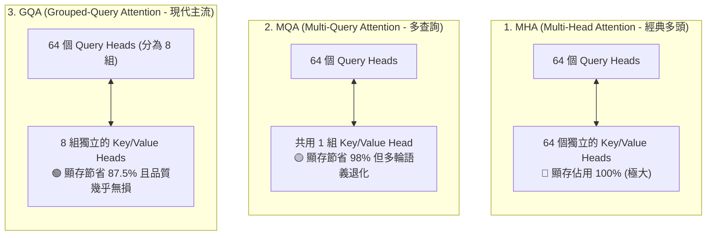

# 🧠 Transformer KV Cache 底層機制與顯存佔用數學推導

> [!NOTE]
> **⚡ 30 秒核心精華 (Key Takeaway)**
> 在 Transformer 的自回歸解碼中，為了避免每產生一個新字都要將歷史所有文字重新進行全神經網絡計算，模型將歷史所有位置的 **Key (鍵) 向量與 Value (值) 向量持久保存在 GPU 顯存中**，這就是 **KV Cache**。
> 雖然 KV Cache 將單步時間複雜度從 $O(N)$ 降低至 $O(1)$，但其顯存空間複雜度呈 **$O(N)$ 線性持續增長**。在長程對話（如 128k 上下文）下，單一並發請求的 KV Cache 就高達 **40 GB**，直接吃掉半張頂級 GPU 顯存，成為現代 AI Agent 系統中最嚴峻的瓶頸（OOM 危機）。

---

## 🔍 一、技術背景：為什麼必須引入 KV Cache？

標準 Multi-Head Attention (多頭注意力機制) 的核心計算公式如下：

$$
\text{Attention}(Q, K, V) = \text{softmax}\left(\frac{Q K^T}{\sqrt{d_k}}\right) V
$$

在 [[01_Transformer_Prefill_vs_Decode|自回歸逐字生成 (Decode)]] 階段：
* 假設當前已經生成了 $t-1$ 個文字，模型正在預測第 $t$ 個 Token。
* 為了計算第 $t$ 個 Token 的注意力分佈，模型需要計算當前字的查詢向量 $Q_t \in \mathbb{R}^{1 \times d_k}$。
* 但根據注意力矩陣乘法，模型必須讓 $Q_t$ 與 **過去所有位置的 Key 矩陣 $K_{1:t-1} \in \mathbb{R}^{(t-1) \times d_k}$** 進行內積，並將注意力權重加權在 **過去所有位置的 Value 矩陣 $V_{1:t-1} \in \mathbb{R}^{(t-1) \times d_v}$** 上。

### 💥 兩種實現途徑的代價對比：
1. **無快取途徑 (No Cache)**：每生成第 $t$ 個字，都將長度為 $t$ 的整串歷史文字重新輸入神經網絡。生成總長度為 $L$ 的句子，計算複雜度高達 $\sum_{t=1}^{L} t = O(L^2)$，每一步都極度緩慢。
2. **有快取途徑 (With KV Cache)**：將過去每一層神經網絡計算出的 $K_{1:t-1}$ 與 $V_{1:t-1}$ 永久駐留在 GPU 顯存中。生成第 $t$ 個字時，只需計算當前字的 $K_t, V_t$ 並追加到顯存尾端。**單步生成的時間複雜度從 $O(t)$ 驟降為 $O(1)$**。

---

## 🏛️ 二、注意力演進架構圖與精讀指引

為了在保障模型語義品質的前提下緩解 KV Cache 的顯存危機，業界架構經歷了從 **MHA $\to$ MQA $\to$ GQA** 的重大演進：



### 📖 圖表深度精讀指南 (Diagram Walkthrough)

1. **【核心視野】**：本圖展示了 Query（查詢頭）與 Key/Value（鍵值快取頭）的比例配置關係，這是決定 KV Cache 顯存大小最關鍵的結構參數。
2. **【看圖路徑 (Step-by-Step)】**：
   * **MHA (頂部)**：每個 Query Head 都配備一個專屬的 KV Head（$1:1$ 比例）。在 70B 模型中，64 個 KV Heads 同時保存數據，顯存開銷達到理論最大值。
   * **MQA (中部)**：所有的 Query Heads 強制共享同 1 個 KV Head（$64:1$ 比例）。顯存雖然被壓縮了 64 倍，但在複雜推理時注意力容易模糊。
   * **GQA (底部)**：折衷方案，將 64 個 Query Heads 分為 8 組，每組共享 1 個 KV Head（$8:1$ 比例）。在大幅降低 87.5% 顯存的同時，完全保留了多頭注意力的豐富語義表達。
3. **【工程結論】**：現代主流開源與商用模型（如 LLaMA-3, Mistral, Gemma-2）已全數轉向 **GQA** 架構。

---

## 📐 三、KV Cache 顯存大小數學推導公式

對於任意 Transformer 解碼器模型，單一並發請求在上下文長度為 $L$ 時，KV Cache 的顯存佔用量（字節數）計算公式如下：

$$
\mathbf{Memory}_{\text{KV}} = 2 \times n_{\text{layers}} \times n_{\text{kv\_heads}} \times d_{\text{head}} \times L \times \text{bytes\_per\_param}
$$

### 📋 參數物理定義表：

| 參數符號 | 物理含義說明 | 典型數值 (以 LLaMA-3-70B 為例) | 物理單位 |
| :--- | :--- | :--- | :--- |
| **$2$** | 同時儲存 Key 與 Value 兩個獨立的張量 | 固定常數 $2$ | 純純量 |
| **$n_{\text{layers}}$** | 模型的 Transformer 總層數 | $80$ 層 | 層 (Layers) |
| **$n_{\text{kv\_heads}}$** | 模型配置的 Key/Value Head 數量 (GQA 參數) | $8$ 個 (對應 Query Head 為 64) | 個 (Heads) |
| **$d_{\text{head}}$** | 每個 Attention Head 的隱藏特徵維度 | $128$ 維 | 維度 (Dimension) |
| **$L$** | 當前對話累積的上下文序列長度 (Context Length) | 例如 $131,072$ (128k Tokens) | Tokens |
| **$\text{bytes\_per\_param}$** | 數值精度格式所佔用字節數 | BF16 / FP16 = $2$ Bytes, FP8 = $1$ Byte | Bytes / Param |

---

## 💥 四、128k 長上下文顯存暴增實例計算

以業界廣泛部署的 **LLaMA-3-70B (BF16, 80 Layers, 8 KV Heads, $d_{\text{head}}=128$)** 為基準進行推導：

1. **單一 Token 在所有神經網路層中產生的 KV 顯存常數**：
   $$\text{Bytes per Token} = 2 \times 80 \times 8 \times 128 \times 2 = 327,680 \text{ Bytes} \approx \mathbf{320 \text{ KB / Token}}$$
2. **當上下文長度達到 128k ($L = 131,072$ Tokens) 時**：
   $$\text{Total Memory} = 131,072 \times 327,680 \text{ Bytes} = 42,949,672,960 \text{ Bytes} = \mathbf{40.00 \text{ GB}}$$

### 🚨 工程結論與震撼啟示：
* 在不包含模型權重（140GB）的前提下，**光是單一使用者跑滿 128k 上下文，就需要整整 40GB 的純顯存來存放 KV Cache**！
* 如果伺服器要支援 **10 位使用者並發**，僅 KV Cache 就需要 $10 \times 40\text{GB} = \mathbf{400\text{ GB 顯存}}$（相當於 5 張頂級 80GB H100 滿載）！
* 這正是為什麼現代 AI Agent 必須發展 **上下文觀測（Context Observation）** 與 **極致壓縮引擎（Context Compression）** 的根本原因。

---

## 💻 五、最小可執行驗證腳本 (Python Script)

以下提供完整的 Python 顯存推導計算腳本，包含參數校驗與單位換算：

```python
#!/usr/bin/env python3
"""
KV Cache 顯存大小精確計算工具
支援 MHA、MQA、GQA 架構與 FP16/BF16/FP8 精度計算
"""

def calculate_kv_cache(
    layers: int,
    kv_heads: int,
    head_dim: int,
    seq_len: int,
    precision_bytes: int = 2
) -> dict:
    # 核心公式計算總字節數
    bytes_per_token = 2 * layers * kv_heads * head_dim * precision_bytes
    total_bytes = bytes_per_token * seq_len
    
    total_kb = total_bytes / 1024
    total_mb = total_kb / 1024
    total_gb = total_mb / 1024
    
    return {
        "bytes_per_token_kb": bytes_per_token / 1024,
        "total_gb": total_gb,
        "total_mb": total_mb
    }

if __name__ == "__main__":
    # 配置 LLaMA-3-70B 參數 (80 layers, 8 kv_heads, head_dim 128, BF16)
    llama3_70b = calculate_kv_cache(
        layers=80,
        kv_heads=8,
        head_dim=128,
        seq_len=131072, # 128k tokens
        precision_bytes=2 # BF16
    )
    
    print("=" * 60)
    print("📊 LLaMA-3-70B @ 128k Context (BF16) KV Cache 顯存推導結果:")
    print(f"  • 每個 Token 顯存開銷: {llama3_70b['bytes_per_token_kb']:.2f} KB / Token")
    print(f"  • 128k 上下文總顯存:   {llama3_70b['total_gb']:.2f} GB")
    print("=" * 60)
    # 預期輸出:
    # 每個 Token 顯存開銷: 320.00 KB / Token
    # 128k 上下文總顯存:   40.00 GB
```

---

## 🔗 六、相關概念與延伸閱讀
* [[01_Transformer_Prefill_vs_Decode]]：推論兩階段之 Prefill 與 Decode 物理對照。
* [[03_Prompt_Caching_Lifecycle]]：前綴快取如何重用顯存中的 KV Cache 矩陣。
* [[02_architecture/01_Context_5_Dimensions|Context 5 維度模型]]：深入探討哪一個維度最容易吃光 KV 顯存。
