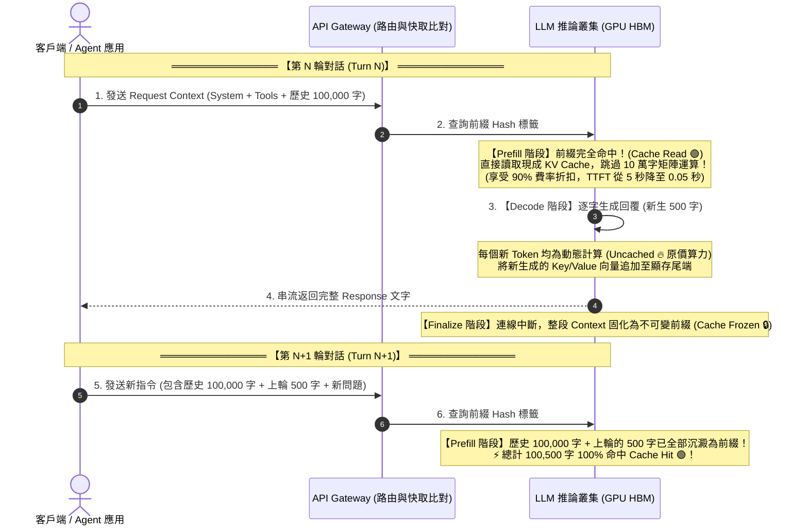
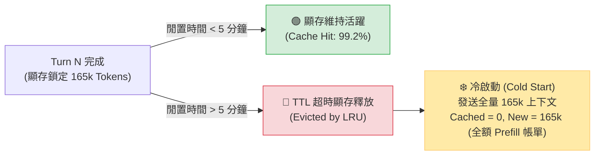

# ⚡ Prompt Caching 前綴快取生命週期與物理機制

> [!NOTE]
> **⚡ 30 秒核心精華 (Key Takeaway)**
> 現代 LLM API（如 Google Gemini, Anthropic Claude, OpenAI GPT-4o）之所以能對長上下文提供高達 **50% ~ 90% 的費用折扣** 並將首字延遲（TTFT）降低一個數量級，核心技術正是 **Prompt Caching (前綴快取)**。
> 其底層物理機制為：**在多輪對話中，上一輪生成的回覆文字在當下是新生算力（Uncached），但一旦回合結束，整段歷史即固化為不可變前綴（Immutable Prefix）；在下一輪請求中，伺服器直接復用已儲存在 GPU 顯存中的 [[02_KV_Cache_Mechanics|KV Cache]] 矩陣，完全跳過重複的 Prefill 矩陣相乘**。
> 本篇進一步解密生產環境中 **TTL 顯存淘汰機制** 與 **同族模型變體（如 `safety-le`）共享底層前綴快取池** 的前沿架構。

---

## 🔍 一、技術背景：前綴快取的誕生動機

在傳統的無快取 LLM API 中，多輪對話的計費與算力開銷是極具毀滅性的：
* 第 1 輪：送入 2,000 字 $\to$ 計算 2,000 字。
* 第 2 輪：送入 2,000 字歷史 + 新輸入 500 字 $\to$ **將 2,500 字全部重新跑一次神經網絡**。
* 第 20 輪：上下文累積到 50,000 字 $\to$ 每問一句話，伺服器都必須對 50,000 字重新做一次矩陣相乘。

### 💡 核心洞察：
在標準對話中，**前面的 49,000 個字在內容與順序上是完全沒有變化的**。既然歷史文字不變，它們通過各層神經網絡所產生的 Key 和 Value 向量就是完全確定的常數。
因此，伺服器只需在內存中將這段 **前綴 KV Cache 鎖定並共享**，即可在後續請求中直接跳過 98% 的計算！

---

## 🏛️ 二、快取生命週期時序圖與精讀指引



### 📖 圖表深度精讀指南 (Diagram Walkthrough)

1. **【核心視野】**：本圖展示了單一請求跨越兩輪對話時，Tokens 是如何從「未快取的新生算力」轉化為「固化快取前綴」的完整時序演進。
2. **【看圖路徑 (Step-by-Step)】**：
   * **步驟 1 ~ 2 (Turn N Prefill)**：客戶端發送請求，Gateway 透過前綴 Hash 快速定位 GPU 顯存中的現成快取塊，達成 **Cache Read (綠色)**。
   * **步驟 3 (Turn N Decode)**：模型開始逐字吐字。由於未來文字是動態創造的，此階段必定是 **Uncached (紅色)**，同時將新向量逐字 Append 到隊列尾端。
   * **步驟 4 (Turn N Finalize)**：連線結束瞬間，整段對話被標記為唯讀固化（Cache Frozen）。
   * **步驟 5 ~ 6 (Turn N+1 躍遷)**：當下一輪請求進來時，上一輪的 500 字已自然融入歷史前綴中，直接享受下一輪的 100% 快取命中！
3. **【色彩與符號物理意義】**：
   * 🟢 **綠色 (Cache Read)**：顯存記憶體直讀，帶寬極高，零 FLOPs 開銷。
   * 🔥 **紅色 (Uncached)**：矩陣乘法運算，消耗 GPU Tensor Core 算力。
4. **【底層隱藏工程細節】**：
   * 現代叢集採用 PagedAttention 與 Radix Tree 樹狀索引管理顯存塊，不同會話若開頭 Prompt 相同，亦可跨 Session 共享根節點 KV Cache。

---

## 🎯 三、極簡 2 輪對話快取狀態機與數值演繹 (Concrete Walkthrough)

帶入極簡真實輸入，演繹資料由「新生算力」轉化為「固化快取前綴」的完整過程：

* **靜態系統前綴 (System Instruction)**：`"You are a helpful assistant."` (5 Tokens)
* **Turn 0 使用者輸入**：`"Hi"` (1 Token)
* **Turn 1 使用者輸入**：`"How are you?"` (3 Tokens)

```text
════════════════════════════════════════════════════════════════════════════════
【第 0 輪：首次請求 (Turn 0 - Cache Write / Initial)】
  輸入上下文 : [System (5 Tokens)] + [User0: "Hi" (1 Token)] = 6 Tokens
  快取比對   : 首次建立會話，無歷史前綴可復用
  狀態結算   : 
    * Cached Tokens : 0 Tokens
    * New Tokens    : 6 Tokens (100% 執行全量 Prefill 運算)
    * Cache Status  : 🔵 [CACHE WRITE] (快取命中率: 0.0%)
  模型輸出   : 生成 "Hello! How can I help you?" (8 Tokens)
  顯存固化   : 回合結束，整串 6 + 8 = 14 Tokens 固化為不可變前綴 (Frozen Prefix)
════════════════════════════════════════════════════════════════════════════════
【第 1 輪：後續請求 (Turn 1 - Cache Hit 躍遷)】
  輸入上下文 : [System (5)] + [User0 (1)] + [Assistant0 (8)] + [User1: "How are you?" (3)]
               = 總計 17 Tokens
  快取比對   : 前 14 Tokens 與顯存中已固化的前綴 100% 嚴格吻合！
  狀態結算   :
    * Cached Tokens : 14 Tokens (直接復用現成 KV Cache，跳過 Prefill！)
    * New Tokens    : 3 Tokens (僅對新問題 "How are you?" 做 Prefill)
    * Cache Status  : 🟢 [CACHE HIT] (快取命中率: 14 / 17 = 82.4%)
  模型輸出   : 生成 "I am doing great!" (5 Tokens)
════════════════════════════════════════════════════════════════════════════════
【最終 Output 收益對比】
  * 若無快取 : Turn 1 需計算全量 17 Tokens (耗費原價 100% 算力與延遲)
  * 有前綴快取 : Turn 1 僅計算 3 Tokens，算力與費用直接節省 82.4%！
```

---

## ⏳ 四、TTL 顯存淘汰與冷啟動物理 (TTL Eviction & Cold Starts)

快取並非永久存在。在雲端推論叢集中，GPU HBM 屬於稀缺資源，系統透過 **TTL (Time To Live，如 Gemini 叢集預設約 5 分鐘)** 與 LRU 機制管理顯存：



### 實測驗證：
當使用者在對話長度達 16.5 萬字時離開座位超過 5 分鐘再發送下一則訊息：
* **現象**：發送的新 Prompt 依然包含這 16.5 萬字歷史，但 API 回傳的官方 Telemetry 顯示 `Cached Tokens: 0`；
* **物理代價**：伺服器必須重新執行 16.5 萬字的 Prefill 矩陣相乘，產生高昂的冷啟動計算延遲與費用。

---

## 🔬 五、模型動態路由與同族變體快取共享 (`safety-le`)

在複雜的 Agentic Coding 場景中，系統會依任務性質動態切換後端模型變體：

| 模型名稱 | 使用時機與場景 | 安全性設定 (Safety Filter) |
| :--- | :--- | :--- |
| `gemini-3.7-flash` | 通用對話、架構設計、日常分析 | 標準嚴格安全審查 |
| `gemini-3.7-flash-safety-le` | 終端命令執行 (`rm`, `kill`)、代碼 Diff、二進制操作 | **Safety Low Enforcement (寬鬆審查)** |
| `gemini-3.7-flash-high` | 極限推理、深層思維鏈 (Thinking) 模式 | 高強度思考預算 |

### 💡 關鍵快取機制：
許多開發者擔心「切換 Model 會導致 Prompt Cache 破壞」。然而實證表明：
**`flash`、`flash-safety-le` 與 `flash-high` 屬於同一模型家族，共享完全相同的 Tokenizer 與基礎 Transformer 權重結構。雲端叢集的 Prefix Cache Manager 在比對 KV Cache 時，只要前綴字串一致，跨變體的請求依然可以命中同一個 KV Cache 區塊！**

---

## 🔍 六、快取命中與破壞的物理條件 (Cache Invalidation)

Prompt Caching 依賴於 **嚴格最長公共前綴 (LCP - Longest Common Prefix)** 機制。任何在上下文頂部或中途的微小變更，都會引發雪崩式的快取失效：

```mermaid
flowchart TD
    subgraph CaseA ["🟢 完美快取命中 (Append-Only 模式)"]
        direction LR
        A1["[1. 靜態系統提示詞]"] --> A2["[2. 工具 Schema 宣告]"] --> A3["[3. 歷史對話紀錄 1..N]"] --> A4["[4. 新使用者輸入]"]
        style A1 fill:#d4edda,stroke:#28a745
        style A2 fill:#d4edda,stroke:#28a745
        style A3 fill:#d4edda,stroke:#28a745
        style A4 fill:#fff3cd,stroke:#ffc107
    end

    subgraph CaseB ["🔴 全域快取破壞 (Prefix Invalidation 災難)"]
        direction LR
        B1["[1. 系統詞 + 動態時間戳]"] --> B2["[2. 工具 Schema 宣告]"] --> B3["[3. 歷史對話紀錄 1..N]"] --> B4["[4. 新使用者輸入]"]
        style B1 fill:#f8d7da,stroke:#dc3545
        style B2 fill:#f8d7da,stroke:#dc3545
        style B3 fill:#f8d7da,stroke:#dc3545
        style B4 fill:#f8d7da,stroke:#dc3545
    end
```



### 📋 快取設計的三大鐵律：
1. **靜態內容必須置頂 (Static Content at Top)**：永遠將固定不變的 System Instructions 與 Tools Schema 置於 Context 最前端。
2. **禁止在頂部注入動態變數**：若在 System Instruction 中插入 `Current Time: 15:30:22.105` 或隨機數，整整 10 萬字的前綴快取會瞬間全毀（Cache Miss 100%）。
3. **保持歷史不可變 (Immutable History)**：若必須對歷史進行壓縮或修改，必須整批在特定檢查點執行，並承擔該輪快取重建的代價。

---

## 🔗 七、相關概念與延伸閱讀
* [[01_Transformer_Prefill_vs_Decode]]：推論兩階段之 Prefill 與 Decode 物理對照。
* [[02_KV_Cache_Mechanics]]：KV Cache 顯存大小推導與 GQA 架構。
* [[04_Context_Compaction_and_Summarization]]：上下文雙水位線壓縮與遞迴摘要機制。
* [[02_architecture/02_Token_Calculation_and_LCP|Token 計算與 LCP 演算法]]：手刻 LCP 前綴比對演算法實作。
* [[02_architecture/06_Dual_Track_Telemetry_and_Window_Accounting|雙軌遙測架構與窗口會計]]：官方 Protobuf 帳單與本地 5 維度分析。
