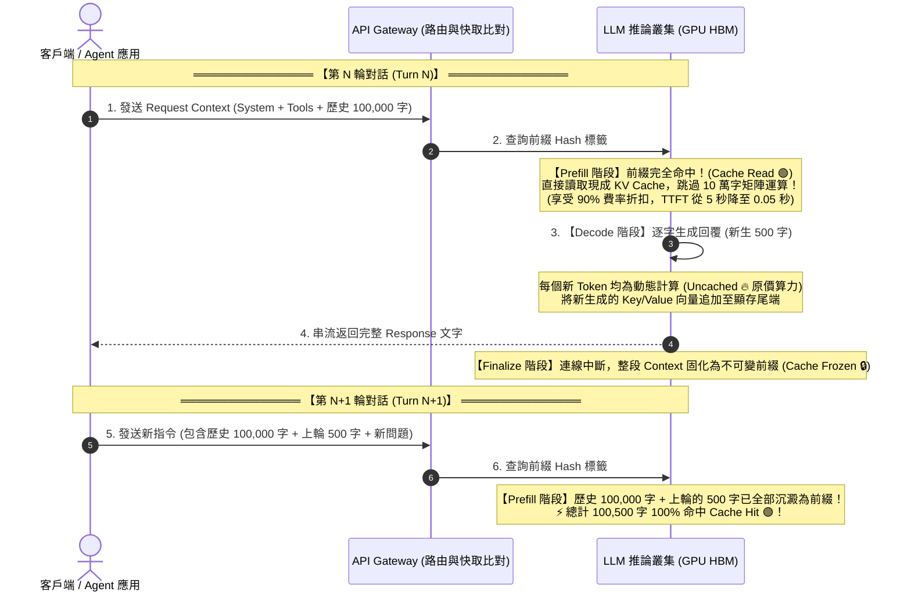

# ⚡ Prompt Caching 前綴快取生命週期與物理機制

> [!NOTE]
> **⚡ 30 秒核心精華 (Key Takeaway)**
> 現代 LLM API（如 Gemini 1.5, Claude 3.5, GPT-4o）之所以能對長上下文提供高達 **50% ~ 90% 的費用折扣** 並將首字延遲（TTFT）降低一個數量級，核心技術正是 **Prompt Caching (前綴快取)**。
> 其底層物理機制為：**在多輪對話中，上一輪生成的回覆文字在當下是新生算力（Uncached），但一旦回合結束，整段歷史即固化為不可變前綴（Immutable Prefix）；在下一輪請求中，伺服器直接復用已儲存在 GPU 顯存中的 [[02_KV_Cache_Mechanics|KV Cache]] 矩陣，完全跳過重複的 Prefill 矩陣計算**。

---

## 🔍 一、技術背景：前綴快取的誕生動機

在傳統的無快取 LLM API 中，多輪對話的計費與算力開銷是極具毀滅性的：
* 第 1 輪：送入 2,000 字 $\to$ 計算 2,000 字。
* 第 2 輪：送入 2,000 字歷史 + 新輸入 500 字 $\to$ **將 2,500 字全部重新跑一次神經網絡**。
* 第 20 輪：上下文累積到 50,000 字 $\to$ 每問一句話，伺服器都必須對 50,000 字重新做一次矩陣相乘。

### 💡 核心洞察：
在標準對話中，**前面的 49,000 個字在內容與順序上是完全沒有變化的**。既然歷史文字不變，它們通過各層神經網絡所產生的 Key 和 Value 向量就是完全確定的常數。
因此，伺服器只需在內存中將這段 **前綴 KV Cache 鎖定並共享**，即可在後續請求中直接跳過 98% 的計算！

---

## 🏛️ 二、快取生命週期時序圖與精讀指引

### 📖 圖表深度精讀指南 (Diagram Walkthrough)

1. **【核心視野】**：本圖展示了單一請求跨越兩輪對話時，Tokens 是如何從「未快取的新生算力」轉化為「固化快取前綴」的完整時序演進。
2. **【看圖路徑 (Step-by-Step)】**：
   * **步驟 1 ~ 2 (Turn N Prefill)**：客戶端發送請求，Gateway 透過前綴 Hash 快速定位 GPU 顯存中的現成快取塊，達成 **Cache Read (綠色)**。
   * **步驟 3 (Turn N Decode)**：模型開始逐字吐字。由於未來文字是動態創造的，此階段必定是 **Uncached (紅色)**，同時將新向量逐字 Append 到隊列尾端。
   * **步驟 4 (Turn N Finalize)**：連線結束瞬間，整段對話被標記為唯讀固化（Cache Frozen）。
   * **步驟 5 ~ 6 (Turn N+1 躍遷)**：當下一輪請求進來時，上一輪的 500 字已自然融入歷史前綴中，直接享受下一輪的 100% 快取命中！

---

## 🔍 三、快取命中與破壞的物理條件 (Cache Invalidation)

Prompt Caching 依賴於 **嚴格最長公共前綴 (LCP - Longest Common Prefix)** 機制。任何在上下文頂部或中途的微小變更，都會引發雪崩式的快取失效：

```mermaid
flowchart TD
    subgraph CaseA ["🟢 完美快取命中 (Append-Only 模式)"]
        direction LR
        A1["[1. 靜態系統提示詞]"] --> A2["[2. 工具 Schema 宣告]"] --> A3["[3. 歷史對話紀錄 1..N]"] --> A4["[4. 新使用者輸入]"]
        style A1 fill:#d4edda,stroke:#28a745
        style A2 fill:#d4edda,stroke:#28a745
        style A3 fill:#d4edda,stroke:#28a745
        style A4 fill:#fff3cd,stroke:#ffc107
    end

    subgraph CaseB ["🔴 全域快取破壞 (Prefix Invalidation 災難)"]
        direction LR
        B1["[1. 系統詞 + 動態時間戳]"] --> B2["[2. 工具 Schema 宣告]"] --> B3["[3. 歷史對話紀錄 1..N]"] --> B4["[4. 新使用者輸入]"]
        style B1 fill:#f8d7da,stroke:#dc3545
        style B2 fill:#f8d7da,stroke:#dc3545
        style B3 fill:#f8d7da,stroke:#dc3545
        style B4 fill:#f8d7da,stroke:#dc3545
    end
```

### 📋 快取設計的三大鐵律：
1. **靜態內容必須置頂 (Static Content at Top)**：永遠將固定不變的 System Instructions 與 Tools Schema 置於 Context 最前端。
2. **禁止在頂部注入動態變數**：若在 System Instruction 中插入 `Current Time: 15:30:22.105` 或隨機數，整整 10 萬字的前綴快取會瞬間全毀（Cache Miss 100%）。
3. **保持歷史不可變 (Immutable History)**：若必須對歷史進行壓縮或修改，必須整批在特定檢查點執行，並承擔該輪快取重建的代價。

---

## 🔗 四、相關概念與延伸閱讀
* [[01_Transformer_Prefill_vs_Decode]]：推論兩階段之 Prefill 與 Decode 物理對照。
* [[02_KV_Cache_Mechanics]]：KV Cache 顯存大小推導與 GQA 架構。
* [[02_architecture/02_Token_Calculation_and_LCP|Token 計算與 LCP 演算法]]：手刻 LCP 前綴比對演算法實作。
