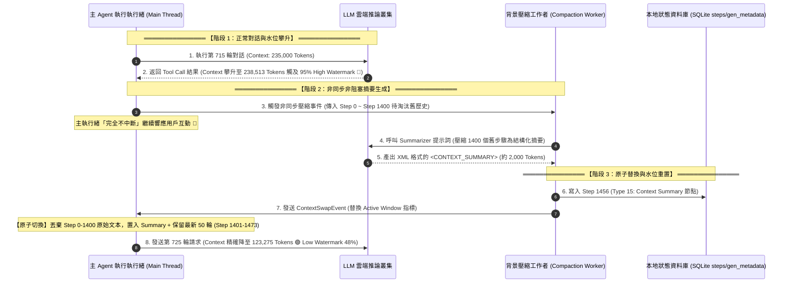
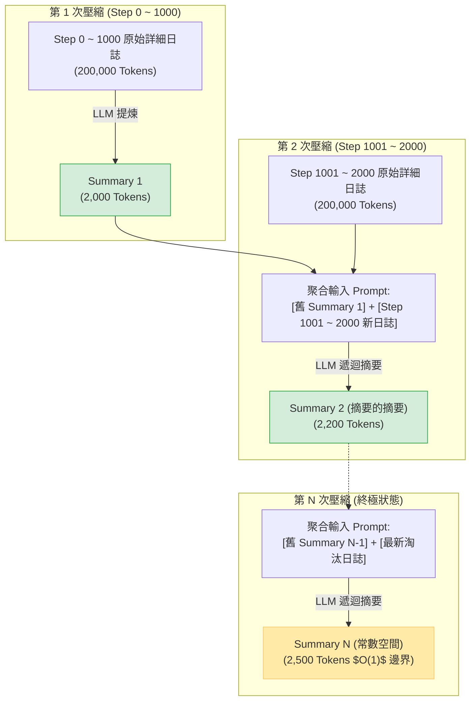

# 🧬 Context 雙水位線壓縮與遞迴摘要機制 (Compaction & Recursive Summarization)

> [!NOTE]
> **⚡ 30 秒核心精華 (Key Takeaway)**
> 在長週期的自主 Agent（如 Antigravity, Claude Code, Cline）運行中，累積的對話日誌高達數百萬字，但 LLM 物理窗口有限（如 256k Tokens）。為避免上下文溢出（OOM），現代 Agent 內核採用 **「雙水位線非同步壓縮 (Dual-Watermark Compaction) 與遞迴摘要 (Recursive Summarization)」** 機制。
> 當活躍上下文觸及 **高水位線 (High Watermark ~95%, 240k Tokens)** 時，系統在後台非同步啟動壓縮管線，將早期被淘汰的千百輪步驟提煉為結構化的 `<CONTEXT_SUMMARY>` 標籤，並將活躍上下文原子替換重置至 **低水位線 (Low Watermark ~48%, 120k Tokens)**。透過「摘要的摘要」遞迴聚合演算法，成功在數學上保證歷史摘要以 **$O(1)$ 常數空間** 永久收斂！

---

## 🔍 一、技術背景：為什麼需要主動上下文壓縮？

自主編程 Agent 在執行大型任務時具有三大特性：
1. **日誌無限增長 (Append-Only Accumulation)**：每讀一個檔案、跑一次測試、產生一段 Diff，本地對話記錄都在持續膨脹（隨便一場任務即可達 50 萬至 200 萬字）。
2. **LLM 物理視窗限制 (Hard Context Limit)**：模型視窗存在物理上限（如 Gemini 256k / 1M Tokens）。
3. **推理成本與延遲二次方膨脹**：上下文越長，每輪 Prefill 的成本越高，且注意力機制可能產生「大海撈針（Needle In A Haystack）」注意力分散問題。

### 💡 核心挑戰：
如何在「完全不遺失早期重大工程決策、使用者關鍵約束與專案全貌」的前提下，將數十萬字的歷史精煉至模型安全容量內？

---

## 🏛️ 二、雙水位線壓縮架構時序圖與精讀指引



### 📖 圖表深度精讀指南 (Diagram Walkthrough)

1. **【核心視野】**：本圖展示了 Agent 如何透過「高水位偵測 $\to$ 背景非同步壓縮 $\to$ 原子指針切換」達成無感顯存降載。
2. **【看圖路徑 (Step-by-Step)】**：
   * **步驟 1 ~ 2 (臨界水位偵測)**：第 715 輪 API 呼叫後，活躍 Tokens 達到 238,513（佔 256k 窗口的 93.2%），觸發 High Watermark 警報。
   * **步驟 3 ~ 5 (背景非阻塞工作者)**：主執行緒不卡頓，壓縮任務交由背景 Worker 呼叫 LLM 提煉 XML 結構化摘要。
   * **步驟 6 ~ 8 (原子替換與狀態重置)**：寫入特殊的 Context Summary 步驟節點，主執行緒無縫切換上下文指針，第 725 輪請求時上下文成功回落至 123,275 Tokens（低水位線 48%）。
3. **【色彩與符號物理意義】**：
   * 🚨 **紅色 (High Watermark 95%)**：即將發生 OOM 溢出，強制觸發壓縮。
   * 🟢 **綠色 (Low Watermark 48%)**：安全穩態水位，保留充足餘裕供未來 50 輪對話生長。
4. **【底層隱藏工程細節】**：
   * 替換過程為記憶體指標原子交換（Atomic Swap），保證在切換瞬間若有新 Tool 呼叫返回，不會發生資料競爭（Race Condition）或上下文空窗。

---

## 🎯 三、實機現場壓測數據與演繹 (Live Trace Case Study)

以下為本專案在真實運行中從本地 SQLite 資料庫（`gen_metadata` 與 `steps` 表）抓取的第一手實測連線數據：

```text
════════════════════════════════════════════════════════════════════════════════
【實況現場：第 716 輪 Generation (Step 1455 - 壓縮觸發前夕)】
  * Generation ID : 716
  * Step Index    : 1455
  * Total Tokens  : 238,513 Tokens (93.2% of 256k Window 🚨 High Watermark!)
  * Cached Tokens : 217,718 Tokens (Cache Hit: 91.3%)
  * New Tokens    : 20,795 Tokens
  * 系統狀態      : 偵測到容量瀕臨飽和，背景 Worker 啟動，鎖定 Step 0 ~ 1400 進行提煉
════════════════════════════════════════════════════════════════════════════════
【實況現場：第 725 輪 Generation (Step 1473 - 壓縮完成重置)】
  * Generation ID : 725
  * Step Index    : 1473
  * Total Tokens  : 123,275 Tokens (48.1% of 256k Window 🟢 Low Watermark!)
  * Cached Tokens : 0 Tokens (新前綴重置，首輪進行 Cache Write)
  * New Tokens    : 123,275 Tokens
  * 釋放顯存空間  : 238,513 - 123,275 = 115,238 Tokens (成功釋放約 11.5 萬字！)
════════════════════════════════════════════════════════════════════════════════
```

---

## 🔬 四、「摘要的摘要」遞迴聚合演算法 (Recursive Summarization)

當會話持續運行數天、發生第 2 次、第 3 次 Compaction 時，系統如何防止 `<CONTEXT_SUMMARY>` 本身無限膨脹？

答案是 **Recursive Compaction（遞迴聚合）**：



### 📐 數學空間收斂性證明：
設每次淘汰的原始日誌 Token 數為 $L \approx 200,000$，壓縮比率為 $\rho \approx 0.01$（1% 資訊密度抽脂率）：
* 第一次摘要長度：$S_1 = L \cdot \rho = 2,000$ Tokens。
* 第二次摘要長度：$S_2 = (S_1 + L) \cdot \rho = (2,000 + 200,000) \cdot 0.01 = 2,020$ Tokens。
* 第 $k$ 次摘要長度通項公式：
  $$S_k = S_0 \cdot \rho^k + L \sum_{i=1}^k \rho^i = L \cdot \frac{\rho(1 - \rho^k)}{1 - \rho}$$
* 當 $k \to \infty$（對話進行無限多輪時）：
  $$\lim_{k \to \infty} S_k = \frac{L \cdot \rho}{1 - \rho} = \frac{200,000 \cdot 0.01}{1 - 0.01} = \frac{2,000}{0.99} \approx \mathbf{2,020.2 \text{ Tokens}}$$

👉 **數學結論**：無論對話進行幾萬輪、日誌累積幾千萬字，歷史摘要的總長度將嚴格收斂在約 **2,020 Tokens 的 $O(1)$ 常數空間**，永遠不會撐爆 Context！

---

## 📑 五、結構化 XML 摘要標籤規範

實證中從資料庫逆向出的標準 `<CONTEXT_SUMMARY>` 格式包含 4 大核心板塊：

```xml
<CONTEXT_SUMMARY>
  <!-- 板塊 1: 專案目標與最高憲法原則 -->
  <User_Directives>
    1. 使用者要求代碼 100% 英文，文檔 100% 繁體中文 (憲法鐵律)。
    2. 採用 Pure Go 單一二進制分發，拒絕 Python 依賴。
  </User_Directives>

  <!-- 板塊 2: 歷史關鍵里程碑與已完成功能 -->
  <Completed_Milestones>
    - [Step 001-450] 完成 Phase 1: 逆向 SQLite 7 大表格與 Protobuf 解析。
    - [Step 451-980] 完成 Phase 2: 實作 BPE 5 維度 Token 分類器與 LCP 演算法。
    - [Step 981-1400] 完成 Phase 3: 開發全螢幕 k9s 風格 TUI 雙軌儀表板。
  </Completed_Milestones>

  <!-- 板塊 3: 當前關鍵技術架構與狀態機 -->
  <Architecture_State>
    * Active Window : 使用 Reverse Sliding Window 倒推填滿官方 Budget。
    * Database Path : ~/.gemini/antigravity-cli/conversations/<session>.db (WAL 模式)。
  </Architecture_State>

  <!-- 板塊 4: 待辦清單與下一步任務 -->
  <Next_Immediate_Tasks>
    - 修復 Fallback TTL 超時冷啟動時 Context 計算遺漏問題。
  </Next_Immediate_Tasks>
</CONTEXT_SUMMARY>
```

---

## 🔗 六、相關概念與延伸閱讀
* [[01_Transformer_Prefill_vs_Decode]]：長上下文對 Prefill 運算延遲的物理衝擊。
* [[03_Prompt_Caching_Lifecycle]]：壓縮重置後對 Prompt Cache 的冷啟動影響。
* [[02_architecture/03_Agent_Storage_and_State_Machine|儲存與狀態機架構]]：SQLite steps 表（Type 15）如何持久化儲存 Summary 節點。
* [[02_architecture/06_Dual_Track_Telemetry_and_Window_Accounting|雙軌遙測架構與窗口會計]]：倒推滑動窗口（Reverse Sliding Window）如何過濾已被淘汰的遠古步驟。
