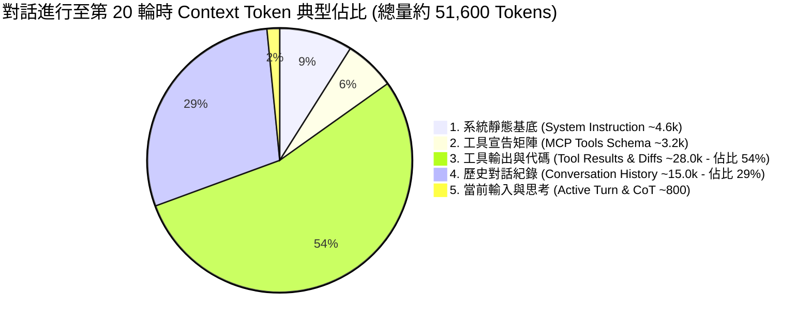

# 📊 Agent Context 載荷 5 維度模型與膨脹動力學

> [!NOTE]
> **⚡ 30 秒核心精華 (Key Takeaway)**
> 現代自主 AI Agent（如 Claude Code, Google Antigravity, Cursor）發送給大腦的 Context 絕非單一扁平文字，而是由 **5 個具備不同生命週期、不同快取特性與不同膨脹速率的維度** 組成。
> 深入解剖這 5 個維度，不僅是打造 `agent-observer` 進行即時 Token 監控的核心基礎，更是未來設計 Context 極致壓縮引擎（目標 80% 壓縮率且 0 語義遺失）的唯一戰略依據。

---

## 🔍 一、技術背景：為什麼需要解剖 Context 結構？

在傳統單輪對話中，上下文僅包含簡單的「系統提示詞」與「使用者問題」。然而在多輪 Agent 任務中，Agent 必須透過不斷呼叫工具（Tool Calls）、讀取檔案、執行指令、並將終端機輸出灌回 Context 中進行下一輪決策。

這種自主迴圈導致 Context 呈現 **非線性爆炸式增長**：
* 常常僅執行 10 個步驟，Context 水位就突破 50,000 Tokens。
* 若不對內部結構進行解剖，開發者只會看到「帳單暴增、速度變慢、顯存吃緊」，卻無法得知到底是哪一部分的內容在瘋狂吞噬資源。

---

## 🏛️ 二、Context 5 維度佔比圓餅圖與精讀指引



### 📖 圖表深度精讀指南 (Diagram Walkthrough)

1. **【核心視野】**：本圖展示了長程任務進行到中期時，Context 內部各組件的真實權重分佈。直觀揭示了「資源消耗的真正罪魁禍首」。
2. **【關鍵洞察與資料流分佈】**：
   * **固定前綴基底 (維度 1 + 2 $\approx 15\%$)**：由系統規範與工具定義組成，開局即佔用近 8,000 Tokens，但在整個生命週期中大小恆定。
   * **超線性膨脹核心 (維度 3 $\approx 54\%$)**：工具回傳的檔案全文、終端機日誌與 Git Diff 佔據了超過一半的顯存空間。
   * **線性增長歷史 (維度 4 $\approx 29\%$)**：過往人類指令與模型回覆的累積。
   * **動態新生算力 (維度 5 $\approx 2\%$)**：當前回合的即時 Prompt 與思考鏈。
3. **【戰略結論】**：任何壓縮優化方案若只針對對話歷史（維度 4）動刀，最多只能解決 30% 的問題；**真正的決戰主戰場在工具輸出（維度 3）！**

---

## 🎯 三、極簡 3 輪對話 5 維度數值變遷演繹 (Concrete Trace Walkthrough)

帶入極簡真實編程對話，演繹 5 大維度 Token 如何逐輪疊加與突變：

* **基準環境**：System Instruction = 4,618 Tokens, MCP Tools Schema = 3,200 Tokens (固定基底 7,818 Tokens)。
* **Turn 0 (使用者發問)**：`"Please list project files."` (10 Tokens)
* **Turn 1 (工具呼叫與輸出)**：Model 呼叫 `list_dir`，回傳目錄清單 (50 Tokens)。
* **Turn 2 (讀取源碼)**：Model 呼叫 `view_file("main.go")`，回傳 300 行代碼 (1,500 Tokens)。

```text
════════════════════════════════════════════════════════════════════════════════
【Turn 0：開局發問】
  輸入事件 : User: "Please list project files." (10 Tokens)
  5 維度數值變遷 :
    ├─ 1. System Instruction : 4,618 Tokens  (58.9%)
    ├─ 2. MCP Tools Schema   : 3,200 Tokens  (40.9%)
    ├─ 3. Tool Results / Diff:     0 Tokens  ( 0.0%)
    ├─ 4. Conversation Hist  :     0 Tokens  ( 0.0%)
    └─ 5. Active Turn / CoT  :    10 Tokens  ( 0.1%)
  總上下文 (Total Context)   : 7,828 Tokens
  快取結算 : 🔵 [CACHE WRITE] (命中: 0 Tokens | 命中率: 0.0%)
════════════════════════════════════════════════════════════════════════════════
【Turn 1：目錄掃描結果注入】
  輸入事件 : ToolResult: "main.go, go.mod, README.md..." (50 Tokens)
  5 維度數值變遷 :
    ├─ 1. System Instruction : 4,618 Tokens  (58.6%)
    ├─ 2. MCP Tools Schema   : 3,200 Tokens  (40.6%)
    ├─ 3. Tool Results / Diff:    50 Tokens  ( 0.6%)  <-- 工具輸出首次沉澱！
    ├─ 4. Conversation Hist  :    10 Tokens  ( 0.1%)  <-- 上輪 User 發問固化為歷史！
    └─ 5. Active Turn / CoT  :     5 Tokens  ( 0.1%)  (Model 發起 view_file 參數)
  總上下文 (Total Context)   : 7,883 Tokens
  快取結算 : 🟢 [CACHE HIT] (命中: 7,828 Tokens | 命中率: 99.3%)
════════════════════════════════════════════════════════════════════════════════
【Turn 2：讀取 300 行源代碼】
  輸入事件 : ToolResult: 300 行 main.go 代碼全文 (1,500 Tokens)
  5 維度數值變遷 :
    ├─ 1. System Instruction : 4,618 Tokens  (49.2%)
    ├─ 2. MCP Tools Schema   : 3,200 Tokens  (34.1%)
    ├─ 3. Tool Results / Diff: 1,550 Tokens  (16.5%)  <-- 暴增 30 倍！(膨脹主因)
    ├─ 4. Conversation Hist  :    15 Tokens  ( 0.2%)
    └─ 5. Active Turn / CoT  :     5 Tokens  ( 0.1%)
  總上下文 (Total Context)   : 9,388 Tokens
  快取結算 : 🟢 [CACHE HIT] (命中: 7,883 Tokens | 命中率: 84.0%)
════════════════════════════════════════════════════════════════════════════════
【最終 Output: agent-observer 結構體生成】
  TokenBreakdown{
      SystemTokens: 4618, ToolsDefTokens: 3200, ToolResultTokens: 1550,
      HistoryTokens: 15, ActiveTurnTokens: 5, TotalTokens: 9388,
      CachedTokens: 7883, NewTokens: 1505, CacheHitRate: 84.0
  }
```

---

## 📊 四、Context 5 維度特徵矩陣全解析

| 維度名稱 | 內容特徵與資料來源 | 典型 Token 水位 | 快取特性 (Cacheability) | 膨脹複雜度 | 壓縮與優化戰略 (Optimization Priority) |
| :--- | :--- | :---: | :---: | :---: | :--- |
| **1. System Instruction** | `<identity>`, `<skills>`, OS 環境、安全規範。 | 4,000 ~ 6,000 | 🟢 永久固定前綴 (100% Cacheable) | $O(1)$ (恆定常數) | ⚠️ **絕對不可動**（保護頂部前綴以維護全域快取） |
| **2. MCP Tools Schema** | 工具的 JSON Schema 宣告（如 `run_command`, `view_file`）。 | 2,500 ~ 4,000 | 🟢 固定前綴 (100% Cacheable) | $O(1)$ (恆定常數) | 🟡 **動態過濾 (JIT Injection)**：未啟用的工具 Schema 可延遲注入 |
| **3. Tool Results / Diff** | `view_file` 讀取的檔案源碼、終端機標準輸出、Diff。 | 5,000 ~ 80,000+ | 🟡 沉澱為前綴，但極度消耗顯存空間 | **$O(N)$ 超線性暴增** | 🔴 **【第一核心戰場】**：過期淘汰、語義剪枝、Diff 差分替代全量 |
| **4. Conversation Hist** | 過去輪次的使用者發言與模型回答文字。 | 2,000 ~ 30,000 | 🟢 沉澱為歷史前綴 (100% Cacheable) | $O(N)$ 線性增加 | 🟡 **分層摘要 (Hierarchical Summary)**：滾動式金字塔記憶壓縮 |
| **5. Active Turn / CoT** | 使用者最新發問、模型 Thinking 思維鏈與工具參數。 | 100 ~ 2,000 | 🔴 當前為新生算力 (Uncached) | 單次回合波動 | ⚪ 即時計算，回合結束後固化沉澱入維度 4 |

---

## 📈 五、真實 Agent 對話輪次膨脹動力學實測

以下為模擬典型 AI Agent 在解決一個實際編程任務時的 Token 水位增長實測數據：

| 任務進程階段 | 輪次 (Turn) | 1. System | 2. Tools | 3. Tool Results | 4. History | 5. Active | **總 Token 水位** | **前綴快取命中率** |
| :--- | :---: | :---: | :---: | :---: | :---: | :---: | :---: | :---: | :---: |
| **開局初始化** | Turn 1 | 4,618 | 3,200 | 0 | 0 | 350 | **8,168** | **0.0% (Cache Write)** |
| **探索目錄與讀檔** | Turn 5 | 4,618 | 3,200 | 5,200 | 1,800 | 480 | **15,298** | **94.8% (Cache Hit)** |
| **大規模修改代碼** | Turn 15 | 4,618 | 3,200 | 28,400 | 9,100 | 650 | **45,968** | **98.2% (Cache Hit)** |
| **長程修復與驗收** | Turn 30 | 4,618 | 3,200 | **72,000 (佔70%)**| 24,000 | 850 | **104,668 (突破10萬)**| **99.2% (Cache Hit)** |

---

## 🔗 六、相關概念與延伸閱讀
* [[02_Token_Calculation_and_LCP]]：5 維度 Token 的 BPE 計數與 LCP 快取演算法。
* [[01_theory/03_Prompt_Caching_Lifecycle|Prompt Caching 生命周期]]：前綴快取命中與破壞機制。
* [[03_Agent_Storage_and_State_Machine]]：底層日誌與 Context JSON 的組裝模式。
