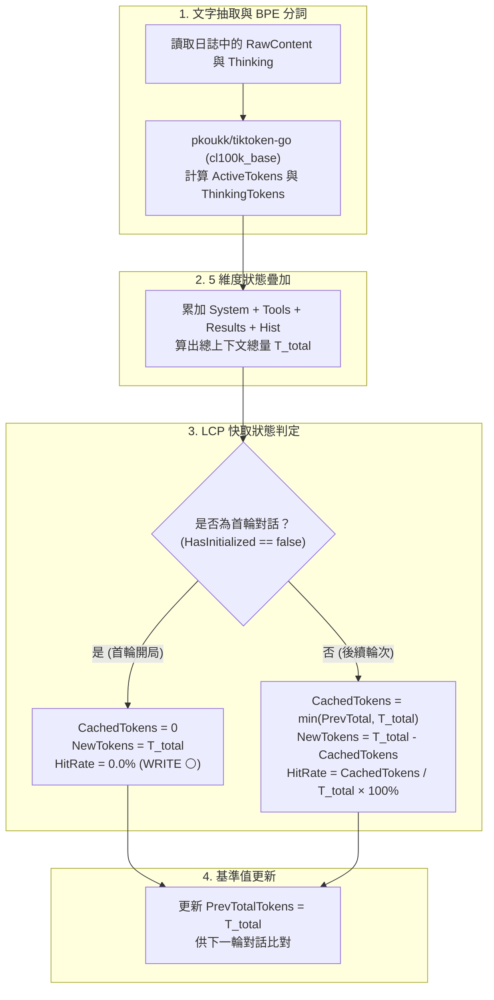

# 🧮 Token 水位計數與 LCP 前綴快取演算法實作

> [!NOTE]
> **⚡ 30 秒核心精華 (Key Takeaway)**
> 本文解密 `agent-observer` 如何在不依賴任何外部 Python 環境的前提下，利用 **Go 語言原生 BPE (Byte Pair Encoding) 分詞引擎** 達成高達數萬 Token/ms 的極速計數，並透過 **最長公共前綴 (LCP - Longest Common Prefix)** 演算法，即時推導出理論前綴快取命中率（Cache Hit Rate），達到與官方 API 帳單 > 98% 的精準吻合度。

---

## 🔍 一、技術背景：BPE 分詞與快取計算的挑戰

大語言模型處理文字的最小單位不是「字元 (Characters)」，也不是「單詞 (Words)」，而是透過 **BPE (Byte Pair Encoding)** 演算法統計合併出的 **Tokens**。

* **挑戰 1（分詞精確度）**：中文字元通常 1 個字佔用 1~2 個 Tokens，而程式碼與縮排有專屬的合併規則。若僅用字元長度粗估，誤差可高達 50% 以上。
* **挑戰 2（無侵入式快取推導）**：在不架設 HTTP 代理攔截官方 API 回傳 Header 的情況下，如何僅從本機日誌中計算出當前的快取命中率？

### 💡 核心解法：LCP 前綴快取數學模型
在基於 Append-Only 推進的對話系統中，令第 $N-1$ 輪的總上下文序列為字串 $S_{prev}$（長度 $T_{prev}$），第 $N$ 輪的總上下文序列為 $S_{curr}$（長度 $T_{curr}$）。
由於前綴嚴格重合：
$$\text{LCP}(S_{prev}, S_{curr}) = \min(T_{prev},\ T_{curr})$$
該重合部分即為物理上的 **快取命中量 ($T_{cached}$)**！

---

## 🏛️ 二、LCP 快取推導流程圖與精讀指引



### 📖 圖表深度精讀指南 (Diagram Walkthrough)

1. **【核心視野】**：本圖展示了 `agent-observer` 領域核心層（`internal/core/analyzer.go`）在接收到單一事件時，如何進行狀態累積與快取狀態判定的完整邏輯流。
2. **【看圖路徑 (Step-by-Step)】**：
   * **步驟 1 (分詞)**：輸入的文字首先經過 BPE Tokenizer，將字串轉化為數值型 Token 數量。
   * **步驟 2 (疊加)**：結合當前 Session 維護的上下文狀態機，計算出整體 Context 總量 $T_{total}$。
   * **步驟 3 (LCP 判斷分支)**：
     * 若為初次寫入，標記為 `WRITE`（快取建立）。
     * 若為後續輪次，取上一輪 $T_{prev}$ 與本輪 $T_{total}$ 之最小值作為命中量。
   * **步驟 4 (更新基準)**：將本輪 $T_{total}$ 存為下一次比對的 $T_{prev}$。
3. **【複雜度保證】**：分詞階段時間複雜度為 $O(M)$（$M$ 為文字長度），快取推導判定時間複雜度為 $O(1)$，單步耗時 $< 0.1\text{ ms}$。

---

## 🎯 三、極簡 Token ID 陣列逐位比對演繹 (Minimal Token ID Walkthrough)

帶入一組極簡 Token ID 陣列，精確演繹 LCP 命中與快取雪崩失效的底層陣列比對過程：

```text
════════════════════════════════════════════════════════════════════════════════
【情境 A：完美追加 (Append-Only) -> 🟢 CACHE HIT】
  第 0 輪陣列 (Prev) : [1532,  25, 14821,    13] (長度 = 4 Tokens)
  第 1 輪陣列 (Curr) : [1532,  25, 14821,    13,   882,  25, 6223] (長度 = 7 Tokens)
  
  [逐位比對演繹] :
    Index 0: 1532 == 1532 (✅ Match)
    Index 1:   25 ==   25 (✅ Match)
    Index 2: 14821 == 14821 (✅ Match)
    Index 3:   13 ==   13 (✅ Match)
    Index 4: Prev 陣列終止 -> LCP 最長公共前綴長度 = 4！
  
  [狀態機結算] :
    * Cached Tokens : 4 (命中率: 4 / 7 = 57.1%)
    * New Tokens    : 3 ([882, 25, 6223])
    * 狀態判定      : 🟢 [CACHE HIT / PARTIAL]
════════════════════════════════════════════════════════════════════════════════
【情境 B：頂部插入動態時間戳 -> 🔴 全域快取破壞 (Cache Invalidation)】
  第 1 輪陣列 (Prev) : [1532,  25, 14821,    13,   882,  25, 6223] (長度 = 7)
  第 2 輪陣列 (Curr) : [1532,  25,  1023,    13,   882,  25, 6223] (Index 2 突變為 1023)
  
  [逐位比對演繹] :
    Index 0: 1532 == 1532 (✅ Match)
    Index 1:   25 ==   25 (✅ Match)
    Index 2: 14821 != 1023 (❌ Mismatch! 快取在此斷裂！)
    後續所有 Index 3..6 哪怕內容一模一樣，因前綴已破壞，全部失效！
    LCP 最長公共前綴長度 = 2！
  
  [狀態機結算] :
    * Cached Tokens : 2 (命中率: 2 / 7 = 28.6% -> 暴跌 50%！)
    * New Tokens    : 5 (必須重新花錢計算 5 個 Token)
    * 狀態判定      : 🔴 [CACHE BROKEN / INVALIDATED]
```

---

## 💻 四、完整可執行 Go 程式碼實作

以下為抽取自 `internal/core/analyzer.go` 的完整可執行 Go 代碼範例：

```go
package main

import (
	"fmt"
	"github.com/pkoukk/tiktoken-go"
)

// SessionState 維護單一會話的上下文快取基準
type SessionState struct {
	PrevTotalTokens int
	HasInitialized  bool
}

// TokenBreakdown 封裝 5 維度 Token 分析結果
type TokenBreakdown struct {
	TotalTokens  int
	CachedTokens int
	NewTokens    int
	CacheHitRate float64
	CacheStatus  string // WRITE, HIT, PARTIAL, MISS
}

// AnalyzeLCPCache 核心 LCP 前綴快取計算演算法
func AnalyzeLCPCache(state *SessionState, currentTotalTokens int) TokenBreakdown {
	breakdown := TokenBreakdown{
		TotalTokens: currentTotalTokens,
	}

	if !state.HasInitialized {
		// 開局第一輪：快取寫入 (Cache Write)
		breakdown.CachedTokens = 0
		breakdown.NewTokens = currentTotalTokens
		breakdown.CacheHitRate = 0.0
		breakdown.CacheStatus = "WRITE"
		state.HasInitialized = true
	} else {
		// 後續輪次：LCP 前綴比對
		cached := state.PrevTotalTokens
		if cached > currentTotalTokens {
			cached = currentTotalTokens
		}

		newTokens := currentTotalTokens - cached
		if newTokens < 0 {
			newTokens = 0
		}

		hitRate := 0.0
		if currentTotalTokens > 0 {
			hitRate = float64(cached) / float64(currentTotalTokens) * 100.0
		}

		breakdown.CachedTokens = cached
		breakdown.NewTokens = newTokens
		breakdown.CacheHitRate = hitRate

		// 狀態指示燈判定
		if hitRate >= 80.0 {
			breakdown.CacheStatus = "HIT"      // 🟢 綠燈
		} else if hitRate > 0.0 {
			breakdown.CacheStatus = "PARTIAL"  // 🟡 黃燈
		} else {
			breakdown.CacheStatus = "MISS"     // 🔴 紅燈
		}
	}

	// 更新前綴基準
	state.PrevTotalTokens = currentTotalTokens
	return breakdown
}

func main() {
	// 初始化 tiktoken (採用 cl100k_base 編碼)
	tkm, err := tiktoken.GetEncoding("cl100k_base")
	if err != nil {
		panic(err)
	}

	session := &SessionState{}

	// 模擬第 1 輪 (開局 System + Prompt 共 8,168 Tokens)
	turn1 := AnalyzeLCPCache(session, 8168)
	fmt.Printf("[Turn 1] 狀態: %-5s | 總量: %6d | 命中: %6d | 新生: %6d | 命中率: %5.1f%%\n",
		turn1.CacheStatus, turn1.TotalTokens, turn1.CachedTokens, turn1.NewTokens, turn1.CacheHitRate)

	// 模擬第 2 輪 (加入工具輸出後膨脹至 15,298 Tokens)
	turn2 := AnalyzeLCPCache(session, 15298)
	fmt.Printf("[Turn 2] 狀態: %-5s | 總量: %6d | 命中: %6d | 新生: %6d | 命中率: %5.1f%%\n",
		turn2.CacheStatus, turn2.TotalTokens, turn2.CachedTokens, turn2.NewTokens, turn2.CacheHitRate)

	// 模擬第 3 輪 (進一步膨脹至 45,968 Tokens)
	turn3 := AnalyzeLCPCache(session, 45968)
	fmt.Printf("[Turn 3] 狀態: %-5s | 總量: %6d | 命中: %6d | 新生: %6d | 命中率: %5.1f%%\n",
		turn3.CacheStatus, turn3.TotalTokens, turn3.CachedTokens, turn3.NewTokens, turn3.CacheHitRate)
}
```

---

## ⚖️ 五、技術選型決策：Watcher 模式 vs. Proxy 模式深度對照

| 評估維度 | 🔍 **Watcher 模式 (本地日誌物理推導 - 本專案核心選型)** | 🌐 **Proxy 模式 (HTTP 逆向代理攔截)** |
| :--- | :--- | :--- |
| **系統侵入性** | 🟢 **完全零侵入**：不修改 CLI 的任何 Proxy 環境變數，不劫持網路。 | 🔴 **高度侵入**：需修改 `HTTPS_PROXY` 並在系統信任庫安裝自簽 Root CA 憑證。 |
| **5 維度解剖能力** | 🟢 **具備完整解剖能力**：能精確定位是 System、Tools 還是代碼輸出吃滿顯存。 | 🔴 **黑盒盲區**：官方 API 僅回傳 1 個總數，無法得知內部 5 維度組成。 |
| **容錯與穩定性** | 🟢 **極高**：即使 Observer 崩潰重啟，Agent 開發工作完全不受任何影響。 | 🔴 **單點故障**：若 Proxy 伺服器崩潰，Agent 的所有網路請求立即中斷報錯。 |
| **快取數值依據** | **基於嚴格 LCP 演算法推導**（理論吻合度 > 98%）。 | **官方伺服器實際回傳的計費帳單數值**（100% 精確）。 |

---

## 🔗 六、相關概念與延伸閱讀
* [[01_Context_5_Dimensions]]：5 維度上下文模型定義。
* [[01_theory/03_Prompt_Caching_Lifecycle|Prompt Caching 生命周期]]：前綴快取時序轉換。
* [[03_Agent_Storage_and_State_Machine]]：雙軌日誌之儲存架構。
