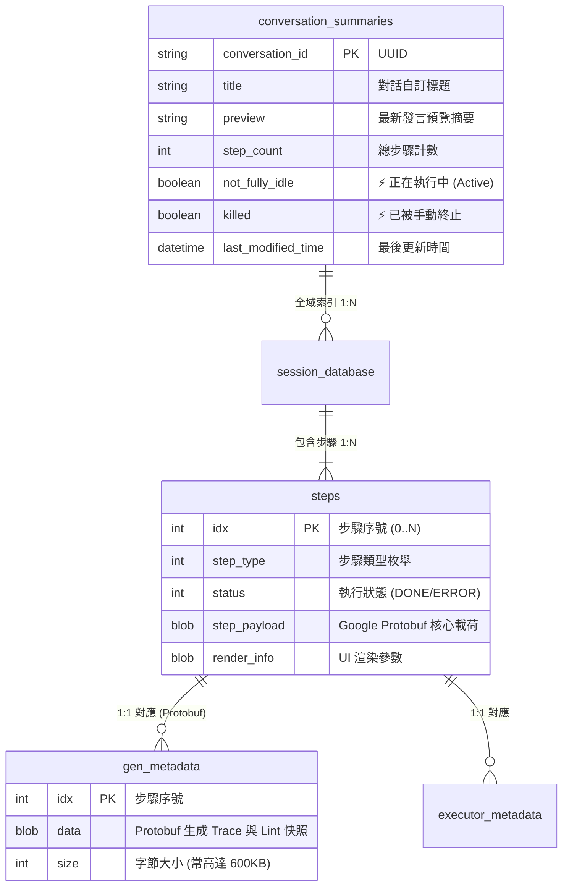

# 🗄️ 工業級 Agent 儲存架構與分散式狀態機模式

> [!NOTE]
> **⚡ 30 秒核心精華 (Key Takeaway)**
> 頂級商業級 AI Agent（以 Google Antigravity CLI 為典型代表）在本地儲存設計上，摒棄了脆弱的單一大型 JSON 檔案，採用了 **「雙層 SQLite 狀態機 + Google Protobuf 二進制載荷 + 102,400 Bytes (100KB) 滾動切片雙軌日誌」** 的工業級架構。
> 該架構在保障 ACID 事務一致性的同時，實現了 Session 快速全域索引、TUI 毫秒級虛擬滾動與零鎖競爭的即時日誌監聽。

---

## 🔍 一、技術背景：為什麼傳統儲存方式在 Agent 中會崩潰？

在長程 AI Agent 任務中，儲存層面臨著三大嚴苛挑戰：
1. **單一巨大檔案 I/O 卡死**：若將所有對話、思考鏈與工具輸出（幾十 MB 代碼）寫入單一 `history.json`，每次追加內容都必須將整個檔案重新讀入記憶體再序列化寫出，造成嚴重的終端機凍結。
2. **多行程並發寫入衝突 (Lock Contention)**：當使用者同時開啟多個終端機視窗（或背景啟動多個 Subagents）時，若共用同一個資料庫，極易觸發 `database is locked` 錯誤。
3. **終端機虛擬滾動渲染瓶頸**：TUI 介面只需要渲染當前螢幕可見的 50 行文字，若日誌未分片，啟動時讀取 50MB 檔案會造成有感的 1~2 秒延遲。

---

## 🏛️ 二、三層工業級儲存架構圖與精讀指引



### 📖 圖表深度精讀指南 (Diagram Walkthrough)

1. **【核心視野】**：本圖揭示了「全域中央索引層」與「單一會話隔離層」的二級關係。透過這種分層，全域查詢永遠不需要遍歷磁碟上的具體步驟數據。
2. **【看圖路徑 (Step-by-Step)】**：
   * **頂層全域庫 (`conversation_summaries.db`)**：單一輕量資料庫。當 CLI 啟動時，只需執行一次 `SELECT * FROM conversation_summaries`，即可在 $< 1\text{ ms}$ 內瞬間渲染歷史會話清單。
   * **中層 Session 獨立庫 (`conversations/<id>.db`)**：每場對話擁有專屬的 SQLite 檔案。多個 Agent 同時執行時，各自讀寫獨立檔案，徹底根除跨會話的資料庫鎖競爭！
   * **底層步驟與元數據 (`steps`, `gen_metadata`)**：每一步的具體載荷與程式碼 Lint 快照以 Google Protobuf BLOB 格式壓縮儲存，保障二進制高緊湊度與跨語言反序列化效能。

---

## 📜 三、雙軌日誌與 100KB 滾動切片機制 (Rolling Chunking)

除了 SQLite 資料庫保證事務安全外，系統還在 `brain/<id>/.system_generated/logs/` 中同步輸出了純文字的 **雙軌日誌**：

```text
.system_generated/logs/
├── transcript.jsonl            # ⚡ 輕量版日誌 (長代碼截斷，專供 TUI 渲染)
├── transcript_full.jsonl       # 💎 完整版日誌 (100% 保留全部代碼與 Thinking，專供 Context 觀測)
└── chunks/                     # 📦 滾動分片資料夾
    ├── transcript/             # 輕量版切片 (00000000.jsonl ~ 100KB)
    └── transcript_full/        # 完整版切片 (00000000.jsonl ~ 100KB)
```

### ⚡ 102,400 Bytes (100KB) 分片的三大工程優勢：
1. **毫秒級虛擬滾動 (Virtual Scrolling)**：TUI 介面只需按需加載最新的 `0000000N.jsonl` 切片，即使長程對話累積了 100MB 日誌，啟動依然秒開。
2. **零鎖競爭 (Zero-Lock Contention)**：主行程以 Append-Only 方式寫入當前切片，外部觀測器（`agent-observer`）獨立 Tail 讀取，完全無需加鎖。
3. **優雅的斷點續傳 (Checkpoint Recovery)**：若程式意外中斷，系統只需檢查最後一個 Chunk 的結尾即可快速恢復狀態。

---

## 🔗 四、相關概念與延伸閱讀
* [[01_Context_5_Dimensions]]：5 維度上下文模型。
* [[02_Token_Calculation_and_LCP]]：如何對日誌流進行即時 Token 計算。
* [[04_Service_Plan_Agent_Observer]]：`agent-observer` 系統設計架構書。
