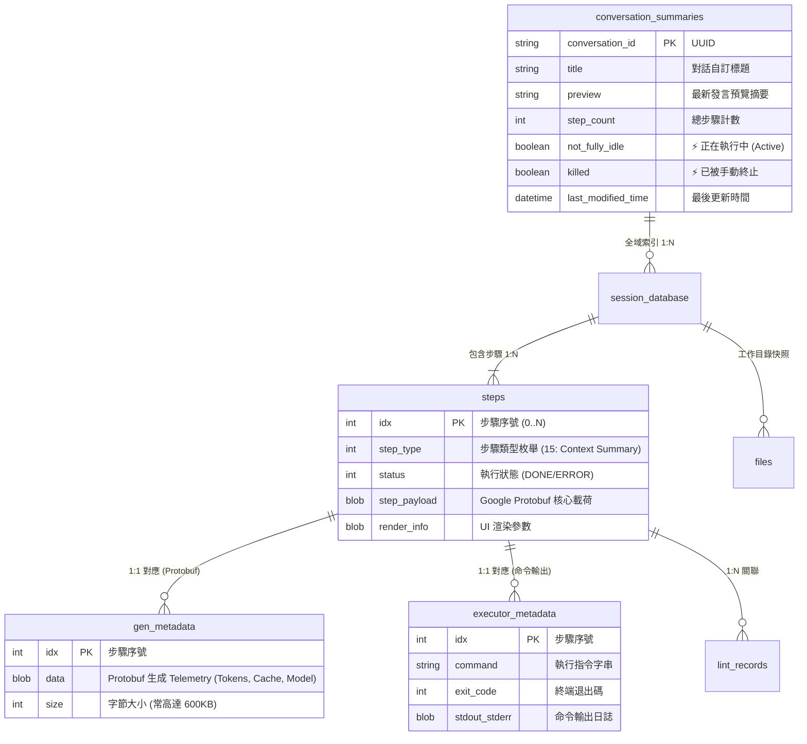
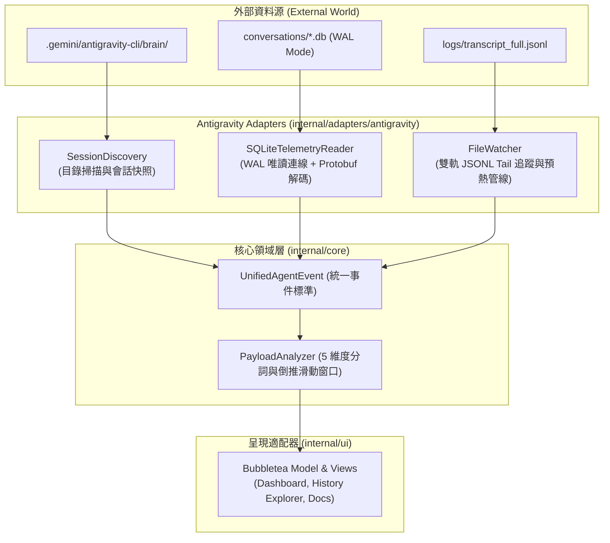

# 🗄️ 工業級 Agent 儲存架構、SQLite 7 表結構與 Protobuf 狀態機

> [!NOTE]
> **⚡ 30 秒核心精華 (Key Takeaway)**
> 頂級商業級 AI Agent（以 Google Antigravity CLI 為典型代表）在本地儲存設計上，摒棄了脆弱的單一大型 JSON 檔案，採用了 **「雙層 SQLite 7 表結構 (WAL 模式) + Google Protobuf 二進制載荷 + 102,400 Bytes (100KB) 滾動切片雙軌日誌」** 的工業級架構。
> 該架構在保障 ACID 事務一致性的同時，實現了 Session 快速全域索引、TUI 毫秒級虛擬滾動與零鎖競爭的即時遙測直解（包含官方 `TotalTokens`, `CachedTokens`, `HitRate` 與 `OfficialModel`）。

---

## 🔍 一、技術背景：為什麼傳統儲存方式在 Agent 中會崩潰？

在長程 AI Agent 任務中，儲存層面臨著三大嚴苛挑戰：
1. **單一巨大檔案 I/O 卡死**：若將所有對話、思考鏈與工具輸出（幾十 MB 代碼）寫入單一 `history.json`，每次追加內容都必須將整個檔案重新讀入記憶體再序列化寫出，造成嚴重的終端機凍結。
2. **多行程並發寫入衝突 (Lock Contention)**：當使用者同時開啟多個終端機視窗（或背景啟動多個 Subagents）時，若共用同一個資料庫，極易觸發 `database is locked` 錯誤。
3. **終端機虛擬滾動渲染瓶頸**：TUI 介面只需要渲染當前螢幕可見的 50 行文字，若日誌未分片，啟動時讀取 50MB 檔案會造成有感的 1~2 秒延遲。

---

## 🏛️ 二、三層工業級儲存架構圖與精讀指引



### 📖 圖表深度精讀指南 (Diagram Walkthrough)

1. **【核心視野】**：本圖揭示了「全域中央索引層」與「單一會話隔離層」的二級關係。透過這種分層，全域查詢永遠不需要遍歷磁碟上的具體步驟數據。
2. **【看圖路徑 (Step-by-Step)】**：
   * **頂層全域庫 (`conversation_summaries.db`)**：單一輕量資料庫。當 CLI 啟動時，只需執行一次 `SELECT * FROM conversation_summaries`，即可在 $< 1\text{ ms}$ 內瞬間渲染歷史會話清單。
   * **中層 Session 獨立庫 (`conversations/<id>.db`)**：每場對話擁有專屬的 SQLite 檔案。多個 Agent 同時執行時，各自讀寫獨立檔案，徹底根除跨會話的資料庫鎖競爭！
   * **底層步驟與元數據 (`steps`, `gen_metadata`)**：每一步的具體載荷與模型 Telemetry 以 Google Protobuf BLOB 格式壓縮儲存，保障二進制高緊湊度。
3. **【色彩與符號物理意義】**：
   * `gen_metadata.data`：二進制 Protobuf BLOB，內嵌 Google 官方推論叢集真實結算的 Token 計費帳單。
4. **【底層隱藏工程細節】**：
   * 資料庫開啟 **WAL (Write-Ahead Logging)** 模式，讀取端採用 `file:<path>?mode=ro&_journal_mode=WAL` 連線，保證即時遙測觀察者永不阻塞主 Agent 寫入。

---

## 📚 三、SQLite 7 大資料表欄位辭典 (The 7-Table Schema)

| 表格名稱 | 主鍵 (PK) | 核心欄位 | 業務功能與儲存數據 |
| :--- | :--- | :--- | :--- |
| `conversation_summaries` | `conversation_id` | `title`, `preview`, `step_count`, `not_fully_idle` | 全域會話中樞索引，支援毫秒級 Dashboard 總覽 |
| `steps` | `idx` | `step_type`, `status`, `step_payload`, `render_info` | 核心步驟狀態機，Type 15 專門記錄 Context Summary |
| `gen_metadata` | `idx` | `data` (BLOB), `size` | **官方 Telemetry 中樞**：解析 Token 總數、快取命中與 Model |
| `executor_metadata` | `idx` | `command`, `exit_code`, `stdout`, `stderr` | 終端命令執行記錄、Subagent 生命週期追蹤 |
| `lint_records` | `id` | `step_index`, `file_path`, `lint_errors` | 靜態分析與 Linter 自動修復歷史 |
| `files` | `path` | `content_hash`, `size`, `mtime` | 工作區檔案狀態快照與變更偵測 |
| `conversations` | `id` | `created_at`, `config_json`, `metadata` | 單一會話全域配置與環境參數 |

---

## 🔬 四、Protobuf BLOB 官方遙測解密 (Protobuf Telemetry Extraction)

在 `gen_metadata` 表格的 `data` 欄位中，內嵌了 Google 官方推論服務返回的原始二進制數據。`agent-observer` 透過純 Go 零侵入解析出以下關鍵物理指標：

```go
// TelemetryRecord 從 gen_metadata BLOB 萃取的官方結算指標
type TelemetryRecord struct {
    StepIndex     int     // 步驟序號
    GenerationID  int     // API 請求輪次
    TotalTokens   int     // Google 官方結算總活躍上下文 (Total Active Window)
    CachedTokens  int     // Google 官方前綴快取命中數 (Prefix Cache Hit)
    NewTokens     int     // 本次真實計費新 Token 數 (Billable Prefill)
    CacheHitRate  float64 // 物理快取命中率 (Cached / Total * 100)
    OfficialModel string  // 官方後端模型 (如 gemini-3.7-flash-safety-le)
}
```

---

## 📜 五、雙軌日誌與 100KB 滾動切片機制 (Rolling Chunking)

除了 SQLite 資料庫保證事務安全外，系統還在 `brain/<id>/.system_generated/logs/` 中同步輸出了純文字的 **雙軌日誌**：

```text
.system_generated/logs/
├── transcript.jsonl            # ⚡ 輕量版日誌 (長代碼截斷，專供 TUI 渲染)
├── transcript_full.jsonl       # 💎 完整版日誌 (100% 保留全部代碼與 Thinking，專供 Context 觀測)
└── chunks/                     # 📦 滾動分片資料夾
    ├── transcript/             # 輕量版切片 (00000000.jsonl ~ 100KB)
    └── transcript_full/        # 完整版切片 (00000000.jsonl ~ 100KB)
```

### ⚡ 102,400 Bytes (100KB) 分片的三大工程優勢：
1. **毫秒級虛擬滾動 (Virtual Scrolling)**：TUI 介面只需按需加載最新的 `0000000N.jsonl` 切片，即使長程對話累積了 100MB 日誌，啟動依然秒開。
2. **零鎖競爭 (Zero-Lock Contention)**：主行程以 Append-Only 方式寫入當前切片，外部觀測器（`agent-observer`）獨立 Tail 讀取，完全無需加鎖。
## 🏛️ 六、六角架構適配器設計與零侵入 WAL 直讀 (Hexagonal Architecture & WAL Direct Read)

為了讓觀測系統維持「零侵入性 (Zero Intrusion)」與「高擴充性」，`agent-observer` 採用了嚴格的六角架構（Ports & Adapters）：



### 💡 直讀 WAL 模式 vs 建立分析型 Sink DB 之架構決策 (Tradeoffs)：
* **直讀 WAL 模式 (Zero-Sink Direct WAL Read - 最終採納)**：
  * 使用唯讀連線 `file:<path>?mode=ro&_journal_mode=WAL` 直讀主 Agent 正在寫入的 SQLite 資料庫；
  * **優點**：架構極簡、常駐記憶體 $< 15\text{MB}$、即時零延遲、無需在本地維護第二份資料庫複製品；
  * **代價**：讀取端必須自行解析底層 Protobuf BLOB 二進制資料。
* **建立分析型 Sink DB (Rejected)**：
  * 開闢獨立的 DuckDB 或 SQLite 將日誌 ETL 轉存；
  * **缺點**：寫入放大 (Write Amplification)、磁碟佔用加倍、且需處理複雜的資料同步與快照過期問題。

---

## ⚡ 七、本地永久保留 vs 雲端 GPU 5 分鐘 TTL 顯存淘汰

* **本地磁碟層**：`conversation_summaries` 與 JSONL 是 **永久且不可變的 Append-Only 日誌**，對話歷史會隨步數一路增長至數十萬乃至數百萬字（`Raw Log Accumulated`）；
* **雲端推論層**：Google GPU 叢集顯存遵循 **5 分鐘閒置淘汰 (5-min Idle Eviction TTL)**。閒置超過 5 分鐘後，GPU HBM 中的 KV Cache 會被釋放；
* **觀測系統的職責**：精確識別本地日誌的持續累積與雲端 GPU 快取的過期斷層，標記 `[TTL EXPIRED]`，提醒工程師注意冷啟動 Prefill 代價！

---

## 🔗 八、相關概念與延伸閱讀
* [[01_Context_5_Dimensions]]：5 維度上下文分類模型。
* [[02_Token_Calculation_and_LCP]]：Token 計算與最長公共前綴演算法。
* [[06_Dual_Track_Telemetry_and_Window_Accounting]]：雙軌遙測引擎與倒推滑動窗口實作。
* [[07_TUI_Engine_and_Terminal_Layout_Mechanics]]：全螢幕 TUI 引擎與終端機盒模型物理。
* [[08_Interactive_Session_Switching_and_Anti_Jitter|互動式會話快切與防抖動機制]]：全域會話快切與動態目錄發現。
* [[05_troubleshooting/02_Startup_Warmup_Double_Ingestion_and_Cache_Lag|實戰排查：開機預熱雙重分析與全域遙測誤用]]：開機預熱管線單一攝入修復。
