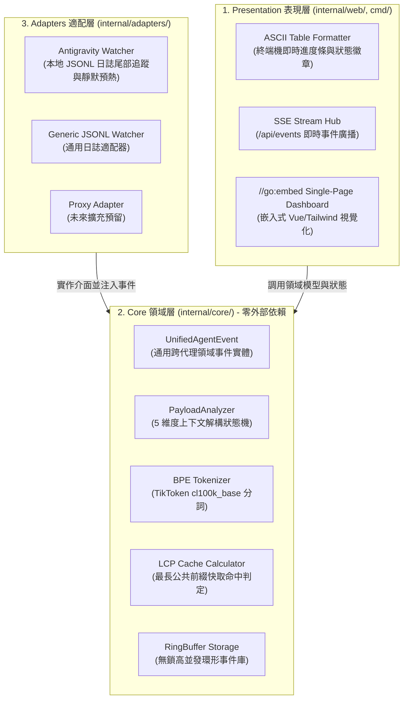

# 🛠️ Agent-Observer 觀測服務系統架構規劃書

> [!NOTE]
> **⚡ 30 秒核心精華 (Key Takeaway)**
> `agent-observer` 是專為自主 AI Agent 量身打造的本地輕量化 Context 觀測與遙測服務。系統遵循 **Clean Architecture (整潔架構)** 原則，具備 **零外部環境依賴、單一靜態 Binary、< 15MB RSS 常駐記憶體開銷、即時 SSE 事件廣播與 //go:embed 嵌入式 Web 儀表板**。

---

## 🔍 一、設計哲學與極限約束條件

作為一個長駐在開發者本機背景的輔助觀測工具，`agent-observer` 設立了三條不可妥協的工程紅線：
1. **零外部依賴 (Zero Dependency)**：不得要求使用者安裝 Python、Node.js 或管理虛擬環境，必須以單一靜態二進制檔交付。
2. **極致低開銷 (< 15MB RSS)**：長駐背景運行時，CPU 佔用率必須趨近於 0%，常駐記憶體必須嚴格壓在 15MB 以內。
3. **零網路侵入性 (Zero Network Intrusion)**：不劫持使用者的 `HTTPS_PROXY`，不中斷 Agent 的主連線，透過單向日誌監聽實現完全解耦。

---

## 🏛️ 二、Clean Architecture 分層架構圖與精讀指引



### 📖 圖表深度精讀指南 (Diagram Walkthrough)

1. **【核心視野】**：本圖展示了依賴倒置原則（Dependency Inversion Principle）。領域核心層（`internal/core/`）居於中央，完全不依賴外部適配器或表現層。
2. **【看圖路徑 (Step-by-Step)】**：
   * **底層 Adapters**：負責對接具體的外部資料源（如 Antigravity CLI 的 `transcript_full.jsonl`），並將原始格式轉換為領域標準的 `UnifiedAgentEvent`。
   * **中央 Core**：負責維護 Session 狀態機、執行 BPE Token 計算與 LCP 前綴比對，並將結果存入 RingBuffer。
   * **頂層 Presentation**：透過 SSE 廣播或終端機表格向使用者呈現觀測數據。
3. **【可替換性保證】**：未來若要支援 Cursor、Claude Code 或自研 Agent，只需在 `adapters/` 新增一個適配器，`core/` 與 `web/` 的所有邏輯 100% 無需修改！

---

## 💻 三、一鍵構建與執行指南

```bash
# 1. 執行完整的單元測試套件 (包含分詞器、分析器與格式化測試)
make test

# 2. 編譯為極致輕量之單一靜態二進制檔 (< 15MB)
make build

# 3. 啟動觀測當前活動的 Agent Session
./bin/agent-observer
```

---

## 🔗 四、相關概念與延伸閱讀
* [[01_Context_5_Dimensions]]：5 維度上下文模型。
* [[02_Token_Calculation_and_LCP]]：Token 計算與快取推導演算法。
* [[03_Agent_Storage_and_State_Machine]]：底層日誌儲存與狀態機模式。
