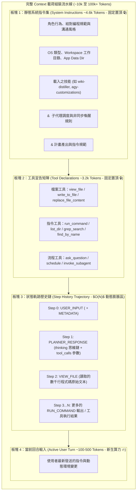

# 🧬 Agent 上下文載荷 4 大板塊與底層 API 通訊協議

> [!NOTE]
> **⚡ 30 秒核心精華 (Key Takeaway)**
> 每一輪發送給 LLM 推論大腦的 Context 載荷，在底層組裝上嚴格遵循 **4 大板塊** 的物理順序：
> 1. **靜態系統指令集 (System Instruction ~4.6k Tokens)**：包含 `<identity>`, `<skills>`, 安全與環境規範；
> 2. **工具宣告矩陣 (Tools Schema ~3.2k Tokens)**：包含可用工具的 JSON Schema 宣告；
> 3. **狀態軌跡歷史鏈 (Step Trajectory - 動態膨脹區)**：包含過往所有的 Tool Calls 與 Tool Results；
> 4. **當前回合輸入 (Active Turn ~100-800 Tokens)**：包含最新發送的使用者指令。
> 任何商業級 Agent 與後端 API（如 Google Code Assist 端點）的通訊，皆是將此 4 大板塊以 JSON/Protobuf 格式進行序列化傳輸。

---

## 🔍 一、技術背景：為什麼 Context 必須嚴格分板塊組裝？

在自主 AI Agent 中，大腦之所以能維持長期的一致性行為、遵守使用者工作目錄限制，並正確發起工具調用，全賴於其在每一輪請求中都被注入了完整的 **系統設定與工具簽名**。

* **開局即佔用 8,000 Tokens**：即便使用者只打了一句 `"Hello"`，發送給模型的請求就已經包含了約 7,800 Tokens 的靜態定義。
* **前綴快取保護需求**：板塊 1 與板塊 2 必須永久固定在 Context 最前端，絕不能隨意變更順序，才能確保大模型伺服器能夠 100% 命中前綴快取。

---

## 🏛️ 二、Context 4 大板塊組裝流程圖與精讀指引



### 📖 圖表深度精讀指南 (Diagram Walkthrough)

1. **【核心視野】**：本圖展示了 Agent 在發送 HTTP/gRPC 請求前，如何由上至下依序將 4 個板塊拼接為單一 Context 陣列。
2. **【看圖路徑 (Step-by-Step)】**：
   * **頂部前綴 (板塊 1 + 板塊 2)**：永恆固定的前綴基底（約 7,800 Tokens）。只要這兩大板塊字元不變，在推論伺服器端永遠享受 100% 快取命中。
   * **中間膨脹區 (板塊 3)**：隨著對話輪次增加，每一次的 Tool Calls 與 Tool Results 依序沉澱入歷史鏈中，成為 Context 體積最大的板塊。
   * **尾端增量 (板塊 4)**：最新的使用者輸入，接在歷史鏈的最末端。
3. **【色彩與物理意義】**：
   * 🔒 **深藍色/置頂**：快取保護區，不可插入任何動態時間戳。
   * 🔥 **橙色/尾端**：新生算力區，逐輪推進。

---

## 🔍 三、底層 API 通訊 Trace 與 JSON Schema 解析

在商業級 Agent 運行時，底層與 Google 後端服務（`daily-cloudcode-pa.googleapis.com`）的每一次 HTTP 通訊，均被記錄在運行時日誌中。

### 1. `USER_INPUT` (使用者輸入步驟 JSON Schema)
```json
{
  "step_index": 0,
  "source": "USER_EXPLICIT",
  "type": "USER_INPUT",
  "status": "DONE",
  "created_at": "2026-08-18T07:20:06Z",
  "content": "<USER_REQUEST>\n請幫我分析 KV Cache 顯存大小\n</USER_REQUEST>\n<ADDITIONAL_METADATA>\nThe current local time is: 2026-08-18T15:20:06+08:00.\n</ADDITIONAL_METADATA>"
}
```

### 2. `PLANNER_RESPONSE` (模型決策與思考鏈 JSON Schema)
```json
{
  "step_index": 1,
  "source": "MODEL",
  "type": "PLANNER_RESPONSE",
  "status": "DONE",
  "created_at": "2026-08-18T07:20:08Z",
  "thinking": "使用者希望分析 KV Cache 顯存大小，我需要先調用 view_file 讀取公式...",
  "tool_calls": [
    {
      "name": "view_file",
      "args": {
        "AbsolutePath": "/path/to/formula.md",
        "toolSummary": "View KV Cache formula"
      }
    }
  ]
}
```

---

## 🔗 四、相關概念與延伸閱讀
* [[01_Context_5_Dimensions]]：5 維度上下文模型定義。
* [[02_Token_Calculation_and_LCP]]：如何對各板塊進行 BPE 分詞計數。
* [[03_Agent_Storage_and_State_Machine]]：雙軌日誌與 SQLite 狀態機。
