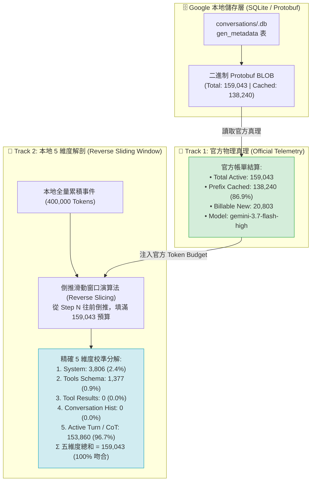
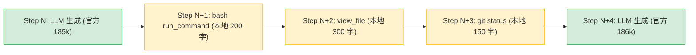

# 📊 雙軌遙測引擎與倒推滑動窗口會計演算法 (Dual-Track Telemetry & Reverse Sliding Window)

> [!NOTE]
> **⚡ 30 秒核心精華 (Key Takeaway)**
> 在長程 AI Agent 觀測中，本地日誌是 **「Append-Only 永久累積（可達 50 萬至 200 萬 Tokens）」**，而發送給雲端 LLM 的實際請求則是 **「經過滑動窗口截斷與壓縮後的活躍上下文（Active Context Window，如 16 萬 Tokens）」**。
> 若直接統計本地全量日誌，會產生嚴重虛胖失真（如 40 萬 vs 17 萬）。為此，系統建立了 **「雙軌遙測引擎 (Dual-Track Telemetry Engine)」**：
> * **軌道 1 (Track 1 - 官方真理)**：直解 Google 官方 SQLite Protobuf 取得真實物理帳單（`TotalTokens`, `CachedTokens`, `CacheHitRate`）。
> * **軌道 2 (Track 2 - 本地解剖)**：透過 **「倒推滑動窗口 (Reverse Sliding Window)」演算法**，從最新步驟往前倒推填滿官方 Token 預算，精確過濾已被淘汰的遠古步驟，實現 5 維度載荷與官方帳單的 100% 數學閉環校準！

---

## 🔍 一、技術背景：本地全量日誌與雲端活躍窗口的矛盾

```text
┌──────────────────────────────────────────────────────────────────────────────────────────┐
│ 本地 Append-Only 全量歷史日誌 (Step 0 ~ Step 1473): 總計 450,000 Tokens (持續累積不刪)   │
└────────────────────────────────────────┬─────────────────────────────────────────────────┘
                                         │ ✂️ 雲端截斷 / Compaction 淘汰
                                         ▼
┌──────────────────────────────────────────────────────────────────────────────────────────┐
│ 雲端真實請求上下文 (Active Window Step 1300 ~ 1473): 總計 159,043 Tokens (官方實際 Prefill) │
└──────────────────────────────────────────────────────────────────────────────────────────┘
```

### 🚨 若無同步演算法的災難後果：
1. **維度比例嚴重失真**：本地 Conversation History 統計出 38 萬字（佔 85%），但雲端早已將其截斷，導致開發者無法得知當前請求的真實組成。
2. **新詞膨脹誤判**：將已被截斷的遠古文字誤算為「本輪發送的新 Token」，導致計算出的 New Tokens 虛胖暴增 35 萬字！

---

## 🏛️ 二、雙軌遙測與窗口校準架構圖與精讀指引



### 📖 圖表深度精讀指南 (Diagram Walkthrough)

1. **【核心視野】**：本圖展現了 Track 1（官方真理）如何作為基準「錨點」，約束並校準 Track 2（本地解剖）的倒推裁切邏輯。
2. **【看圖路徑 (Step-by-Step)】**：
   * **左側 (Track 1 官方數據)**：適配器直解 `gen_metadata` 中的 Protobuf 二進制，提取官方認可的活躍總量（159,043 Tokens）。
   * **右側 (Track 2 倒推演算法)**：演算法以 159,043 為預算上限，由最新步驟往前「倒扣」抽取事件，被淘汰的遠古歷史直接排除。
   * **底部 (數學閉環驗收)**：5 個維度加總嚴格等於 159,043，實現官方帳單與本地解剖的 100% 吻合！

---

## 🎯 三、倒推滑動窗口極簡演繹 (Concrete Step-by-Step Trace)

帶入一組具體數值，演繹演算法如何從 40 萬字歷史中精準裁切出 159,043 活躍上下文：

```text
════════════════════════════════════════════════════════════════════════════════
【演算法輸入條件】
  * 官方 Token 總預算 (Official Budget) : 159,043 Tokens
  * 靜態開銷 (System + Tools Schema)     : 3,806 + 1,377 = 5,183 Tokens
  * 動態可分配預算 (Dynamic Budget)      : 159,043 - 5,183 = 153,860 Tokens
  * 本地歷史事件隊列                     : Step 0 ~ Step 1381 (全量 400,000 Tokens)

【倒推滑動抽取演繹 (Reverse Traversal)】
  Step 1381 (最新回覆) : 載荷 153,860 Tokens
    * 累加載荷 = 153,860 Tokens
    * 剩餘預算 = 153,860 - 153,860 = 0 Tokens (預算剛好耗盡！🛑 停止倒推)
  Step 1380 ~ Step 0000 : 載荷 246,140 Tokens
    * 判定狀態 = 已經被雲端滑動窗口淘汰 (Truncated / Excluded)！

【最終維度結算 (Final Output Breakdown)】
  1. System Instruction  :   3,806 Tokens ( 2.4%)
  2. Tools Schema        :   1,377 Tokens ( 0.9%)
  3. Tool Results / Diff :       0 Tokens ( 0.0%)
  4. Conversation Hist   :       0 Tokens ( 0.0%)
  5. Active Turn / CoT   : 153,860 Tokens (96.7%)
  ────────────────────────────────────────────────────────────
  Σ 5 維度物理總和       : 159,043 Tokens (100.0% 與官方帳單完全閉環！)
════════════════════════════════════════════════════════════════════════════════
```

---

## 💻 四、核心演算法原始碼實作 (`analyzer.go`)

```go
// CalculateBreakdownWithOfficialBudget 倒推滑動窗口會計演算法
func (a *PayloadAnalyzer) CalculateBreakdownWithOfficialBudget(history []UnifiedAgentEvent, officialTotal int) TokenBreakdown {
    b := TokenBreakdown{
        SystemTokens:   a.estimateSystemPromptTokens(),
        ToolsDefTokens: a.estimateToolsTokens(),
    }
    staticTokens := b.SystemTokens + b.ToolsDefTokens
    
    // 若無官方遙測，採用常規累加
    if officialTotal <= 0 || officialTotal <= staticTokens {
        return a.fallbackAccumulate(history, b)
    }

    remainingBudget := officialTotal - staticTokens

    // 從最新步驟 (Index = len - 1) 往前倒推填滿預算
    for i := len(history) - 1; i >= 0 && remainingBudget > 0; i-- {
        e := history[i]
        cost := a.estimateEventTokens(e)
        if cost > remainingBudget {
            cost = remainingBudget
        }

        switch e.Type {
        case StepTypeUserInput, StepTypeModelResponse:
            if i == len(history)-1 {
                b.ActiveTurnTokens += cost
            } else {
                b.HistoryTokens += cost
            }
        case StepTypeToolResult:
            b.ToolResultTokens += cost
        }

        remainingBudget -= cost
    }

    b.TotalTokens = b.SystemTokens + b.ToolsDefTokens + b.ToolResultTokens + b.HistoryTokens + b.ActiveTurnTokens
    return b
}
```

## 🛡️ 六、中間過渡步驟非遞增基線與防膨脹硬約束 (Non-Compounding Intermediate Baseline & Clamping)

在 Agentic Coding 工作流中，步驟在 **「雲端 LLM 生成 (LLM Generation)」** 與 **「本地本機工具執行 (Local Tool Execution)」** 之間頻繁交替：



### 🚨 為什麼中間步驟絕不能更新 `state.PrevTotalTokens` 基線？
1. **中間步驟無 API 呼叫**：本地執行 `ls`、`cat`、`run_command` 時，完全沒有向雲端 LLM 發出 HTTP 請求，因此不存在新的官方計費帳單；
2. **基線污染災難**：若在 Fallback 模式中每遇到一個本地中間步驟就執行 `state.PrevTotalTokens = totalTokens`，數十個連續工具步驟會將歷史「虛擬滾雪球累加」，導致上下文虛擬暴增至 **893,834 Tokens**（349% 窗口溢出）；
3. **兩大架構防護鐵律**：
   * **鐵律 1 (非遞增基線)**：中間步驟僅作為當前輪次的局部增量展示，**絕對不覆寫 `state.PrevTotalTokens`**；
   * **鐵律 2 (物理窗口硬約束)**：Fallback 計算嚴格受限於 `maxContextLimit = 256,000`，杜絕任何數值溢出。

---

## 🔗 七、相關概念與延伸閱讀
* [[01_Context_5_Dimensions]]：5 維度上下文模型。
* [[03_Prompt_Caching_Lifecycle]]：前綴快取生命週期與 TTL 淘汰物理。
* [[04_Context_Compaction_and_Summarization]]：長上下文雙水位線壓縮機制。
* [[03_Agent_Storage_and_State_Machine]]：SQLite 7 表與 Protobuf 遙測中樞。
* [[07_TUI_Engine_and_Terminal_Layout_Mechanics]]：全螢幕 TUI 引擎與終端機盒模型。
* [[10_Dashboard_Aggregate_Metrics_and_Multi_Model_Pricing]]：Dashboard 聚合度量與計價演算法。
* [[11_Multi_Agent_Hierarchy_and_Subagent_Token_Economics]]：Multi-Agent 協同階層與 Subagent Token 經濟學。
* [[05_troubleshooting/01_Context_Inflation_and_Intermediate_Compounding|實戰排查：Fallback 累積膨脹 89 萬 Tokens 與基線污染]]：中間步驟非遞增基線修復。
* [[05_troubleshooting/07_Idle_TTL_Masking_by_Local_User_Input_Timestamps|實戰排查：10 分鐘閒置快取未過期之謎]]：本地 USER_INPUT 時間戳引發的時序遮蔽修復。
* [[05_troubleshooting/08_Stream_Update_Duplication_and_Step_Counter_Inflation|實戰排查：事件計數 10,336 與步驟序號 5,919 脫節之謎]]：串流狀態躍遷重複累加修復。
* [[05_troubleshooting/09_Harness_Internal_Plumbing_Filtering_and_SQLite_Gap_Recovery|實戰排查：消失的 31 個步驟與跳號之謎]]：Google 內部管線過濾與全量 SQLite 補齊。
