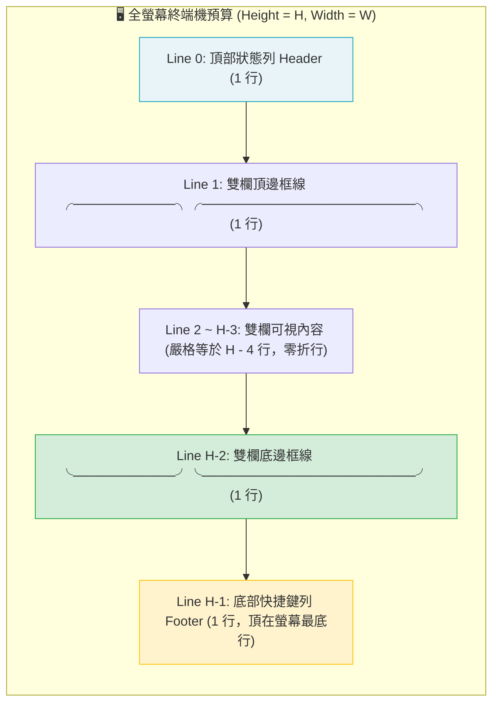
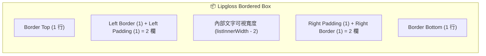

# 🖥️ 全螢幕 TUI 引擎架構、終端機盒模型與 CJK 渲染物理 (TUI Engine & Terminal Layout Mechanics)

> [!NOTE]
> **⚡ 30 秒核心精華 (Key Takeaway)**
> 現代 AI 觀測工具（如 `agent-observer`）採用 **Bubbletea (Elm 架構) 與 Lipgloss 樣式引擎** 打造全螢幕互動式 TUI。然而，終端機開發面臨著三大傳統 Web CSS 所沒有的底層物理陷阱：
> 1. **等寬網格限制 (Monospace Grid)**：終端機只有離散的行與欄，零像素插值；
> 2. **Lipgloss 盒模型內外距疊加**：`.Width(W)` 設定內部尺寸，疊加 `.Border()` (+2) 與 `.Padding()` (+2) 後實際外徑達 $W+4$；
> 3. **中文字元 (CJK) 2 倍列寬隱形折行**：Go 的 `len([]rune)` 算 1 個字元，但在終端機佔用 2 欄，導致隱形換行撐爆容器。
> 透過 **`go-runewidth` 視覺寬度硬切、統一虛擬滾動緩衝區（Unified Scroll Buffer）與像素級垂直行數鎖定**，徹底實現終端機級的 `overflow: hidden; white-space: nowrap`！

---

## 🔍 一、技術背景：終端機渲染的特殊物理約束

與現代瀏覽器渲染引擎（Blink/WebKit）不同，終端機模擬器（如 iTerm2, macOS Terminal, Alacritty）是一張由 **$W$ 欄 (Columns) $\times$ $H$ 行 (Rows)** 組成的二維字元網格：

```text
(0,0) ┌────────────────────────────────────────────────────────────┐
      │ Monospace Character Grid (80 x 24 / 120 x 35)               │
      │ 每個英文字元佔用 1 欄 (Width=1)                            │
      │ 每個中文字元 (CJK) 或 Emoji 佔用 2 欄 (Width=2)             │
      │ 若單行總視覺寬度 > W，終端機會「強制向下折行 (Line Wrap)」  │
      └────────────────────────────────────────────────────────────┘ (W-1, H-1)
```

### 🚨 終端機自動折行 (Line Wrap) 的連鎖災難：
若在 80 欄終端機中輸出一行 81 欄的字串，終端機會自動將第 81 字元換到下一行，導致整張畫面的行數從 24 行膨脹為 25 行。在全螢幕模式下，這 1 行的膨脹會導致**全螢幕向下位移滾動，游標落到螢幕外，底部快捷鍵被推擠出視野！**

---

## 🏛️ 二、TUI 垂直行數預算與盒模型幾何架構圖



### 📐 嚴格垂直行數守恆公式：
$$\text{總垂直行數} = 1 \text{ (Header)} + 1 \text{ (Top Border)} + (H - 4) \text{ (Content)} + 1 \text{ (Bottom Border)} + 1 \text{ (Footer)} \equiv \mathbf{H \text{ 行}}$$

---

## 🎯 三、Lipgloss 盒模型內外距算術 (Box Model Arithmetic)

在 Lipgloss 中，樣式的寬高設定是針對 **內部可繪製區域 (Inner Dimension)**：



$$\text{外部總寬度 (Outer Width)} = W_{\text{inner}} + 2 \text{ (Border)} + 2 \text{ (Padding)} = W_{\text{inner}} + 4$$
$$\text{外部總高度 (Outer Height)} = H_{\text{inner}} + 2 \text{ (Top/Bottom Border)} = (H - 4) + 2 = H - 2$$

👉 **避坑鐵律**：若左欄欲分配 $32\%$ 螢幕寬度，則：
$$W_{\text{left\_outer}} = \text{int}(0.32 \times W) \implies W_{\text{list\_inner}} = W_{\text{left\_outer}} - 4$$
文字在排版截斷時，可用的文字物理欄寬為 **$W_{\text{list\_inner}} - 2$**（扣除左右各 1 格 Padding 空白）。

---

## 🔬 四、中文字元 (CJK) 2 倍列寬與 `go-runewidth` 硬切實作

為徹底根除繁體中文、全形符號與 Emojis 造成的隱形折行，必須使用 `go-runewidth` 針對字元終端列寬進行計算：

```go
// truncateVisualWidth 依據終端機物理列寬 (CJK/Emoji 算 2 列, 英文算 1 列) 進行精確硬切
// 徹底實現終端機級 overflow: hidden; white-space: nowrap
func truncateVisualWidth(s string, maxVisualWidth int) string {
    s = strings.ReplaceAll(s, "\n", " ")
    s = strings.ReplaceAll(s, "\r", "")
    s = strings.ReplaceAll(s, "\t", "    ")

    if maxVisualWidth <= 0 {
        return ""
    }

    w := 0
    var res []rune
    for _, r := range []rune(s) {
        rw := runewidth.RuneWidth(r)
        if w+rw > maxVisualWidth {
            break
        }
        res = append(res, r)
        w += rw
    }
    return string(res)
}
```

---

## 📜 五、右欄軟換行虛擬緩衝區 (Soft-Wrapping Virtual Buffer)

在 Inspector 右欄中，長代碼或長段落若直接硬切會遺失資訊。系統採用 **Pre-wrapping 軟換行虛擬緩衝區**：

```go
// wrapVisualLines 將長段落預先切成符合欄寬的虛擬行，精確忽略 ANSI 轉義字元佔位
func wrapVisualLines(text string, maxWidth int) []string {
    if maxWidth <= 0 {
        return []string{""}
    }
    var result []string
    lines := strings.Split(text, "\n")
    for _, line := range lines {
        line = strings.ReplaceAll(line, "\r", "")
        line = strings.ReplaceAll(line, "\t", "    ")
        if line == "" {
            result = append(result, "")
            continue
        }
        runes := []rune(line)
        var currentChunk []rune
        currentW := 0
        inAnsi := false

        for _, r := range runes {
            if r == 0x1b { // Escape char
                inAnsi = true
                currentChunk = append(currentChunk, r)
                continue
            }
            if inAnsi {
                currentChunk = append(currentChunk, r)
                if (r >= 'a' && r <= 'z') || (r >= 'A' && r <= 'Z') {
                    inAnsi = false
                }
                continue
            }

            rw := runewidth.RuneWidth(r)
            if currentW+rw > maxWidth {
                if len(currentChunk) > 0 {
                    result = append(result, string(currentChunk))
                    currentChunk = nil
                    currentW = 0
                }
            }
            currentChunk = append(currentChunk, r)
            currentW += rw
        }
        if len(currentChunk) > 0 || len(runes) == 0 {
            result = append(result, string(currentChunk))
        }
    }
    return result
}
```

---

## 🎨 七、ANSI 轉義序列感知狀態機與全寬懸掛縮排 (ANSI State Machine & Hanging Indent)

### 🚨 致命黑天鵝：隱形 ANSI 轉義字元虛擬佔位
* **現象**：字串在經由 Lipgloss 上色後（如 `\x1b[38;2;108;92;231m...`），底層包含了約 20 個不可見字元；
* **Bug 根因**：若直接在渲染後呼叫寬度截斷，這些不可見字元會被誤計為 20 欄寬，導致文字才剛印到第 50 欄就被當作達到 100 欄而**腰斬折行**；
* **徹底解決方案**：在 `truncateVisualWidth` 與 `wrapVisualLines` 導入 **ANSI 感知狀態機**（遇到 `\x1b` 至結尾字母期間 `w += 0`），使文字 100% 完整延伸至螢幕最右側邊界 `│`！

### 📖 29 格全寬懸掛縮排 (Hanging Indent)
對於辭典類的 Key-Value 排版，採用純文字先折行與 29 格縮排：
* **Line 1**：`  Key (24) : DescChunk[0]`（第一段文字頂到最右邊界）；
* **Line 2+**：`                           `（29 格縮排）+ `DescChunk[i]`（維持左側欄位垂直對齊）。

---

## ⚡ 八、過度滾動硬性約束與嵌入式 Markdown 多語言架構 (Zero-Overscroll & Embedded i18n)

1. **過度滾動硬性約束 (Zero-Overscroll Clamping)**：
   * 透過 `m.getDocsMaxScroll()` 動態計算總行數與視窗高度差額，將滾動變數 `docsScroll` 嚴格約束在 `[0, maxScroll]` 範圍內；
   * 徹底杜絕連按 `j` 到底後按 `k` 需連敲數十下才動的數值溢出延遲。
2. **Go `embed.FS` 嵌入式雙語辭典**：
   * 採用 `//go:embed docs/*.md` 將 `docs_en.md` 與 `docs_zh.md` 靜態編譯進二進制檔；
   * 預設英文，在 Docs 視圖中按下小寫 **`[l]`** 或 **`Tab`** 即可即時無縫切換繁中與英文。
3. **職責分離**：
   * **`?` Shortcuts Modal**：輕量全域浮動快捷鍵面板；
   * **`[3] Docs` 獨立頁面**：具備 `/` 即時搜尋、多語言切換與全寬懸掛縮排的完整架構辭典。

---

## 🔗 九、相關概念與延伸閱讀
* [[03_Agent_Storage_and_State_Machine]]：SQLite 狀態機與 Protobuf 載荷。
* [[06_Dual_Track_Telemetry_and_Window_Accounting]]：雙軌遙測與倒推滑動窗口。
* [[04_Service_Plan_Agent_Observer]]：`agent-observer` 完整服務架構規劃。
* [[08_Interactive_Session_Switching_and_Anti_Jitter|互動式會話快切與防抖動機制]]：全域會話快切與動態目錄發現。
* [[05_troubleshooting/03_TUI_ANSI_Escape_Truncation_and_Overscroll_Lag|實戰排查：ANSI 字元隱形佔位腰斬折行與過度滾動卡頓]]：終端機排版三大黑天鵝排查。
