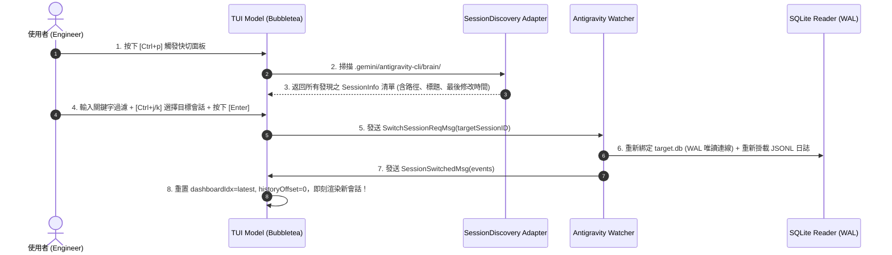
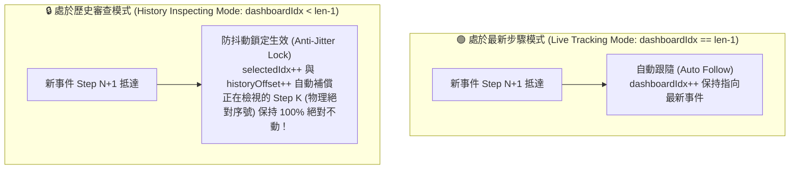

# 🔀 互動式會話快切、動態目錄發現與歷史步驟防抖動鎖定機制 (Interactive Session Switching & Anti-Jitter Lock)

> [!NOTE]
> **⚡ 30 秒核心精華 (Key Takeaway)**
> 在多工作區與長程 Agentic Coding 實戰中，工程師需要隨時跨多個 Session 調閱歷史遙測，同時在即時串流（Live Streaming）湧入新步驟時**保持當前正在檢視的歷史步驟絕對鎖定，防止視圖跳動**。
> 本篇解密兩大核心架構設計：
> 1. **全域會話快切中樞 (Quick Switcher)**：透過 `DiscoverAllSessions` 自動掃描使用者工作區，結合 Vim-First 鍵盤導航與 Fuzzy 即時過濾，實現 0 重啟熱切換（Hot Reloading）；
> 2. **歷史檢驗防抖動鎖定 (Anti-Jitter Lock)**：透過「邏輯倒序索引與物理正序索引的對映不變量」，在背景即時追加新步驟時自動補償偏移量，實現歷史審查的「零抖動、零跳頁、零中斷」！

---

## 🔍 一、技術背景：長程串流觀測的兩大體驗痛點

1. **會話切換重啟成本高**：傳統 CLI 必須關閉程式、重新下指令傳入新的 `SessionID`，無法在單一 TUI 視窗內任意漫遊多個會話；
2. **串流追加引發視圖抖動 (Streaming Jitter)**：
   * 在 History Explorer 中，使用者正停留在「Step 100」仔細分析 Tool Result；
   * 此時背景 Agent 執行完指令，新增了「Step 2409」；
   * 若無防抖動機制，整個步驟清單會被往下推擠，使用者正在檢視的內容瞬間跳掉，嚴重破壞除錯體驗。

---

## 🏛️ 二、會話動態發現與即時切換架構圖



### 📖 圖表深度精讀指南 (Diagram Walkthrough)
1. **【核心視野】**：本圖展示了從快捷鍵觸發、目錄自適應掃描、模糊搜尋到熱切換新會話的完整事件流。
2. **【看圖路徑 (Step-by-Step)】**：
   * **步驟 1~3**：全域掃描使用者的所有 active workspaces，自動過濾無效目錄；
   * **步驟 4~5**：採用 Vim 優先導航（`Ctrl+j/k` 或 `↑/↓`）並支援字母即時模糊過濾；
   * **步驟 6~8**：透過 Bubbletea 的 Message 機制熱切換 SQLite 與 Watcher 檔案指針，毫秒級渲染！

---

## 🔒 三、歷史步驟防抖動鎖定機制 (Anti-Jitter Lock Mechanics)

為了保證工程師在回溯歷史時不受背景新事件干擾，系統建立了 **物理索引不變性數學模型**。



### 📐 數學推導與補償公式：
假設當前會話共有 $M$ 筆事件（索引 $0 \dots M-1$）。
* 使用者在左側清單中選中了第 $K$ 個步驟（由新到舊倒序排序，對應的選中索引為 $\text{selectedIdx}$）；
* 正在檢視的事件在底層數組中的物理下標為：
  $$\text{PhysicalIndex} = M - 1 - \text{selectedIdx}$$
* 當背景新增 $1$ 筆即時事件時，總數變為 $M+1$：
  * 若要維持 $\text{PhysicalIndex}$ 恆定不變：
    $$(M + 1) - 1 - \text{selectedIdx}_{\text{new}} \equiv M - 1 - \text{selectedIdx}$$
    $$\implies \mathbf{\text{selectedIdx}_{\text{new}} = \text{selectedIdx} + 1}$$
* 因此，只需在每次 `handleLiveLine` 時將 `selectedIdx` 與 `historyOffset` 自動 $+1$，使用者眼前看到的畫面與選中框便 **絕對靜止鎖定**！

---

## 🎯 四、極簡防抖動演繹實例 (Concrete Anti-Jitter Trace)

帶入極簡 3 個步驟演繹：

```text
════════════════════════════════════════════════════════════════════════════════
【初始狀態 (Total = 3 步: Step 0, Step 1, Step 2)】
  * 使用者正在檢視 : Step 1 (PhysicalIndex = 1)
  * 左側倒序列表   : [0: Step 2], [1: Step 1 ◀ (選中)], [2: Step 0]
  * selectedIdx    = 1 (指向 Step 1)

【事件觸發 (Event Ingestion)】
  * 背景 Agent 完成了一次工具調用，寫入新事件: Step 3 (Total 變為 4 步)

【防抖動鎖定補償計算 (Anti-Jitter Compensation)】
  * 判斷條件 : selectedIdx > 0 (正在檢視歷史步驟，非 Live 跟隨)
  * 補償更新 : selectedIdx = 1 + 1 = 2

【最終畫面結算 (Final UI State)】
  * 新左側倒序列表 : [0: Step 3 (新)], [1: Step 2], [2: Step 1 ◀ (依然選中！)], [3: Step 0]
  * 檢視目標       : 物理下標 4 - 1 - 2 = 1 (依然是 Step 1！)
  * 讀者體驗       : 畫面完全無跳動，新步驟靜默出現在頂部！
════════════════════════════════════════════════════════════════════════════════
```

---

## 🔗 五、相關概念與延伸閱讀
* [[03_Agent_Storage_and_State_Machine]]：SQLite 7 表與 Protobuf 狀態機。
* [[07_TUI_Engine_and_Terminal_Layout_Mechanics]]：TUI 盒模型與終端機佈局。
* [[06_Dual_Track_Telemetry_and_Window_Accounting]]：雙軌遙測與倒推滑動窗口。
* [[05_troubleshooting/02_Startup_Warmup_Double_Ingestion_and_Cache_Lag|實戰排查：開機預熱雙重分析與全域遙測誤用]]：開機預熱管線單一攝入修復。
