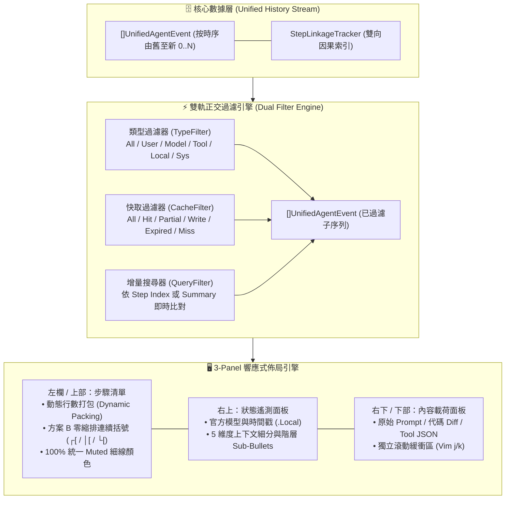

# 🔭 歷史步進瀏覽器、雙軌過濾引擎與因果拓撲圖譜 (History Explorer & Causality Graph)

> [!NOTE]
> **⚡ 30 秒核心精華 (Key Takeaway)**
> 在長程 AI Agent 執行過程中，單一會話往往累積數千個步驟（包含人類意圖、雲端決策、多工具並行與終端執行回傳）。
> `agent-observer` 的 **History Explorer（歷史步進瀏覽器）** 提供了一套工業級的因果檢視與導航中樞：
> 1. **因下果上連續括號封裝 (`┌[` / `│[` / `└[`)**：在無水平縮排浪費的前提下，直觀綁定每一個因果輪次（Inbound Cause $\to$ Cloud Effect）；
> 2. **雙軌正交過濾引擎 (`[T:Type]` 與 `[C:Cache]`)**：支援依步驟類型（User, Model, Tool, Output, System）與真實 GPU 快取狀態（Hit, Partial, Write, Expired, Miss）進行高速交叉篩選，並具備嚴格的互斥隔離邊界；
> 3. **雙向因果跳轉體系 (`p` / `c` / `C`)**：透過 `StepLinkageTracker` 追蹤的親緣指標，一鍵穿梭於父任務與已消費子步驟之間。

---

## 🔍 一、技術背景：為什麼需要步驟因果圖譜？

在傳統終端機或純文本日誌中，檢視 Agent 歷史存在三大致命痛點：
1. **因果斷裂 (Causality Disconnection)**：當 Agent 並行呼叫 5 個工具時，終端機日誌交錯穿插，工程師難以分辨某個 `view_file` 是由哪一次模型決策引發、其輸出又被哪一步模型所消費；
2. **大海撈針 (Needle in a Haystack)**：在 6,000 步歷史中尋找一次突發的 `[CACHE MISS]` 或使用者原始輸入，需手動向上滾動數萬行；
3. **時序與計費混淆**：若無法精確區分本地 Intent 與雲端 GPU Generation，容易產生「使用者打字為什麼也會算快取未命中」的認知誤區。

---

## 🏛️ 二、歷史步進瀏覽器核心架構圖與精讀指引



### 📖 圖表 4 維度深度精讀指南 (Diagram Walkthrough)

1. **【核心視野】**：展示從底層原始事件流，經過雙軌正交過濾與搜尋，最終送入 3-Panel 響應式佈局引擎的完整資料流向。
2. **【看圖路徑 (Step-by-Step)】**：
   * **步驟 1（數據層）**：`UnifiedAgentEvent` 攜帶官方 Telemetry 與本地 5 維度度量，由 `StepLinkageTracker` 建立 `ParentStepIdx` 與 `ConsumedStepIndices`。
   * **步驟 2（過濾層）**：使用者透過 `t` 鍵切換類型過濾器、`c` 鍵切換快取過濾器、`/` 鍵輸入搜尋字串，三個條件取交集（AND）產出 `Filtered` 切片。
   * **步驟 3（佈局層）**：佈局引擎依據終端機寬度（$\ge 100$ 或 $< 100$ 欄）自動選擇橫向分割或垂直堆疊，並套用極致緊湊的連續括號排版。
3. **【色彩與符號物理意義】**：
   * 藍色區塊代表狀態機與資料流；
   * 綠色區塊代表終端機畫面呈現組件。
4. **【底層隱藏工程細節】**：
   * 搜尋與過濾皆在記憶體切片上進行，複雜度為 $\mathcal{O}(N)$，在 10,000 步歷史下耗時 $< 0.5\text{ ms}$，保證終端機 60 FPS 絲滑響應。

---

## ⚡ 三、雙軌正交過濾引擎與嚴格互斥邊界 (Dual Filter Engine)

歷史瀏覽器提供兩條獨立的正交過濾軸線：

### 1. 步驟類型過濾軸 (`TypeFilter`)
循環切換鍵：小寫 **`[t]`**
* `[T:All]`：展示所有步驟；
* `[T:User]`：僅展示使用者輸入（`👤 USER`）；
* `[T:Model]`：僅展示雲端模型自然語言回覆（`🤖 MODEL`）；
* `[T:Tool]`：僅展示工具呼叫指令（`🛠️ TOOL`）；
* `[T:Local]`：僅展示本地工具實體執行結果（`💻 OUTPUT`）；
* `[T:System]`：僅展示系統啟動與 Context 截斷檢查點（`⚙️ SYSTEM` / `CHECKPOINT`）。

### 2. 快取狀態過濾軸 (`CacheFilter`)
循環切換鍵：小寫 **`[c]`**
* `[C:All]`：展示所有快取狀態；
* `[C:Hit]`：前綴快取命中率 $\ge 70\%$ 的高性價比步驟；
* `[C:Partial]`：前綴快取命中率介於 $0.1\% \sim 69.9\%$ 的局部稀釋步驟；
* `[C:Write]`：會話開局第 0 步首筆寫入步驟；
* `[C:Expired]`：閒置超過 5 分鐘觸發 TTL 淘汰之步驟（`CacheStatus == "EXPIRED"`）；
* `[C:Miss]`：真正的冷啟動或前綴被破壞之步驟（`CacheStatus == "MISS"`）。

#### 🛡️ 關鍵防禦：嚴格互斥守衛 (Strict Exclusion Guard)
在 `matchCacheFilter()` 實作中，**嚴格排除本地步驟、EXPIRED 與 WRITE**，確保 `[C:Miss]` 絕不混入任何逾時淘汰的步驟：

```go
case CacheFilterMiss:
    // 本地執行為離線操作，絕非 Cache Miss
    if e.IsLocalStep() || e.Scope == core.ScopeLocalExecution {
        return false
    }
    // 嚴格排除 EXPIRED 與 WRITE，維持篩選純度
    if e.CacheStatus == "EXPIRED" || e.CacheStatus == "TTL_EXPIRED" || e.CacheStatus == "WRITE" {
        return false
    }
    return e.CacheStatus == "MISS" || (e.Tokens.TotalTokens > 0 && e.Tokens.CachedTokens == 0 && e.Tokens.NewTokens > 0)
```

---

## 🌲 四、因果拓撲導航與無縮排連續括號 (Causality Navigation & Flush Brackets)

### 1. 連續括號封裝 (Continuous Turn Brackets)
在歷史清單中，時間由下至上流動（舊 $\to$ 新）。系統透過單橫線連續括號將一個因果輪次視覺化封裝：

```text
╭────────────────────────────────────╮
│ STEPS (6054) <                     │
│ Filters: [T:All] [C:All]           │
│   ...                              │
│ ┌[4446] 🛠️ TOOL [HIT 100%]         │  <-- 果 (Cloud Effect: Top of bracket)
│ │  Model: Gemini 3.7 Flash         │  <-- Cloud Hint (統一 Muted 灰色細線)
│ │[4445] 💻 OUTPUT (Local)         │  <-- 因 (Local Cause: Inside stem, [ 齊頭)
│ └  Tool: edit_file                 │  <-- Local Hint (統一 Muted 灰色細線)
│ ┌[4440] 🤖 MODEL [HIT 100%]        │  <-- 果 (Cloud Effect: Top of bracket)
│ │  Model: Gemini 3.7 Flash         │  <-- Cloud Hint (統一 Muted 灰色細線)
│ └[4433] 👤 USER                   │  <-- 因 (Local Cause: Bottom of bracket, [ 齊頭)
╰────────────────────────────────────╯
```

### 2. 雙向因果快捷鍵 (Bidirectional Causality Hotkeys)
* **`[p]` (Jump to Parent)**：
  * 當游標位於 `OUTPUT` 上時，一鍵跳轉至觸發它的 `TOOL_CALL`；
  * 當游標位於 `TOOL_CALL` 上時，一鍵跳轉至發起該任務的 `USER_INPUT`。
* **`[c]` (Jump to Consumed Child)**：
  * 當游標位於雲端步驟時，一鍵跳轉至其所打包的第一個本地子步驟。
* **`[C]` (Jump to Last Child)**：
  * 跳轉至該雲端步驟所打包的最後一個本地子步驟。
* **`[Tab]` / `[h / l]`**：
  * 在左欄步驟清單與右欄內容載荷之間無縫切換焦點。

---

## 🔬 五、極簡 Input $\to$ 逐輪演繹 $\to$ Final Output 實例

### 📥 極簡真實 Input：
使用者依序執行：
1. 輸入 Prompt：`"請幫我檢查 views.go 並修改排版"`（Step #201）；
2. 模型呼叫工具 `view_file`（Step #202）；
3. 本地回傳檔案內容（Step #203）；
4. 模型呼叫工具 `edit_file`（Step #204）；
5. 本地回傳編輯 Diff（Step #205）；
6. 模型給出最終說明（Step #206）。

---

### 🔄 狀態機逐輪演繹與因果拓撲演化：

| 時序步驟 | 步驟類型 | 範疇 (Scope) | `ParentStepIdx` | `ConsumedStepIndices` | `PackagedInStepIdx` | 渲染外觀 |
| :--- | :--- | :--- | :--- | :--- | :--- | :--- |
| **#201** | `USER_INPUT` | UserInteraction | `0` (Root) | `[]` | `#202` | `└[0201] 👤 USER` |
| **#202** | `TOOL_CALL` | CloudInference | `#201` | `[#201]` | `0` | `┌[0202] 🛠️ TOOL [HIT 100%]` |
| **#203** | `OUTPUT` (Local) | LocalExecution | `#202` | `[]` | `#204` | `│[0203] 💻 OUTPUT (Local)` |
| **#204** | `TOOL_CALL` | CloudInference | `#201` | `[#203]` | `0` | `┌[0204] 🛠️ TOOL [HIT 100%]` |
| **#205** | `OUTPUT` (Local) | LocalExecution | `#204` | `[]` | `#206` | `│[0205] 💻 OUTPUT (Local)` |
| **#206** | `MODEL_RESP` | CloudInference | `#201` | `[#205]` | `0` | `┌[0206] 🤖 MODEL [HIT 100%]` |

---

### 📤 Final Output (終端機動態呈現)：
* **視覺連續性**：`#201` 與 `#202` 形成第一個封裝括號；`#203` 與 `#204` 形成第二個封裝括號；`#205` 與 `#206` 形成第三個封裝括號。
* **按鍵導航測試**：
  * 在 `#205` 上按 `p` $\to$ 光標精確跳至 `#204`；
  * 在 `#204` 上按 `p` $\to$ 光標精確跳至 `#201`；
  * 在 `#206` 上按 `c` $\to$ 光標精確跳至 `#205`。
* **過濾測試**：
  * 按 `t` 切換至 `[T:Local]` $\to$ 清單僅呈現 `#203` 與 `#205`，動態打包鋪滿全螢幕高度，零多餘留白！

---

## 🔗 六、相關概念與延伸閱讀
* [[01_Context_5_Dimensions]]：5 維度上下文結構定義。
* [[03_Agent_Storage_and_State_Machine]]：Universal 4 態 FSM 與 SQLite 儲存層。
* [[07_TUI_Engine_and_Terminal_Layout_Mechanics]]：3-Panel 響應式盒模型與動態行數打包。
* [[08_Interactive_Session_Switching_and_Anti_Jitter|互動式會話快切與防抖動機制]]：會話中樞切換。
* [[05_troubleshooting/04_Filter_Isolation_and_Cache_Expired_Boundary_Leak|實戰排查：EXPIRED 步驟洩漏至 MISS 過濾結果之邊界漏洞]]：快取過濾邊界隔離。
* [[05_troubleshooting/05_USER_Input_Inbound_Intent_vs_GPU_Cache_Settlement|實戰排查：USER 步驟誤標 MISS 與時序結算錯位]]：使用者輸入語意解耦。
* [[05_troubleshooting/06_Single_Line_Card_Static_Packing_Blank_Gap|實戰排查：單行卡片靜態除二計算導致清單底部大片留白]]：動態行數打包演算法修復。
