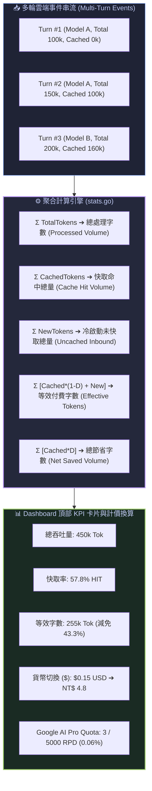

# Dashboard 全局聚合度量、多模型折扣矩陣與貨幣計價演算法

> [!NOTE]
> **⚡ 30 秒核心精華 (Key Takeaway)**  
> * **單輪活躍 vs. 全局聚合**：單一輪次的 Token 僅反映當前 HTTP 視窗狀態，而 Agent 會話的真實成本取決於**多輪累計的等效吞吐量**。
> * **等效字數公式 (Effective Tokens)**：$$\text{Effective} = \sum_{i} \left[ \text{CachedTokens}_i \times (1 - \text{Discount}_{\text{Model}}) + \text{NewTokens}_i \right]$$ 透過多模型快取折扣權重（Flash 75% OFF, Sonnet 90% OFF），將多模型混合調用的總吞吐量標準化為單一付費指標。
> * **Google AI Pro 5,000 RPD 物理模型**：以 $\text{Usage Pct} = \frac{\text{Turns}}{5000} \times 100\%$ 精確換算每日請求上限消耗進度。
> * **雙向鏈接**：本架構依賴 [[01_Context_5_Dimensions]] 與 [[06_Dual_Track_Telemetry_and_Window_Accounting]]，實戰排查參見 [[07_Idle_TTL_Masking_by_Local_User_Input_Timestamps]] 與 [[08_Stream_Update_Duplication_and_Step_Counter_Inflation]]。

---

## 一、概念緣起與全域度量視野

在長時間運行的 AI Agent 任務中（如重構專案、撰寫大型系統），單一輪次的活躍上下文可能高達 20 萬 Token，但透過 **Prompt Caching**，每次雲端請求中 80%~98% 的前綴字串直接復用了 GPU 顯存。

如果僅監控「單輪 Total Context」，開發者會誤以為每一動都在全額燒錢；反之，若僅統計原始日誌字數，又無法反映真實的帳單支出。因此，Agent Observer 建立了 **全局聚合度量體系 (Session Aggregate Metrics Engine)**，負責跨輪次實時結算總吞吐量、快取節省量與等效費用。

---

## 二、全局 5 大聚合度量公式與演算法



### 🔍 圖表 4 維度深度精讀指南 (Diagram Walkthrough)
1. **【核心視野】**：展示從離散的單輪雲端事件到連續全域 KPI 聚合指標的端到端數學沉澱管道。
2. **【看圖路徑 (Step-by-Step)】**：
   * 步驟 1：每當雲端推理輪次結束，接收官方 `TotalTokens` 與模型名稱；
   * 步驟 2：聚合器調用 `GetModelDiscount(Model)` 取得該模型專屬折扣；
   * 步驟 3：同步累加五大數學度量並輸出至 Dashboard 頂部 5 欄 KPI 視圖。
3. **【色彩與符號物理意義】**：
   * 藍色（InboundStream）：原始時序輸入；
   * 紫色（Aggregator）：多模型權重摺積計算核心；
   * 綠色（Presentation）：終端視覺呈現層。
4. **【底層隱藏工程細節】**：本地 Tool 操作與使用者打字步驟的 Token 不計入 $\sum \text{TotalTokens}$，避免重複計算（因其已打包於雲端輪次中）。

---

### 1. 五大核心聚合公式

| 度量名稱 | 英文標籤 | 數學定義公式 | 物理意義 |
| :--- | :--- | :--- | :--- |
| **總處理字數** | `Total Processed` | $$\text{Processed} = \sum_{i=1}^{M} \text{TotalTokens}_i$$ | 會話生命週期中雲端 GPU 處理的總字數規模 |
| **快取命中總量** | `Cache Hit Volume` | $$\text{CachedVol} = \sum_{i=1}^{M} \text{CachedTokens}_i$$ | 直接復用 GPU 顯存的前綴 Token 總和 |
| **冷字未快取總量** | `Uncached Inbound` | $$\text{ColdVol} = \sum_{i=1}^{M} \text{NewTokens}_i$$ | 需要消耗 GPU 算力進行 Prefill 計算的新字數 |
| **等效付費字數** | `Effective Tokens` | $$\text{Effective} = \sum_{i=1}^{M} \left[ \text{Cached}_i \times (1 - D_i) + \text{New}_i \right]$$ | 經模型折扣加權後的標準化等效計費字數 |
| **淨節省字數** | `Net Saved Volume` | $$\text{SavedVol} = \sum_{i=1}^{M} \left[ \text{Cached}_i \times D_i \right]$$ | 透過前綴快取機制免除計費的總字數 |

---

## 三、多模型折扣矩陣與官方計價標準

### 1. 2026 官方主流模型定價與快取折扣表

```text
┌─────────────────────────┬──────────────┬──────────────┬──────────────┬──────────────┐
│ Model Name              │ Input (/1M)  │ Cached (/1M) │ Discount (D) │ Output (/1M) │
├─────────────────────────┼──────────────┼──────────────┼──────────────┼──────────────┤
│ Gemini 3.7 Flash        │ $0.1500      │ $0.0375      │ 75.0% OFF    │ $0.6000      │
│ Gemini 3.7 Flash (High) │ $0.1500      │ $0.0375      │ 75.0% OFF    │ $0.6000      │
│ Gemini 2.5 Pro          │ $1.2500      │ $0.3125      │ 75.0% OFF    │ $5.0000      │
│ Claude 3.7 Sonnet       │ $3.0000      │ $0.3000      │ 90.0% OFF    │ $15.0000     │
│ Claude 3.5 Haiku        │ $0.8000      │ $0.0800      │ 90.0% OFF    │ $4.0000      │
└─────────────────────────┴──────────────┴──────────────┴──────────────┴──────────────┘
```

### 2. 即時貨幣換算公式 (`$` 快捷鍵切換機制)

在 TUI Dashboard 頂部，按下 **`$`** 鍵可在三種單位間循環切換：
$$\text{Display Mode} \in \{\text{Tokens (Tok)} \longrightarrow \text{US Dollar (\$)} \longrightarrow \text{NT Dollar (NT\$)}\}$$

* **USD 美金金額計算**：
  $$\text{Cost}_{\text{USD}} = \sum_{i=1}^{M} \left[ \frac{\text{Cached}_i \times P_{\text{cached}}}{10^6} + \frac{\text{New}_i \times P_{\text{input}}}{10^6} + \frac{\text{Output}_i \times P_{\text{output}}}{10^6} \right]$$
* **TWD 新台幣金額換算**：
  $$\text{Cost}_{\text{TWD}} = \text{Cost}_{\text{USD}} \times 32.0$$

---

## 四、Google AI Pro 5,000 RPD 配額消耗物理模型

對於訂閱 Google AI Pro / Ultra 方案的使用者，系統每日分配 **5,000 次請求 (Requests Per Day, RPD)**：

$$\text{Daily Quota Consumption \%} = \left( \frac{\text{Total Cloud Turns in 24h}}{5000} \right) \times 100\%$$

* **實務基準**：一次長達 4 小時的重度重構會話（~2,800 輪雲端推論），將消耗 **$56.4\%$** 的每日配額。

---

## 五、具體演繹實例 (Concrete Walkthrough)

### 1. Minimal Concrete Input
假設會話進行了 3 輪雲端推論（使用 `gemini-3.7-flash`, Discount $D=0.75$）：
* **Turn #1**：`TotalTokens = 100,000`, `CachedTokens = 0`（首輪冷啟動）
* **Turn #2**：`TotalTokens = 150,000`, `CachedTokens = 100,000`（80% 命中）
* **Turn #3**：`TotalTokens = 200,000`, `CachedTokens = 180,000`（90% 命中）

### 2. Step-by-Step 逐輪計算演繹

```text
Turn #1 計算:
  • NewTokens = 100,000 - 0 = 100,000
  • EffectiveTokens = 0 * (1 - 0.75) + 100,000 = 100,000
  • SavedTokens = 0 * 0.75 = 0

Turn #2 計算:
  • NewTokens = 150,000 - 100,000 = 50,000
  • EffectiveTokens = 100,000 * 0.25 + 50,000 = 75,000
  • SavedTokens = 100,000 * 0.75 = 75,000

Turn #3 計算:
  • NewTokens = 200,000 - 180,000 = 20,000
  • EffectiveTokens = 180,000 * 0.25 + 20,000 = 65,000
  • SavedTokens = 180,000 * 0.75 = 135,000
```

### 3. Final Output 聚合結算結果
* **Total Processed Volume** : $100\text{k} + 150\text{k} + 200\text{k} = \mathbf{450,000\text{ Tok}}$
* **Cache Hit Volume** : $0 + 100\text{k} + 180\text{k} = \mathbf{280,000\text{ Tok}}$ (總命中率 $\frac{280}{450} = \mathbf{62.2\%}$)
* **Uncached Inbound Volume** : $100\text{k} + 50\text{k} + 20\text{k} = \mathbf{170,000\text{ Tok}}$
* **Effective Tokens** : $100\text{k} + 75\text{k} + 65\text{k} = \mathbf{240,000\text{ Tok}}$ (相當於原始規模的 **$53.3\%$**)
* **Net Saved Tokens** : $0 + 75\text{k} + 135\text{k} = \mathbf{210,000\text{ Tok}}$ (總計節省 **$46.7\%$**)
* **USD Billed Cost** : $\frac{280\text{k} \times 0.0375}{10^6} + \frac{170\text{k} \times 0.15}{10^6} = \$0.0105 + \$0.0255 = \mathbf{\$0.0360\text{ USD}}$
* **TWD Billed Cost** : $\$0.0360 \times 32.0 = \mathbf{\text{NT\$} 1.15}$
* **Google AI Pro Quota** : $\frac{3}{5000} \times 100\% = \mathbf{0.06\%}$

---

## 六、雙向鏈接與相關卡片

* **理論基石**：[[01_Transformer_Prefill_vs_Decode]]、[[02_KV_Cache_Mechanics]]、[[03_Prompt_Caching_Lifecycle]]
* **架構實現**：[[01_Context_5_Dimensions]]、[[02_Token_Calculation_and_LCP]]、[[06_Dual_Track_Telemetry_and_Window_Accounting]]
* **實戰排查**：[[07_Idle_TTL_Masking_by_Local_User_Input_Timestamps]]、[[08_Stream_Update_Duplication_and_Step_Counter_Inflation]]
