# 🏆 2026 iThome 鐵人賽總體企劃書 (Master Plan)

> [!IMPORTANT]
> **🌟 主題名稱**：《深入 LLM 記憶中樞：從 Transformer KV Cache 底層、Agent Context 觀測到手刻極致壓縮引擎》
> **🎯 核心定位**：全網第一份貫通 **底層算力物理（Prefill/Decode）**、**實時代理觀測（Agent-Observer）** 與 **極致演算法壓縮（手刻壓縮引擎）** 的端到端技術專題。

---

## 🔍 一、企劃背景與核心價值主張

隨著自主 AI Agent 的普及，開發者普遍面臨三大痛點：
1. **「記憶黑盒」**：只知道 Token 數一直在漲，卻無法得知是哪一部分在吞噬顯存與費用。
2. **「顯存危機」**：在長程多輪任務中，[[01_theory/02_KV_Cache_Mechanics|KV Cache]] 線性暴增，導致延遲拉長甚至觸發 OOM。
3. **「缺乏實用壓縮工具」**：現有方案要麼過於理論，要麼直接依賴暴力截斷，導致嚴重的語義遺失與任務失敗。

本專題以 **實戰與底層原理並重** 為宗旨，帶領讀者從 0 到 1 打造開源級別的觀測與壓縮工具鏈。

---

## 🏛️ 二、四大模組進程甘特圖與精讀指引

```mermaid
gantt
    title 30 天四大模組循序進程圖
    dateFormat  X
    axisFormat  Day %d
    
    section 模組一：記憶物理
    Transformer 注意力與 KV Cache 數學物理 :active, 1, 7
    
    section 模組二：實戰觀測
    手刻 Agent-Observer 觀測服務與快取透視 :active, 8, 15
    
    section 模組三：極致壓縮
    手刻 Context 幾何級壓縮引擎實作 :active, 16, 23
    
    section 模組四：綜合實戰
    百萬 Token 長程多 Agent 綜合實戰 :active, 24, 30
```

### 📖 圖表深度精讀指南 (Diagram Walkthrough)

1. **【核心視野】**：本甘特圖展示了 30 天內容的四階認知階梯（Cognitive Ladder）。由理論物理築基，經實踐觀測驗證，進階到核心演算法實作，最終落地為生產級系統。
2. **【看圖路徑 (Step-by-Step)】**：
   * **模組一 (第 1~7 天)**：深入 Transformer 算力與顯存底層，解構 Prefill/Decode 物理差異與 GQA 演進。
   * **模組二 (第 8~15 天)**：以 Go 語言手刻 `agent-observer`，透過非阻塞日誌追蹤解構 5 維度上下文與 LCP 快取命中率。
   * **模組三 (第 16~23 天)**：手刻語義剪枝、分層摘要與 Diff 差分壓縮引擎，挑戰 80% 壓縮率。
   * **模組四 (第 24~30 天)**：挑戰百萬 Token 長程多 Agent 協作場景，探討 PagedAttention 與系統級開源發布。

---

## 🔗 三、相關企劃與模組導航
* [[02_30_Days_Breakdown]]：30 天每日詳細產出與配圖規劃。
* [[03_Tech_Stack_Tradeoffs]]：Go vs. Python 技術選型權衡。
* [[04_Phased_Implementation_Roadmap]]：Phase 1 ~ 5 實作里程碑。
