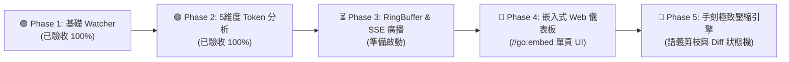

# 🚀 分階段實作路線圖與驗收標準 (Roadmap)

---

## 🚩 一、階段里程碑流程圖與精讀指引

### 📖 圖表深度精讀指南 (Diagram Walkthrough)

1. **【核心視野】**：本圖展示了 `agent-observer` 從最小可行原型（MVP）邁向全功能壓縮引擎的五階段迭代路線。
2. **【各階段進度與依賴關係】**：
   * **Phase 1 (綠燈 - 已完成)**：打通底層日誌 Tailing 管道與靜默預熱機制。
   * **Phase 2 (綠燈 - 已完成)**：建立 BPE Token 計數與 LCP 前綴快取推導核心。
   * **Phase 3 (進行中)**：實作無鎖環形記憶體快取（RingBuffer）與 SSE 即時事件串流廣播。
   * **Phase 4 (規劃中)**：以 `//go:embed` 打包單頁 Vue/Tailwind 視覺化面板。
   * **Phase 5 (規劃中)**：整合語義剪枝與差分壓縮，達成 80% 壓縮率。

---

## 📊 二、各階段驗收標準看板 (Definition of Done)

| 階段編號 | 核心里程碑 | 當前狀態 | 關鍵交付產出 | 驗收標準 (Definition of Done) |
| :--- | :--- | :---: | :--- | :--- |
| **Phase 1** | 最小可行 Watcher 與事件通道 | 🟢 **已驗收** | `adapters/antigravity/watcher.go`, `Makefile` | 成功非阻塞追蹤 `transcript_full.jsonl`，實現啟動靜默預熱（Silent Warmup）。 |
| **Phase 2** | Context 5 維度解構與 LCP 快取分析 | 🟢 **已驗收** | `core/tokenizer.go`, `core/analyzer.go`, ASCII 表格 | BPE 編碼精確計算，LCP 演算法即時推導 Cache Hit Rate，ASCII 進度條渲染。 |
| **Phase 3** | 狀態儲存庫 (RingBuffer) 與 SSE 串流管道 | ⏳ **進行中** | `/api/records`, `/api/events`, Go SSE Hub | 高並發環形快取，支援多個 Web 客戶端同時監聽 SSE 事件流。 |
| **Phase 4** | 嵌入式 Web 儀表板 (`//go:embed`) | 📅 規劃中 | 單頁響應式 UI (Vue/Tailwind) | 單一 Binary 啟動時自動於 `http://localhost:8080` 開啟堆疊視覺化儀表板。 |
| **Phase 5** | 手刻 Context 極致壓縮引擎 | 📅 規劃中 | 語義剪枝、分層摘要、壓縮評測基準 | 實現 Tool Results 與 Diff 自動剪枝，達成 80% 壓縮率且 0 語義遺失。 |
