# 🏆 2026 iThome 鐵人賽總體企劃書 (Master Plan v2.0 旗艦版)

> [!IMPORTANT]
> **🌟 主題名稱**：《深入 LLM 記憶中樞：從 Transformer KV Cache 底層、萬能 Agent 觀測平台 (Antigravity/Claude/OpenCode) 到手刻極致壓縮引擎》  
> **🎭 精神核心**：**「至少直到最後一刻，我與 AI 共舞著。」** —— 一位身處典範轉移風暴中心的軟體工程師，親手打造透明聽診器與壓縮武器庫的破曉追尋與時代殘響。  
> **🎯 核心定位**：全網第一份貫通 **底層算力物理（Self-Attention/KV Cache）**、**跨生態萬能觀測平台（Universal Agent-Observer）** 與 **極致演算法壓縮（手刻壓縮引擎與長程壓測）** 的端到端工業級技術專題。

---

## 🔍 一、企劃背景、心路歷程與核心價值主張

### 1. 時代浪潮下的工程師自白
當生成式 AI 與自主 Coding Agent 席捲全球，程式設計的典範正在經歷不可逆的劇烈轉移。
面對「軟體工程師是否終將被取代」的時代焦慮，本專題選擇正面凝視這場風暴：
* **心路歷程**：從最初的驚艷熱愛、面對能力膨脹時的抗拒與失落、冷靜後的理解與接受，到最後將 AI 視為最親密的協同夥伴，持續精進與超越。
* **工程信念**：即使未來由 AI 主導，這座龐大智力大廈的每一吋地基，都凝聚了軟體工程師的智慧與汗水。**在最後一刻到來之前，我們要看清它的每一個齒輪、掌握它的每一行記憶。**

### 2. 解決 Agentic Coding 的三大核心痛點
1. **「記憶黑盒」**：開發者眼睜睜看著 Token 帳單與延遲飆升，卻無法得知是 System Prompt、MCP Tool 輸出還是過往軌跡在吞噬顯存。
2. **「生態割裂」**：Google Antigravity、Anthropic Claude Code、OpenCode / 本地模型（Ollama）各自為政，缺乏跨平台的統一觀測標準。
3. **「長程退化與記憶爆炸」**：在超過 50 輪的複雜專案中，Context 幾何級膨脹引發 OOM 與模型「迷失在中間 (Lost in the Middle)」，傳統暴力截斷方案嚴重損害代碼生成品質。

---

## 🏛️ 二、四大模組進程甘特圖與精讀指引

```mermaid
gantt
    title 30 天四大模組循序進程圖 (Master Roadmap v2.0)
    dateFormat  X
    axisFormat  Day %d
    
    section 模組一：記憶物理
    Self-Attention 幾何、KV Cache 與 Prompt Caching 物理極限 :active, 1, 7
    
    section 模組二：實戰觀測
    手刻 Agent-Observer 雙軌遙測與全螢幕互動 TUI 引擎 :active, 8, 15
    
    section 模組三：萬能適配
    擴充萬能 Agent 生態系 (Claude Code & OpenCode 適配) :active, 16, 21
    
    section 模組四：極致壓縮
    手刻 Context 壓縮引擎、長程實戰壓測與工程師終章 :active, 22, 30
```

### 📖 圖表深度精讀指南 (Diagram Walkthrough)

1. **【核心視野】**：本圖展示了 30 天專題從「AI 記憶物理築基」$\to$「單一 Agent 觀測中樞」$\to$「跨生態萬能適配」$\to$「極致壓縮與時代終章」的四階心智演進階梯。
2. **【看圖路徑 (Step-by-Step)】**：
   * **模組一 (第 1~7 天)**：從工程師情感出發，深入淺出拆解 Self-Attention QKV 幾何學、Prefill vs. Decode 算力/顯存壁壘與 Prompt Caching 生命週期。
   * **模組二 (第 8~15 天)**：以 Go 六角架構實作 `agent-observer`，結合 SQLite WAL 官方帳單與 Bubbletea 全螢幕雙軌 TUI。
   * **模組三 (第 16~21 天)**：逆向解剖 Anthropic Claude Code（5分鐘 TTL 斷點）與 OpenCode/Ollama，打造萬能跨平台觀測中樞。
   * **模組四 (第 22~30 天)**：手刻語義剪枝、Diff 狀態壓縮，挑戰 80% 壓縮率與 100 輪長程任務穩定性，並在 Day 30 以「軟體工程師的時代殘響」完結收尾。

---

## 🔗 三、相關企劃與模組導航
* [[03_planning/v2/02_30_Days_Breakdown|30 天每日詳細大綱 (v2.0 旗艦版)]]
* [[03_planning/v2/03_Tech_Stack_Tradeoffs|Go vs. Python 技術選型權衡]]
* [[03_planning/v2/04_Phased_Implementation_Roadmap|Phase 1 ~ 5 實作里程碑 (v2.0)]]
* [[03_planning/v1/01_Master_Plan|v1.0 初版企劃存檔]]
