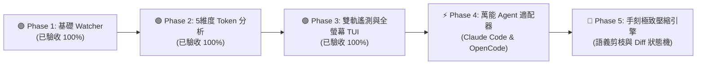

# 🚀 分階段實作路線圖與驗收標準 (Roadmap v2.0)

---

## 🚩 一、階段里程碑流程圖與精讀指引

### 📖 圖表深度精讀指南 (Diagram Walkthrough)

1. **【核心視野】**：本圖展示了 `agent-observer` 從單一 CLI 觀測原型（MVP）邁向「跨生態萬能觀測平台」與「極致壓縮引擎」的五階段迭代路線。
2. **【各階段進度與依賴關係】**：
   * **Phase 1 (綠燈 - 已完成)**：打通底層日誌 Tailing 管道與靜默預熱機制。
   * **Phase 2 (綠燈 - 已完成)**：建立 BPE Token 計數與 LCP 前綴快取推導核心。
   * **Phase 3 (綠燈 - 已完成)**：打通 SQLite `gen_metadata` Protobuf 官方遙測直解，開發 Bubbletea & Lipgloss 全螢幕雙軌 TUI 介面、會話快切與防抖動鎖。
   * **Phase 4 (即將展開)**：開發 Anthropic Claude Code 適配器（5分鐘 TTL 斷點）與 OpenCode/OpenAI/Ollama 通用適配器。
   * **Phase 5 (規劃中)**：整合語義剪枝、Diff 狀態機與分層摘要，達成 80% 壓縮率且 0 語義遺失。

---

## 📊 二、各階段驗收標準看板 (Definition of Done)

| 階段編號 | 核心里程碑 | 當前狀態 | 關鍵交付產出 | 驗收標準 (Definition of Done) |
| :--- | :--- | :---: | :--- | :--- |
| **Phase 1** | 最小可行 Watcher 與事件通道 | 🟢 **已驗收** | `adapters/antigravity/watcher.go`, `Makefile` | 成功非阻塞追蹤 `transcript_full.jsonl`，實現啟動靜默預熱（Silent Warmup）。 |
| **Phase 2** | Context 5 維度解構與 LCP 快取分析 | 🟢 **已驗收** | `core/tokenizer.go`, `core/analyzer.go`, ASCII 表格 | BPE 編碼精確計算，LCP 演算法即時推導 Cache Hit Rate，ASCII 進度條渲染。 |
| **Phase 3** | 雙軌官方遙測引擎與全螢幕互動 TUI | 🟢 **已驗收** | `adapters/antigravity/sqlite_telemetry.go`, `ui/` | 直解 SQLite Protobuf 官方帳單（Track 1），倒推滑動窗口 5 維度解剖（Track 2），k9s 風格 TUI 支援時光機回放、會話快切（`Ctrl+p`）與防抖動鎖定。 |
| **Phase 4** | 萬能多 Agent 適配器矩陣 | ⚡ **即將展開** | `adapters/claudecode/`, `adapters/opencode/` | 支援 Claude Code 5 分鐘 TTL 快取端點解析，相容 OpenCode / Ollama 本地模型事件流，單一 TUI 漫遊三大生態。 |
| **Phase 5** | 手刻 Context 極致壓縮引擎 | 📅 **規劃中** | `compressor/pruner.go`, `diff.go`, `engine.go` | 實現 Tool Results 外科手術剪枝與 Diff 狀態壓縮，達成 80% 壓縮率且 0 語義遺失，通過 100 輪長程任務壓測。 |
