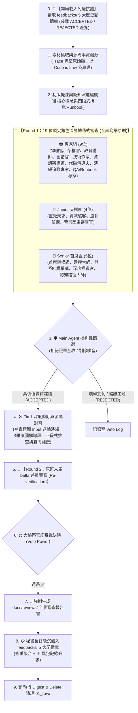

# 🤖 多代理深層對抗審查與自我進化系統模式

> [!NOTE]
> **⚡ 30 秒核心精華 (Key Takeaway)**
> 傳統生成式 AI 撰寫技術文檔常面臨「條列式空洞、缺乏深度推導、無法驗證真實性、充滿虛浮比喻」的痛點。本模式提出了一套工業級的 **「19 位頂尖專家/讀者矩陣 + 雙輪深層對抗審查 (Two-Round Adversarial Review) + 具體演繹專家 + QA/Runbook 專家 + 雙層智能過濾與否決 (Triage & Veto) + 反饋記憶自我進化閉環 (Self-Evolving Feedback Loop)」**，將文檔產出推向世界級技術專著（如 CSAPP, DDIA）般的嚴密水準。

---

## 🔍 一、技術背景：為什麼單一 Agent 無法產出頂級知識？

單一大型語言模型在單次 Prompt 下生成內容時，存在固有的認知缺陷：
1. **「自圓其說的盲點」**：單一 Agent 無法有效審查自己的推論斷層，容易自以為交代清楚而省略關鍵背景。
2. **「浮躁的條列化 (Superficial Bullet Points)」**：傾向於給出空泛的概念清單，缺乏硬體微架構瓶頸（如顯存帶寬）、數學公式推導與可跑代碼。
3. **「虛浮的擬人擬物童話比喻」**：用「想像郵差送信」等模糊概念取代精確的資料結構欄位演變與狀態機突變。
4. **「缺乏歷史免疫記憶」**：每次重開對話，模型容易重複犯下先前已被糾正的錯誤（如範圍蔓延、代碼名詞與源碼 AST 脫節）。

---

## 🏛️ 二、雙輪對抗審查與自我進化架構圖與精讀指引

### 📖 圖表深度精讀指南 (Diagram Walkthrough)

1. **【核心視野】**：本圖揭示了一個具備自我演進能力的閉環系統。從開局載入歷史抗體開始，經由 18 位多角色雙輪對抗與雙層過濾，最終將新教訓沉澱回記憶庫，形成永不退化的正向增益循環。
2. **【看圖路徑 (Step-by-Step)】**：
   * **步驟 0 ~ 2 (前置與初稿)**：在動筆前強制讀取 `feedbacks/` 避開已知陷阱，並 Trace 源碼進行初版提煉。
   * **步驟 3 ~ 4 (首輪對抗與過濾)**：18 位審查官地毯式提出反饋，Main Agent 扮演第一道防線，剔除偏離主題的雜訊，僅採納高價值建議實裝進 Fix 1（包含落實極簡 Input 逐輪演繹）。
   * **步驟 5 ~ 6 (次輪覆審與終審)**：原班人馬逐條覆核 Issue 是否完美解決，大檢察官行使終審一票否決權。
   * **步驟 7 ~ 9 (存檔、進化與清理)**：強制輸出報告書，秘書長更新反饋庫，並清空已消化的素材池。
3. **【色彩與物理意義】**：
   * 🟢 **綠色 (ACCEPTED)**：被驗證為提升文檔品質的核心規範。
   * 🔴 **紅色 (REJECTED)**：已被證實會造成範圍蔓延或過度設計的防禦邊界。

---

## 👥 三、18 位審查官與讀者矩陣之職責分工

| 陣營分類 | 代表角色代號 | 核心審查維度 (Audit Scope) | 關鍵防禦目標 |
| :--- | :--- | :--- | :--- |
| **🎓 領域專家組** | ⚖️ 大檢察官 🎯 具體演繹追蹤專家 🔍 實證代碼驗證官 🏛️ 資訊架構師 ✍️ 首席技術作家 🔬 推論物理官 🏛️ 系統架構官 🎓 技術教育家 🔗 圖譜審查官 | 全局仲裁、**極簡 Input 逐輪狀態演繹**、源碼 AST 對齊、目錄正交性 (MECE)、每圖 4 維度導讀、物理數學推導、啟發式教學坡度。 | 杜絕憑空捏造、杜絕無導讀圖表、杜絕正文人名污染、杜絕虛浮童話比喻、杜絕代碼脫節。 |
| **👶 Junior 天賦組** | 🔍 背景因果審查官 直覺天才·小明 實戰駭客·阿豪 形式邏輯·小華 | 背景交代完備性、直覺物理模型、可直接執行的代碼與終端輸出、因果推導連續性。 | 杜絕「作者預設讀者懂」、杜絕無範例代碼、杜絕因果邏輯跳躍。 |
| **🧓 Senior 首席組** | 🧠 認知路徑大師 🔍 深度推導官 基礎架構·老陳 系統建模·凱文 體系結構·大衛 | 認知編號心智演進鏈、工程縱深與邊界、決策 Tradeoffs 對比矩陣、架構時序圖、顯存帶寬瓶頸與 Big-O。 | 杜絕隨意編號、杜絕單方面吹捧方案、杜絕忽略硬體微架構瓶頸。 |

---

## 🎯 四、硬核具體演繹規範 (Concrete Walkthrough Principle)

由「🎯 具體演繹與端到端追蹤專家」主導，技術文章必須遵循三大演繹準則：

1. **嚴禁擬人擬物童話比喻**：
   * 拒絕「小明送信給郵差」等童話比喻，技術文章應以真實最小資料集（Minimal Concrete Dataset）為載體。
2. **極簡真實 Input $\to$ 逐輪演繹 (Step 1..n) $\to$ Final Output**：
   * 帶入真實極簡輸入（如 Prompt = `"Hi"` $\to$ Turn 1 呼叫 `get_weather` $\to$ Turn 2 回傳 `"25°C"`）；
   * 清晰追蹤每輪 $T_0, T_1, \dots, T_n$ 的狀態機突變、欄位變化、快取命中率與顯存數值，並給出最終產出畫面。

---

## 🧬 五、秘書長與自我進化記憶庫 (`feedbacks/`) 機制

* **智能查重聚合 (Smart Deduplication)**：收到新建議時，先比對既有條目，避免反覆記錄同類碎片。
* **累犯懲罰機制 (Recurrence Penalty)**：若某項已知錯誤再次發生，在原有條目中標記 `⚠️ 累犯記錄 (Occurrences: +N)` 並加粗警示，在下次提煉的 Step 0 提升為最高優先級檢查項目。

---

## 🔗 六、相關概念與延伸閱讀
* [[02_Obsidian_Vault_Topology]]：現代化 Obsidian 知識庫拓撲架構、目錄職責與專案協同憲法。
* [[02_architecture/04_Service_Plan_Agent_Observer|Agent-Observer 系統規格]]：觀測服務之 Clean Architecture 實作。
* [[03_planning/01_Master_Plan|總體企劃書]]：鐵人賽 30 天四大模組認知藍圖。
