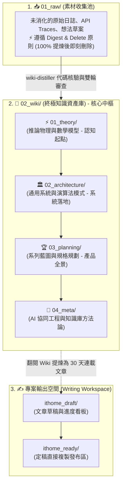

# 💎 現代化 Obsidian 知識庫拓撲架構、目錄職責與專案協同憲法

> [!NOTE]
> **⚡ 30 秒核心精華 (Key Takeaway)**
> 現代軟體工程與 AI 協同開發中，知識管理庫（Obsidian Vault）常因「混雜文章草稿」、「隨機編號混亂」與「缺乏清晰的目錄職責界線」而退化為難以維護的技術垃圾場。
> 本架構提出了三大治理體系：**「全域 ASCII 檔案結構樹與 High-Level 目錄職責矩陣」**、**「Wiki 終點論與三權分立拓撲」** 與 **「.obsidian 嚴格白名單版本控制 + AGENTS.md 語言憲法」**，保障知識資產的長期複利性與團隊協同的一致性。

---

## 🌲 一、全域檔案拓撲結構樹 (Global Vault Tree)

知識庫採用模組化、正交化（MECE）且語意自洽的目錄樹設計：

```text
docs/
├── 01_raw/                   # 📥 [素材收集池] 臨時原始資料池 (遵循 Digest & Delete 原則，提煉後即刪除)
│   └── README.md
├── 02_wiki/                  # 🧠 [核心資產庫] 永久長效知識中樞 (面向人類好讀好學、極致精煉、嚴密編號)
│   ├── 01_theory/            #    ⚡ [推論物理] Attention 數學、KV Cache 顯存大小、Prompt Caching 物理時序
│   │   ├── 01_Transformer_Prefill_vs_Decode.md
│   │   ├── 02_KV_Cache_Mechanics.md
│   │   ├── 03_Prompt_Caching_Lifecycle.md
│   │   └── index.md
│   ├── 02_architecture/      #    🏛️ [系統落地] Context 5 維度、LCP 快取演算法、雙層 SQLite 狀態機、API 載荷
│   │   ├── 01_Context_5_Dimensions.md
│   │   ├── 02_Token_Calculation_and_LCP.md
│   │   ├── 03_Agent_Storage_and_State_Machine.md
│   │   ├── 04_Service_Plan_Agent_Observer.md
│   │   ├── 05_Model_Payload_and_API_Traces.md
│   │   └── index.md
│   ├── 03_planning/          #    🏆 [系列藍圖] 30 天大綱拆解、Go vs Python 選型權衡、分期實作路線圖
│   │   ├── 01_Master_Plan.md
│   │   ├── 02_30_Days_Breakdown.md
│   │   ├── 03_Tech_Stack_Tradeoffs.md
│   │   ├── 04_Phased_Implementation_Roadmap.md
│   │   └── index.md
│   ├── 04_meta/              #    🤖 [協同工程] 17 位審查官雙輪對抗審查、Obsidian 拓撲與協同憲法
│   │   ├── 01_Multi_Agent_Adversarial_Review_Pattern.md
│   │   ├── 02_Obsidian_Vault_Topology.md
│   │   └── index.md
│   └── index.md              #    🧭 Wiki 根目錄全景導覽 (Wiki Root MOC)
├── ithome_draft/             # ✍️ [專案工作區] 鐵人賽 30 天文章草稿撰寫區與寫作進度看板
│   └── README.md
├── ithome_ready/             # 🚀 [發布定稿區] 完稿並排版完畢、可直接複製發布至 iThome 的定稿庫
│   └── README.md
├── reviews/                  # 📜 [審查報告室] 雙輪地毯式對抗審查報告書、思維鏈挑惕紀錄與終審簽核
│   ├── 2026-08-26_meta_module_audit_report.md
│   └── 2026-08-26_two_round_audit_report.md
├── schema.md                 # 📐 [知識庫憲法] Obsidian 拓撲原則、三權分立與卡片規範
├── log.md                    # ⏱️ [時序變更日誌] 全庫 Append-Only 操作與提煉紀錄
└── index.md                  # 🗺️ [全域總導覽] 最高導覽中樞 (Global MOC)
```

---

## 🏛️ 二、High-Level 頂層目錄職責與生命週期矩陣 (Directory Mandates)

每個 High-Level 目錄均被賦予不可混淆的職責與生命週期治理規則：

| 目錄路徑 | 核心職責與功能定位 | 生命週期與治理規則 (Lifecycle Policy) | 存儲內容範例 |
| :--- | :--- | :--- | :--- |
| **`01_raw/`** | **臨時素材收集池 (Intake Pool)**<br/>存放未加工的 API Traces、逆向日誌、臨時截圖與靈感碎片。 | **Digest & Delete**：一旦經 `wiki-distiller` 100% 提煉進 `02_wiki/`，原始檔案立即安全清理刪除，保持素材池極致乾淨。 | 原始 JSONL 日誌、API payload 截圖、發想草案。 |
| **`02_wiki/`** | **永久核心知識資產庫 (Permanent Asset Hub)**<br/>世界級、排版精美、結構自洽、具備 4 維度圖解導讀的永久資產。 | **永不刪除 / 持續迭代**：嚴禁存放未完成的草稿。依大腦認知演進（`01_` $\to$ `02_` $\to$ `03_` $\to$ `04_`）嚴密編號。 | 14 篇經過雙輪審查的長效技術卡片。 |
| **`ithome_draft/`** | **文章草稿工作區 (Writing Workspace)**<br/>以 Wiki 為武器庫，專門用於撰寫 iThome 鐵人賽 30 天連載草稿。 | **短期專案週期**：與底層 Wiki 完全解耦，專注於文章受眾節奏、開場 Hook 與章節編排。 | Day 01 ~ Day 30 連載文章草稿。 |
| **`ithome_ready/`** | **定稿發布庫 (Production Release)**<br/>完成最終潤稿、排版校對，隨時可直接複製 Po 到發文後台。 | **發布就緒**：代表可對外公開發表的正式文章。 | 排版完畢的最終發布 Markdown。 |
| **`reviews/`** | **審查辯論與終審報告室 (Audit Room)**<br/>存放 17 位頂尖審查員的深層思維鏈挑惕、Main Agent 駁回/採納辯論與大檢察官簽核。 | **歷史審計存檔**：永久留存審查軌跡，正文 0 人名，所有審查員人名與辯論完整留存於此。 | 各模組雙輪審查全景報告書。 |

---

## 🏛️ 三、三權分立拓撲架構圖與精讀指引

傳統專案常將筆記庫與文章輸出混在一起，導致文檔變成粗糙的中間站。本架構確立了三權分立公理：



### 📖 圖表深度精讀指南 (Diagram Walkthrough)

1. **【核心視野】**：本圖展示了「素材池 $\to$ 永久知識中樞 $\to$ 專案發布端」的三權分立架構。徹底打破了知識庫與具體發文專案的耦合。
2. **【看圖路徑 (Step-by-Step)】**：
   * **左側素材池 (`01_raw/`)**：單純作為臨時 intake，經過提煉後立即清空，不留存技術債。
   * **中央知識庫 (`02_wiki/`)**：核心長效資產。內部由 `01_theory` $\to$ `02_architecture` $\to$ `03_planning` $\to$ `04_meta` 形成依賴閉環。
   * **右側發布專案 (`ithome_draft/` & `ithome_ready/`)**：寫作者以 Wiki 作為強大知識後盾，自由組織 30 天文章連載。
3. **【色彩與邊界】**：中央藍色區塊為永久不可動搖的最高資產，左右兩側均為可替換、可清理的工作區。

---

## 💎 四、Obsidian Git 版本控制白名單設計 (Strict Whitelist)

為徹底根除多設備同步時的 Git 衝突，[`.gitignore`](file:///Users/daniel_y_yang/Documents/self/ithome2026/.gitignore) 採用了 **「全域忽略 + 明確白名單」** 機制：

```gitignore
# 1. 默認全域忽略所有 .obsidian 內部暫存檔與狀態
docs/.obsidian/*
.obsidian/*

# 2. 嚴格白名單：僅放行 4 個不可或缺的核心設定檔
!docs/.obsidian/app.json                  # 編輯器全寬模式 (readableLineLength: false)
!docs/.obsidian/appearance.json           # 主題名稱與顏色偏好
!docs/.obsidian/core-plugins.json         # 官方外掛清單 (Graph, Backlinks)
!docs/.obsidian/community-plugins.json    # 社群外掛清單
```

| 檔案類型 | 具體檔案範例 | Git 策略 | 決策原因 |
| :--- | :--- | :---: | :--- |
| **核心靜態偏好** | `app.json`, `appearance.json` | 🟢 **白名單追蹤** | 跨設備同步全寬模式與外觀，體積極小且靜態。 |
| **動態操作狀態** | `workspace.json`, `graph.json` | 🔴 **全域忽略** | 記錄視窗分頁與圖譜拖拽座標，頻繁改動易引發衝突。 |
| **第三方大檔案** | `themes/`, `plugins/` | 🔴 **全域忽略** | 本質為外部依賴，可由設定檔自動一鍵重新下載。 |

---

## 📜 五、專案最高協同憲法 (`AGENTS.md`) 核心條款

在專案根目錄設立了不可篡改的最高協同憲法 [`AGENTS.md`](file:///Users/daniel_y_yang/Documents/self/ithome2026/AGENTS.md)：
1. **🌐 語言憲法 (Language Policy)**：
   * `agent-observer/` 與所有工程代碼、註解、Terminal Log **100% 英文 (Strictly English Only)**；
   * `docs/` 面向人類研讀與參賽，以繁體中文撰寫。
2. **💎 白名單憲法 (Whitelist Policy)**：`.obsidian/` 僅放行 4 個白名單檔案。
3. **🧠 知識庫憲法 (KM Policy)**：
   * Wiki 是終點不是中間站；
   * 貫徹 Digest & Delete；
   * 強制 Step 0 檢閱 `feedbacks/`；
   * 正文 100% 杜絕審查員人名；
   * 每張圖強制配備 4 維度深度精讀導讀。

---

## 🔗 六、相關概念與延伸閱讀
* [[01_Multi_Agent_Adversarial_Review_Pattern]]：多代理深層對抗審查與自我進化模式。
* [[02_architecture/03_Agent_Storage_and_State_Machine|Agent 儲存模式]]：工業級 Agent 雙層 SQLite 與 100KB 切片日誌。
* [[03_planning/01_Master_Plan|總體企劃書]]：鐵人賽 30 天四大模組認知藍圖。
