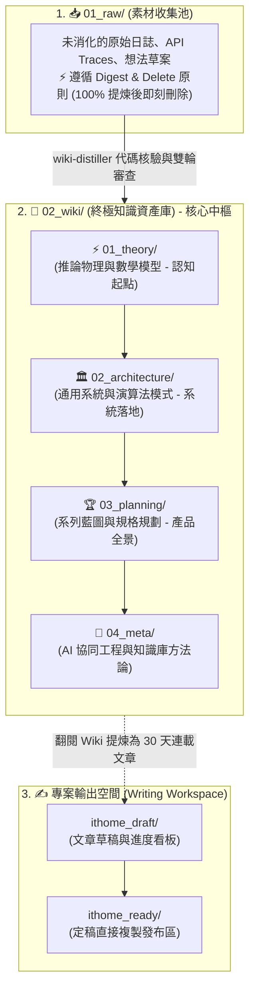

# 💎 現代化 Obsidian 知識庫拓撲架構、版本控制白名單與專案協同憲法

> [!NOTE]
> **⚡ 30 秒核心精華 (Key Takeaway)**
> 現代軟體工程與 AI 協同開發中，知識管理庫（Obsidian Vault）常因「混雜文章草稿」、「隨機編號混亂」與「暫存檔案引發頻繁 Git 衝突」而退化為技術垃圾場。
> 本架構提出了三大治理體系：**「Wiki 終點論與三權分立拓撲」**、**「大腦認知演進編號鐵律」** 與 **「.obsidian 嚴格白名單版本控制 + AGENTS.md 語言憲法」**，保障知識資產的長期複利性與團隊協同的一致性。

---

## 🔍 一、技術背景：傳統知識庫的常見三大退化病症

1. **「中間站陷阱」**：把知識庫當作產出短期文章的草稿堆放處，導致文檔充斥著半成品與過渡片段，失去了作為長效資產的查閱價值。
2. **「時間軸編號混亂」**：按照檔案建立時間隨意給檔名加前綴，讀者無法按照最優認知階梯逐層學習。
3. **「Git 衝突風暴」**：Obsidian 在本地會自動改寫 `workspace.json`（記錄開啟分頁）、`graph.json`（圖譜拖拽座標）與下載第三方主題大包，在多設備同步時引發毀滅性的 Git Merge 衝突。

---

## 🏛️ 二、三權分立拓撲架構圖與精讀指引



### 📖 圖表深度精讀指南 (Diagram Walkthrough)

1. **【核心視野】**：本圖展示了「素材池 $\to$ 永久知識中樞 $\to$ 專案發布端」的三權分立架構。徹底打破了知識庫與具體發文專案的耦合。
2. **【看圖路徑 (Step-by-Step)】**：
   * **左側素材池 (`01_raw/`)**：單純作為臨時 intake，經過提煉後立即清空，不留存技術債。
   * **中央知識庫 (`02_wiki/`)**：核心長效資產。內部由 `01_theory` $\to$ `02_architecture` $\to$ `03_planning` $\to$ `04_meta` 形成閉環。
   * **右側發布專案 (`ithome_draft/` & `ithome_ready/`)**：寫作者以 Wiki 作為強大知識後盾，自由組織 30 天文章連載。
3. **【色彩與邊界】**：中央藍色區塊為永久不可動搖的最高資產，左右兩側均為可替換、可清理的工作區。

---

## 💎 三、Obsidian Git 版本控制白名單設計 (Strict Whitelist)

為徹底根除 Git 同步衝突，[`.gitignore`](file:///Users/daniel_y_yang/Documents/self/ithome2026/.gitignore) 採用了 **「全域忽略 + 明確白名單」** 機制：

```gitignore
# 1. 默認全域忽略所有 .obsidian 內部暫存檔與狀態
docs/.obsidian/*
.obsidian/*

# 2. 嚴格白名單：僅放行 4 個不可或缺的核心設定檔
!docs/.obsidian/app.json                  # 編輯器全寬模式 (readableLineLength: false)
!docs/.obsidian/appearance.json           # 主題名稱與顏色偏好
!docs/.obsidian/core-plugins.json         # 官方外掛清單 (Graph, Backlinks)
!docs/.obsidian/community-plugins.json    # 社群外掛清單
```

| 檔案類型 | 具體檔案範例 | Git 策略 | 決策原因 |
| :--- | :--- | :---: | :--- |
| **核心靜態偏好** | `app.json`, `appearance.json` | 🟢 **白名單追蹤** | 跨設備同步全寬模式與外觀，體積極小且靜態。 |
| **動態操作狀態** | `workspace.json`, `graph.json` | 🔴 **全域忽略** | 記錄視窗分頁與圖譜拖拽座標，頻繁改動易引發衝突。 |
| **第三方大檔案** | `themes/`, `plugins/` | 🔴 **全域忽略** | 本質為外部依賴，可由設定檔自動一鍵重新下載。 |

---

## 📜 四、專案最高協同憲法 (`AGENTS.md`) 條款

在專案根目錄設立了最高協同憲法 [`AGENTS.md`](file:///Users/daniel_y_yang/Documents/self/ithome2026/AGENTS.md)：
1. **🌐 語言憲法**：
   * `agent-observer/` 與所有工程代碼、註解、Terminal Log **100% 英文 (Strictly English Only)**；
   * `docs/` 面向人類研讀與參賽，以繁體中文撰寫。
2. **💎 白名單憲法**：`.obsidian/` 僅放行 4 個白名單檔案。
3. **🧠 知識庫憲法**：
   * Wiki 是終點不是中間站；
   * 貫徹 Digest & Delete；
   * 強制 Step 0 檢閱 `feedbacks/`；
   * 正文 100% 杜絕審查員人名；
   * 每張圖強制配備 4 維度深度精讀導讀。

---

## 🔗 五、相關概念與延伸閱讀
* [[01_Multi_Agent_Adversarial_Review_Pattern]]：多代理深層對抗審查與自我進化模式。
* [[02_architecture/03_Agent_Storage_and_State_Machine|Agent 儲存模式]]：工業級 Agent 雙層 SQLite 與 100KB 切片日誌。
* [[03_planning/01_Master_Plan|總體企劃書]]：鐵人賽 30 天四大模組認知藍圖。
