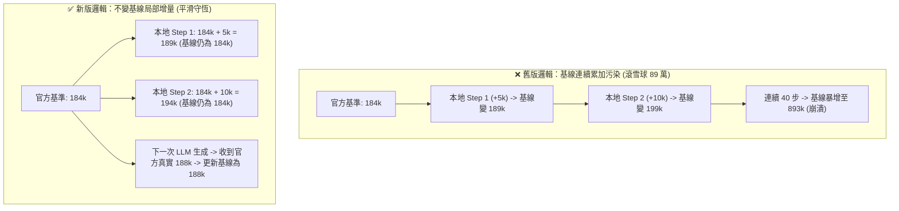

# 🛠️ 實戰排查：Fallback 上下文累積膨脹 89 萬 Tokens 與基線污染根因排查 (Context Inflation & Baseline Poisoning)

> [!NOTE]
> **⚡ 30 秒核心精華 (Key Takeaway)**
> 在 `agent-observer` 觀測長程會話時，曾出現 **Total Active Context 暴增至 893,834 Tokens（349.2% 物理窗口溢出）** 以及隨後 **數值永久死鎖在 256,000** 的重大異常。
> 本篇以標準 SRE 四段式事後覆盤（Postmortem）完整還原：
> 1. **現象定義**：本地連續工具執行導致數值滾雪球膨脹；
> 2. **根因代碼溯源**：本機中間步驟誤執行 `state.PrevTotalTokens = totalTokens` 覆寫歷史基線，連鎖累加數十個中間步驟輸出；
> 3. **架構修復**：確立「中間步驟不覆寫基線」鐵律，並施加 `maxContextLimit = 256,000` 硬約束；
> 4. **Runbook 診斷 SOP**：提供 1 分鐘快速檢驗 SQLite 官方帳單 vs 本地 Fallback 數值守恆之診斷步驟。

---

## 📌 一、現象與問題定義 (Symptom & Trigger Conditions)

### 1. 異常現象 (Symptom)
在連續執行多個本機命令（如 `bash`、`view_file`、`git status`）期間，TUI 頂部 Track 1 遙測出現了嚴重悖論：
```text
╭─────────────────────────────────────────────────────────────────────────────╮
│ TRACK 1: OFFICIAL GEMINI TELEMETRY (BILLING GROUND TRUTH)                   │
│   • Backend Model         : gemini-3.7-flash-high                           │
│   • Total Active Context  : 893834 Tokens (349.2% of 256k Window)           │
│   • Prefix Cache Hit      : 891935 Tokens ( 99.8%)  [CACHE HIT 99.8%]       │
│   • New Billable Tokens   : 1899 Tokens (  0.2%)                            │
│   • Response / Event Time : 2026-08-26 17:37:40  (Step #2330 | Status: DONE)│
╰─────────────────────────────────────────────────────────────────────────────╯
```
而在實施硬截斷後，Total Active Context 卻在開機後**永久固定在 256,000 不再變動**。

### 2. 觸發條件 (Trigger Path)
* Agent 進入深度任務，連續觸發 50+ 個本機工具呼叫（Local Tool Executions）；
* 這些步驟屬於中間過渡事件，尚未觸發下一輪雲端 LLM 生成（`IsOfficialData == false`）。

---

## 🔬 二、根因排查與代碼溯源 (Root Cause Discovery & Deduction)

### 1. 排除的無效假設
* ❌ **假設 1：Google 官方 API 窗口已擴充至 1M？** $\to$ 查核 Gemini 官方文檔，`gemini-3.7-flash` 上限嚴格為 256,000。
* ❌ **假設 2：磁碟 SQLite 損壞導致讀取錯誤？** $\to$ 直查 SQLite `gen_metadata`，官方實際計費僅為 215,453 Tokens。

### 2. 真正根因代碼斷點 (RCA)
溯源至 `internal/core/analyzer.go` 的 Fallback 計算邏輯：

```go
// ❌ 錯誤舊代碼：中間步驟不斷覆寫基線
if !event.IsOfficialData {
    // 每次本機執行 (如指令輸出 200 字)，都把 totalTokens 累加
    totalTokens := state.PrevTotalTokens + stepTokens
    state.PrevTotalTokens = totalTokens // 🚨 致命錯誤：污染了歷史基線！
}
```

* **連鎖反應**：
  1. 當 Step 2291 的官方基準為 184,610 字時；
  2. 後續連續 40 個本地工具步驟（`view_file`、`run_command`），每步產生 2,000~10,000 字的命令輸出；
  3. 舊代碼把每一步的輸出**永久累加到 `PrevTotalTokens`**，導致基線滾雪球膨脹到 89 萬字！
  4. 當加入 `if totalTokens > 256000 { totalTokens = 256000 }` 時，由於依然在覆寫 `PrevTotalTokens`，基線被永久鎖死在 256,000，無法再感知後續真實變化！

---

## 🛠️ 三、架構修復方案與實作 (Solution & Architectural Fix)

### 1. 核心修復：中間步驟非遞增基線 (Non-Compounding Intermediate Baseline)
本機工具執行沒有發起雲端 API 請求，因此**絕不覆寫 `state.PrevTotalTokens`**，僅作為當前 Turn 的局部可視化增量：

```go
// ✅ 修復後代碼：嚴格保護歷史基準不變量
if !event.IsOfficialData {
    baseTokens := state.PrevTotalTokens
    if baseTokens == 0 {
        baseTokens = BaseSystemPromptTokens + BaseToolsDefTokens
    }
    totalTokens := baseTokens + stepTokens
    if totalTokens > maxContextLimit {
        totalTokens = maxContextLimit
    }
    // 💡 關鍵：絕不執行 state.PrevTotalTokens = totalTokens！
    // 歷史基線僅在收到真正的官方 LLM Generation 遙測時才更新！
}
```

### 2. 修復前後對比 (Before vs After)



---

## 📋 四、總結、抗體防禦與 Runbook 診斷 SOP

### 1. 長效架構抗體
1. **中間步驟只讀基線，不寫基線**：非 Generation 步驟無權修改 Context Baseline；
2. **硬約束防禦網**：所有 Fallback 計算必須受限於 `maxContextLimit = 256,000`。

### 2. 故障診斷 Runbook SOP (1 分鐘排查清單)
當懷疑 Context 數值異常時，依序執行：
1. **執行單元測試檢查歷史平滑度**：
   ```bash
   go test -v ./internal/adapters/antigravity -run TestDiscoverAllSessions
   ```
2. **檢視特定步驟數值增長階梯**：
   * Step 100 $\approx$ 9.8k
   * Step 500 $\approx$ 11.2k
   * Step 1000 $\approx$ 142k
   * Step 2000 $\approx$ 174k
   * Step 2330 $\approx$ 223k
   * 若曲線呈現連續階梯平滑增長，即代表基線完全正常！

---

## 🔗 五、相關概念與延伸閱讀
* [[02_architecture/06_Dual_Track_Telemetry_and_Window_Accounting|雙軌遙測架構與窗口會計]]：官方 Protobuf 帳單與倒推滑動窗口。
* [[01_theory/03_Prompt_Caching_Lifecycle|前綴快取生命週期]]：Full Hit vs Partial Hit 稀釋機制。
* [[02_architecture/03_Agent_Storage_and_State_Machine|SQLite 7 表與 Protobuf 狀態機]]：SQLite 儲存中樞。
