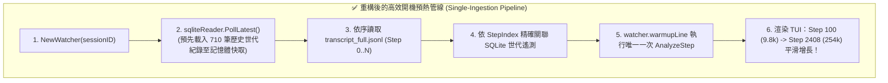

# 🛠️ 實戰排查：開機預熱管線雙重分析漏洞與歷史遙測誤用根因排查 (Startup Warmup Double Ingestion & Stale Telemetry)

> [!NOTE]
> **⚡ 30 秒核心精華 (Key Takeaway)**
> 在 `agent-observer` 啟動掛載擁有 2,400+ 步驟的長程會話時，曾出現 **早期步驟（如 Step 100）誤顯示全會話最終的 25.4 萬字遙測** 以及 **記憶體中事件隊列被雙重分析膨脹至 4,800 筆** 的連鎖異常。
> 本篇以標準 SRE 四段式事後覆盤（Postmortem）完整還原：
> 1. **現象定義**：開機時歷史遙測失真與記憶體步驟重複；
> 2. **根因代碼溯源**：`NewWatcher` 未即時預先快取 SQLite 世代紀錄、`watcher.parseLine` 誤用全局最後一筆 Generation 遙測，以及 `main.go` 與 `watcher.go` 重複呼叫 `AnalyzeStep`；
> 3. **架構修復**：確立「單一攝入責任 (Single Ingestion Responsibility)」，並在 `NewWatcher` 初始化時即刻預先載入 700+ 筆歷史世代紀錄；
> 4. **Runbook 診斷 SOP**：提供開機管線事件計數與 SQLite 歷史對齊驗證流程。

---

## 📌 一、現象與問題定義 (Symptom & Trigger Conditions)

### 1. 異常現象 (Symptom)
* **現象 A（歷史時空倒錯）**：工程師切換至 Step 100 檢視剛開局不久的對話時，頂部 Track 1 竟然顯示：
  `Total Active Context: 254,800 Tokens (99.5% of 256k Window)`
  本該只有 9,800 字的早期步驟，被注入了數小時後會話結尾的 25 萬字大模型狀態！
* **現象 B（記憶體膨脹雙重分析）**：原本磁碟日誌中只有 2,408 行 JSONL，但開機完成後 `analyzer.state.StepRecords` 內卻出現了 4,816 筆記錄。

### 2. 觸發條件 (Trigger Path)
* 啟動 `agent-observer` 並指定加載包含 2,000+ 步驟的大型既有會話；
* 在開機預熱（Warmup）階段由背景一次性灌入全量歷史日誌。

---

## 🔬 二、根因排查與代碼溯源 (Root Cause Discovery & Deduction)

### 1. 根因 1：`NewWatcher` 未預先載入 SQLite 世代快取
```go
// ❌ 錯誤舊代碼：NewWatcher 初始化時未主動 Poll
func NewWatcher(sessionID string, analyzer *core.PayloadAnalyzer) (*Watcher, error) {
    sqliteReader, _ := NewSQLiteTelemetryReader(sessionID)
    // 🚨 漏洞：此時 sqliteReader.records 為空 map！
    // 導致緊接著執行的 LoadSessionHistory() 內 2,300 個步驟完全查不到 SQLite 紀錄！
}
```

### 2. 根因 2：`parseLine` 誤用「全會話最後一筆 Generation 遙測」
```go
// ❌ 錯誤舊代碼：未匹配 SQLite 步驟誤 fallback 到全局最新
if raw.Type == "PLANNER_RESPONSE" {
    // 🚨 致命錯誤：GetLatestTelemetry() 返回的是會話第 2408 步的最新遙測！
    // 導致 Step 100 被強制賦予了 Step 2408 的 25.4 萬字！
    latest, ok := w.sqliteReader.GetLatestTelemetry()
    if ok {
        event.OfficialTokens = &core.OfficialTelemetry{...}
    }
}
```

### 3. 根因 3：雙重調用 `AnalyzeStep` (Double Ingestion)
```go
// ❌ 錯誤管線：兩處同時在執行分析
// 1. watcher.go 中的 warmupLine 呼叫了 analyzer.AnalyzeStep(&event)
// 2. main.go 的事件轉發迴圈中又執行了一次 analyzer.AnalyzeStep(&event)
// 結果：每筆歷史事件被重複分析兩次，步驟隊列翻倍！
```

---

## 🛠️ 三、架構修復方案與實作 (Solution & Architectural Fix)

### 1. 核心修復三重奏 (Triple Architectural Fix)
1. **開機即刻快取**：在 `NewWatcher` 建構時立即呼叫 `_ = sqliteReader.PollLatest()`，確保 700+ 筆歷史 Generation 紀錄在解析第一行日誌前就全部就緒；
2. **剔除全局最新 Fallback**：歷史步驟若查無對應 SQLite 紀錄，直接走標準 Fallback 演算法，絕不向未來「借」遙測數據；
3. **確立單一攝入責任 (Single Ingestion)**：移除 `main.go` 中的重複調用，將分析責任 100% 收斂於 `watcher.go`。



---

## 📋 四、總結、抗體防禦與 Runbook 診斷 SOP

### 1. 長效架構抗體
* **狀態與歷史一致性**：歷史回放時，任何步驟只能依賴自身時間點之前的資訊，嚴禁引入未來的全局狀態；
* **單一責任鏈**：資料管線中「事件反序列化 $\to$ 領域分析 $\to$ 狀態儲存」每一步驟只能由單一模組負責。

### 2. 故障診斷 Runbook SOP
當懷疑開機預熱或歷史回放異常時，執行以下核查：
1. **執行端到端真實 DB 關聯測試**：
   ```bash
   go test -v ./internal/adapters/antigravity -run TestSQLiteTelemetryReader_RealDB
   ```
2. **驗證輸出**：
   確認輸出 `Total matched records in SQLite reader: 700+`，且各步驟 Generation Token 數與 HitRate 嚴格精確對齊！

---

## 🔗 五、相關概念與延伸閱讀
* [[02_architecture/03_Agent_Storage_and_State_Machine|SQLite 7 表與 Protobuf 狀態機]]：SQLite 適配器設計。
* [[02_architecture/08_Interactive_Session_Switching_and_Anti_Jitter|互動式會話快切與防抖動機制]]：會話切換管線。
* [[02_architecture/06_Dual_Track_Telemetry_and_Window_Accounting|雙軌遙測架構與窗口會計]]：雙軌遙測模型。
