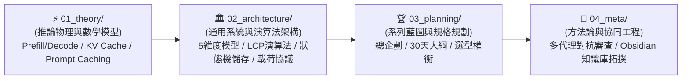

# 🧠 02_wiki: LLM 記憶中樞永久知識庫總導覽 (Wiki Root MOC)

> [!NOTE]
> 歡迎來到 **LLM 記憶中樞 (LLM Memory Hub) 永久知識資產庫**。
> 本庫所有模組與卡片均遵循 **「大腦認知演進順序 (Cognitive Learning Pathway)」** 嚴密編號，各層目錄配備獨立 Index。

---

## 🌲 一、Wiki 模組架構結構樹 (Wiki Module Tree)

```text
docs/02_wiki/
├── 01_theory/            # ⚡ [推論物理] Attention 數學、KV Cache 顯存大小、Prompt Caching 物理時序
│   ├── 01_Transformer_Prefill_vs_Decode.md
│   ├── 02_KV_Cache_Mechanics.md
│   ├── 03_Prompt_Caching_Lifecycle.md
│   └── index.md
├── 02_architecture/      # 🏛️ [系統落地] Context 5 維度、LCP 快取演算法、雙層 SQLite 狀態機、API 載荷
│   ├── 01_Context_5_Dimensions.md
│   ├── 02_Token_Calculation_and_LCP.md
│   ├── 03_Agent_Storage_and_State_Machine.md
│   ├── 04_Service_Plan_Agent_Observer.md
│   ├── 05_Model_Payload_and_API_Traces.md
│   └── index.md
├── 03_planning/          # 🏆 [系列藍圖] 30 天大綱拆解、Go vs Python 選型權衡、分期實作路線圖
│   ├── 01_Master_Plan.md
│   ├── 02_30_Days_Breakdown.md
│   ├── 03_Tech_Stack_Tradeoffs.md
│   ├── 04_Phased_Implementation_Roadmap.md
│   └── index.md
├── 04_meta/              # 🤖 [協同工程] 17 位審查官雙輪對抗審查、Obsidian 拓撲與協同憲法
│   ├── 01_Multi_Agent_Adversarial_Review_Pattern.md
│   ├── 02_Obsidian_Vault_Topology.md
│   └── index.md
└── index.md              # 🧭 本導覽文件 (Wiki Root MOC)
```

---

## 🏛️ 二、四大知識模組職責與認知階梯 (Module Mandates)

| 模組編號與名稱 | 認知職責與核心範疇 | 前置依賴與解鎖能力 |
| :--- | :--- | :--- |
| **`01_theory/`<br/>推論物理與數學模型** | **【認知起點】** 深入 Transformer 推論的底層硬體物理，建立 GEMM/GEMV、算術強度、KV 顯存占用 ($40GB) 與前綴快取的硬核直覺。 | **零前置依賴**。讀完後解鎖「看穿所有 LLM 推論瓶頸與成本來源」的底層物理直覺。 |
| **`02_architecture/`<br/>通用系統與演算法** | **【系統落地】** 將物理直覺轉化為具體的系統架構。定義 Context 5 維度、LCP 快取比對演算法、雙層 SQLite 狀態機與 API 載荷協議。 | **依賴 `01_theory/`**。讀完後解鎖「設計並實作工業級 Agent 觀測與記憶服務」的架構能力。 |
| **`03_planning/`<br/>系列藍圖與規劃規格** | **【產品全景】** 從工程師視角躍升至產品架構師。梳理 30 天每日技術交付大綱、Go vs Python 選型決策與 5 階段路線圖。 | **依賴 `01_` 與 `02_`**。讀完後解鎖「規劃並交付完整工程專案」的全局視野。 |
| **`04_meta/`<br/>AI 協同工程與方法論** | **【元架構體系】** 沉澱專案在 Multi-Agent 雙輪審查、自我進化反饋庫、Obsidian 拓撲與專案協同憲法的最佳實踐。 | **全域通用**。解鎖「構建具備自我進化能力之頂級 AI 協同體系」的組織工程能力。 |

---

## 📑 三、認知學習演進卡片矩陣 (Learning Cards Matrix)



### 1. [[02_wiki/01_theory/index|⚡ 01_theory: 推論物理與數學模型]]
* [[01_Transformer_Prefill_vs_Decode]]：推論兩階段之 GEMM 算力密集 vs. GEMV 顯存帶寬密集深度剖析。
* [[02_KV_Cache_Mechanics]]：自回歸 KV Cache 顯存大小數學推導、GQA 演進與 128k OOM 實例計算 ($40GB)。
* [[03_Prompt_Caching_Lifecycle]]：前綴快取生命週期時序轉換、快取固化與破壞邊界條件。

### 2. [[02_wiki/02_architecture/index|🏛️ 02_architecture: 通用架構與演算法模式]]
* [[01_Context_5_Dimensions]]：Agent Context 載荷 5 維度模型、對話輪次膨脹趨勢與壓縮戰略。
* [[02_Token_Calculation_and_LCP]]：TikToken (BPE) 分詞與 LCP 最長公共前綴快取演算法 Go 實作。
* [[03_Agent_Storage_and_State_Machine]]：工業級 Agent 雙層 SQLite 狀態機、Protobuf 與 100KB 滾動切片雙軌日誌。
* [[04_Service_Plan_Agent_Observer]]：`agent-observer` Go 觀測服務 Clean Architecture 系統架構設計書。
* [[05_Model_Payload_and_API_Traces]]：Context 4 大板塊（System, Tools, Trajectory, Active）組裝順序與底層 API 通訊 JSON Schema。

### 3. [[02_wiki/03_planning/index|🏆 03_planning: 系列藍圖與規格規劃]]
* [[01_Master_Plan]]：系列總體企劃書、核心價值主張與四大模組進程圖。
* [[02_30_Days_Breakdown]]：30 天每日詳細大綱、程式碼交付物與 Wiki 武器庫映射。
* [[03_Tech_Stack_Tradeoffs]]：Go vs. Python 跨維度客觀選型矩陣與權衡分析。
* [[04_Phased_Implementation_Roadmap]]：Phase 1 至 Phase 5 循序漸進實作路線圖。

### 4. [[02_wiki/04_meta/index|🤖 04_meta: AI 協同工程與知識庫方法論]]
* [[01_Multi_Agent_Adversarial_Review_Pattern]]：17 位世界前 1% 審查矩陣、雙輪對抗審查、Main Agent 批判性過濾與自我進化閉環。
* [[02_Obsidian_Vault_Topology]]：全域檔案結構樹、High-Level 目錄職責對照表、Wiki 終點論、三權分立拓撲、.obsidian 嚴格 Git 白名單與 AGENTS.md 協同憲法。

---

## 🧭 導航
* 🔙 回到頂層：[[index|知識庫頂層總導航]]
