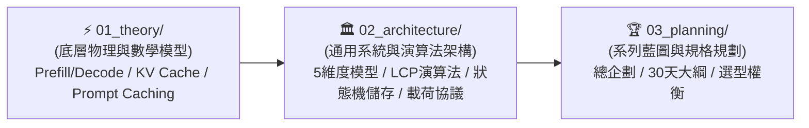

# 🧠 02_wiki: LLM 記憶中樞永久知識庫總導覽 (Wiki Root)

> [!NOTE]
> 歡迎來到 **LLM 記憶中樞 (LLM Memory Hub) 永久知識資產庫**。
> 本庫所有模組與卡片均遵循 **「大腦認知演進順序 (Cognitive Learning Pathway)」** 嚴密編號，各層目錄配備獨立 Index。

---

## 📑 知識模組與認知演進矩陣

---

### 1. [[02_wiki/01_theory/index|⚡ 01_theory: 推論物理與數學模型 (認知起點)]]
* [[01_Transformer_Prefill_vs_Decode]]：推論兩階段之 GEMM 算力密集 vs. GEMV 顯存帶寬密集深度剖析。
* [[02_KV_Cache_Mechanics]]：自回歸 KV Cache 顯存大小數學推導、GQA 演進與 128k OOM 實例計算。
* [[03_Prompt_Caching_Lifecycle]]：前綴快取生命週期時序轉換、快取固化與破壞邊界條件。

---

### 2. [[02_wiki/02_architecture/index|🏛️ 02_architecture: 通用架構與演算法模式 (系統落地)]]
* [[01_Context_5_Dimensions]]：Agent Context 載荷 5 維度模型、對話輪次膨脹趨勢與壓縮戰略。
* [[02_Token_Calculation_and_LCP]]：TikToken (BPE) 分詞與 LCP 最長公共前綴快取演算法 Go 實作。
* [[03_Agent_Storage_and_State_Machine]]：工業級 Agent 雙層 SQLite 狀態機、Protobuf 與 100KB 滾動切片雙軌日誌。
* [[04_Service_Plan_Agent_Observer]]：`agent-observer` Go 觀測服務 Clean Architecture 系統架構設計書。
* [[05_Model_Payload_and_API_Traces]]：Context 4 大板塊（System, Tools, Trajectory, Active）組裝順序與底層 API 通訊 JSON Schema。

---

### 3. [[02_wiki/03_planning/index|🏆 03_planning: 系列藍圖與規劃規格 (產品全景)]]
* [[01_Master_Plan]]：系列總體企劃書、核心價值主張與四大模組進程圖。
* [[02_30_Days_Breakdown]]：30 天每日詳細大綱、程式碼交付物與 Wiki 武器庫映射。
* [[03_Tech_Stack_Tradeoffs]]：Go vs. Python 跨維度客觀選型矩陣與權衡分析。
* [[04_Phased_Implementation_Roadmap]]：Phase 1 至 Phase 5 循序漸進實作路線圖。

---

## 🧭 導航
* 🔙 回到頂層：[[index|知識庫頂層總導航]]
